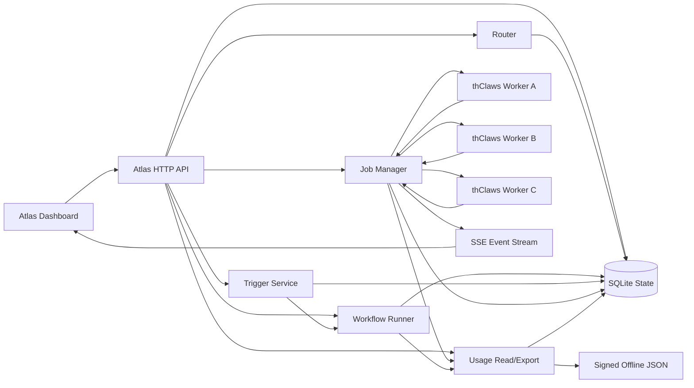
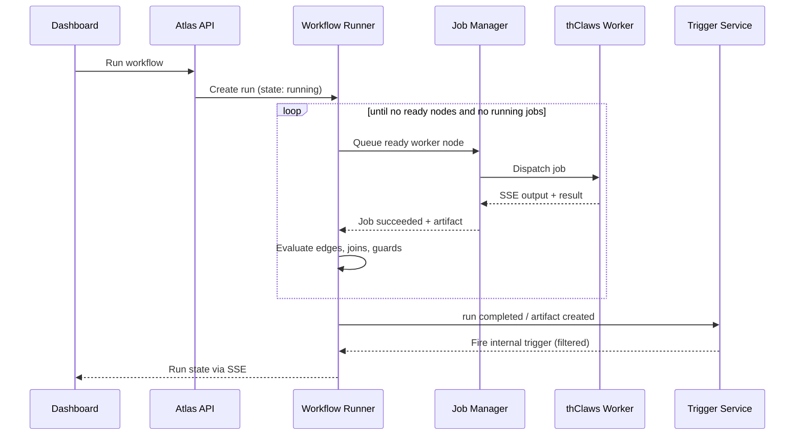

# Atlas Architecture

Atlas is intentionally outside thClaws. thClaws remains the worker runtime; Atlas owns coordination, routing, state, and the browser control surface.

> For definitions of every term used here (node types, join modes, edge
> conditions, artifact kinds, policy, triggers, and states), see
> [Concepts & Reference](concepts-en.md).

## Runtime Roles

- **NOVA** can stay as the user-facing assistant/persona.
- **Atlas** is the control plane and operational dashboard.
- **Hermes** can remain a local bridge when a machine needs browser-to-terminal plumbing.
- **thClaws** is the worker runtime exposed through `thclaws --serve`.

## Routing Order

1. Explicit `workspace_id`.
2. Explicit `worker_id`.
3. Existing conversation session binding.
4. Ranked worker/workspace candidates by status, workspace key, company, tags, role, and prompt hints.

This keeps manual override available while letting Atlas auto-route when the caller only sends a prompt.

## State Model

- `workers`: one thClaws API endpoint per machine or runtime.
- `workspaces`: concrete project directories bound to a worker.
- `conversations`: Atlas-level conversation identity.
- `session_bindings`: maps Atlas conversation to thClaws `session_id`.
- `jobs`: one routed execution.
- `job_events`: append-only event stream persisted from thClaws SSE.
- `workflow_definitions`: versioned graph and policy JSON.
- `workflow_runs`, `workflow_nodes`, `workflow_edges`: persisted runtime state.
- `workflow_events`: append-only run lifecycle timeline.
- `artifacts`: typed workflow blackboard entries.
- `workflow_triggers`, `workflow_trigger_events`: manual, schedule, webhook, and
  internal event automation with dedupe history.
- `audit_log`: operator and system actions.
- `usage_events`: append-only, idempotent per-job/per-run usage records; the
  Atlas instance is the tenant, so the table has no `tenant_id`.

## Workflow Execution

Atlas centrally queues graph nodes. Worker nodes create normal Atlas jobs;
`join` nodes run only in the control plane. Fan-out queues every matching
branch, joins track completed upstream keys, and duplicate incoming edges do
not schedule a node twice. The current executor is queue-based rather than
parallel.

Run completion, artifact creation, and worker status transitions feed the
trigger service. Internal triggers can filter by source workflow, state,
artifact key/kind, worker, or status. Atlas blocks unguarded self-triggering to
avoid infinite automation loops.

## Usage Metering

Job and workflow completion persist their outcome first, then attempt usage
emission as a failure-isolated side effect. `job:<id>` and `run:<id>` unique
keys make retry/recovery emission safe. The raw ledger records workflow-run and
job counts, budget units, wall-clock seconds, status, and visibility-only BYOK
model/token fields.

`GET /api/usage` exposes period JSON/CSV only to administrators and auditors.
Air-gapped instances write an HMAC-SHA256 signed JSON envelope for offline Fleet
ingest. Atlas does not rate records or issue invoices; Fleet and NT billing own
tenant aggregation, CDR mediation, rating, and invoicing.

## Fleet, Packs, BYOK & Health

Several capabilities sit at the edges of the core control plane. Each has an
authoritative spec; see also [Concepts §15](concepts-en.md#15-fleet-packs-byok--health).

- **Fleet** (`fleet/`) is a *separate* component with its own SQLite registry. It
  provisions Atlas instances, polls their `/healthz`, and pulls `usage_events` over HTTP.
  Atlas core has no knowledge of Fleet and no tenant logic, which keeps the silo
  invariant intact.
- **Multi-tenancy is instance-per-tenant (silo):** each tenant runs its own Atlas
  instance and database, so core tables carry no `tenant_id`. Pooled tenancy is deferred —
  see [ADR 0001](adr/0001-multi-tenancy-silo-vs-pooled.md).
- **CDR export:** Fleet aggregates pulled usage into a per-tenant, per-period CDR CSV for
  NT billing (export only; proposed schema) — see [CDR Record Schema](specs/cdr-schema.md).
- **Solution packs** are signed, portable bundles of workflow definitions + triggers that
  import atomically through the real engine validators — see
  [Solution Pack Format](specs/pack-format.md).
- **BYOK key injection** writes a provider key into a worker's env/config and audits the
  action without ever storing, logging, or returning the key — see
  [BYOK Key Injection](specs/byok-key-injection.md) and the
  [Managed Inference Gateway](specs/managed-inference.md) readiness note.
- **`/healthz`** is an unauthenticated liveness endpoint (status + version) that Fleet
  uses to provision and track instances.

## Phase 4 Readiness

Atlas already has stable boundaries for features thClaws does not expose natively today:

- Native worker capability refresh can replace `/v1/agent/info` polling.
- Native job status/cancel can replace best-effort cancel flags.
- Native approval events can be stored as `job_events` and surfaced in the dashboard.
- Native team/agent management endpoints can become new Atlas resources without changing the dashboard's job/session model.
- Native stream resume can replace Atlas event-log replay.

The key decision is to keep Atlas APIs stable and swap only the thClaws adapter when deeper thClaws APIs become available.
