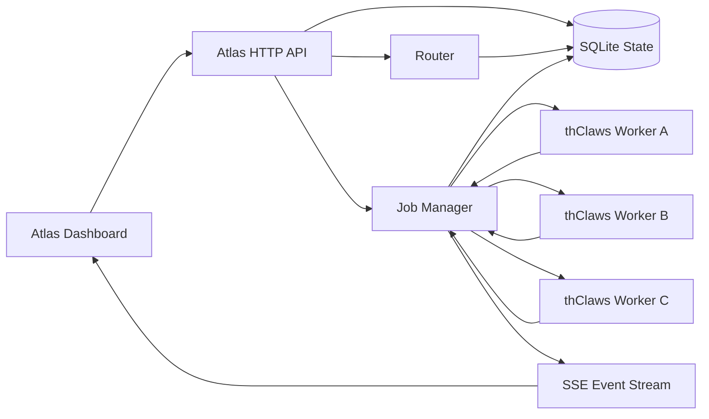

# Atlas Architecture

Atlas is intentionally outside thClaws. thClaws remains the worker runtime; Atlas owns coordination, routing, state, and the browser control surface.

## Runtime Roles

- **NOVA** can stay as the user-facing assistant/persona.
- **Atlas** is the control plane and operational dashboard.
- **Hermes** can remain a local bridge when a machine needs browser-to-terminal plumbing.
- **thClaws** is the worker runtime exposed through `thclaws --serve`.

## Routing Order

1. Explicit `workspace_id`.
2. Explicit `worker_id`.
3. Existing conversation session binding.
4. Ranked worker/workspace candidates by status, workspace key, company, tags, role, and prompt hints.

This keeps manual override available while letting Atlas auto-route when the caller only sends a prompt.

## State Model

- `workers`: one thClaws API endpoint per machine or runtime.
- `workspaces`: concrete project directories bound to a worker.
- `conversations`: Atlas-level conversation identity.
- `session_bindings`: maps Atlas conversation to thClaws `session_id`.
- `jobs`: one routed execution.
- `job_events`: append-only event stream persisted from thClaws SSE.
- `audit_log`: operator and system actions.

## Phase 4 Readiness

Atlas already has stable boundaries for features thClaws does not expose natively today:

- Native worker capability refresh can replace `/v1/agent/info` polling.
- Native job status/cancel can replace best-effort cancel flags.
- Native approval events can be stored as `job_events` and surfaced in the dashboard.
- Native team/agent management endpoints can become new Atlas resources without changing the dashboard's job/session model.
- Native stream resume can replace Atlas event-log replay.

The key decision is to keep Atlas APIs stable and swap only the thClaws adapter when deeper thClaws APIs become available.
