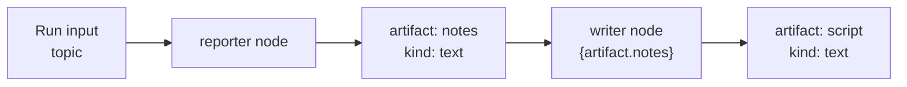

# Atlas Concepts & Reference

**English** · [ภาษาไทย](concepts-th.md)

This is the single reference for every term Atlas actually uses. The values shown
(node types, modes, condition types, kinds, policy keys, states) are the exact
literals the API accepts and the engine checks — all taken from the source code.

> See also: [Workflow Examples](workflow-examples.md) ·
> [Architecture](architecture.md) · [Web Guide](guides/web-user-guide-en.md)

## Contents

1. [Core objects](#1-core-objects)
2. [Routing order](#2-routing-order)
3. [Job states](#3-job-states)
4. [Workflow run states](#4-workflow-run-states)
5. [Node types](#5-node-types)
6. [Join modes](#6-join-modes)
7. [Edge conditions](#7-edge-conditions)
8. [Prompt variables](#8-prompt-variables)
9. [Artifact kinds](#9-artifact-kinds)
10. [Policy](#10-policy)
11. [Manager decision](#11-manager-decision-manager_decision_v1)
12. [Triggers](#12-triggers)
13. [Human gates & approvals](#13-human-gates--approvals)
14. [Usage metering](#14-usage-metering)
15. [Fleet, packs, BYOK & health](#15-fleet-packs-byok--health)

---

## 1. Core objects

Atlas is the control plane; thClaws workers do the work. These are the records
Atlas persists in SQLite.

| Object | Meaning |
| --- | --- |
| **worker** | One thClaws API endpoint per machine/runtime |
| **workspace** | A concrete project directory bound to a worker |
| **conversation** | Atlas-level conversation identity |
| **session binding** | Maps an Atlas conversation to a thClaws `session_id` |
| **job** | One routed execution on a worker |
| **job event** | Append-only event persisted from a worker's SSE stream |
| **workflow definition** | Versioned graph + policy JSON |
| **workflow run** | One execution of a definition |
| **workflow node / edge** | Persisted runtime state of graph nodes and edges |
| **workflow event** | Append-only run lifecycle timeline |
| **artifact** | A typed entry on the workflow blackboard |
| **trigger / trigger event** | Automation source and its dedupe/run history |
| **audit log** | Operator and system actions |
| **usage event** | Idempotent raw usage record for one terminal job or workflow run |

---

## 2. Routing order

When a job is submitted, Atlas picks a worker/workspace in this strict order. The
first rule that resolves wins.

1. Explicit `workspace_id`
2. Explicit `worker_id`
3. Existing conversation's session binding
4. Auto-route by online state, workspace key, company, tags, and prompt hints (a requested
   `role` is a hard filter applied first: if no candidate worker advertises it, the request
   fails instead of falling back to a lower-ranked worker)

A flowchart of this is in the
[web guide §4](guides/web-user-guide-en.md#4-command-jobs-and-handoffs).

---

## 3. Job states

| State | Meaning |
| --- | --- |
| `queued` | Waiting to start |
| `running` | Worker is executing |
| `cancel_requested` | Atlas accepted a cancellation request |
| `succeeded` | Completed successfully |
| `failed` | Failed; inspect events/error |
| `cancelled` | Cancelled |

Cancellation is best effort: a job becomes `cancel_requested` first, and the
worker may already have produced side effects.

---

## 4. Workflow run states

| State | Meaning |
| --- | --- |
| `running` | Executing nodes |
| `paused` | Paused by an operator; resume continues without repeating done nodes |
| `waiting_for_human` | Blocked on a human gate |
| `recovery_required` | Atlas restarted mid-run; interrupted nodes need manual retry |
| `succeeded` | All reachable nodes finished |
| `failed` | A node failed or a guard tripped |
| `cancelled` | Cancelled by an operator |

After a restart, interrupted worker/manager nodes are **not** retried
automatically — use **Retry interrupted** only after reviewing duplicate
side-effect risk. A run lifecycle diagram is in the
[web guide §7](guides/web-user-guide-en.md#7-monitor-workflow-operations).

---

## 5. Node types

Every node has an `id` and a `type`. Only `worker` and `manager` nodes create
thClaws jobs and consume budget; `join` and `human_gate` run in the control plane
only.

### `worker`

Creates a thClaws job.

| Field | Meaning |
| --- | --- |
| `role` | Routing role, e.g. `reporter` (auto-route) |
| `worker_id` / `workspace_id` | Pin to a specific worker/workspace |
| `prompt` | The task; supports prompt variables |
| `outputs` | Artifact keys this node writes |
| `output_format` | `json` parses the reply as JSON (node fails if unparseable) |
| `budget_units` | Cost against `max_budget_units` (default `1`) |

The reply is stored under the **first** declared `outputs` key (parsed JSON when
`output_format: json`).

### `manager`

Proposes the allowed next node(s); Atlas validates and decides.

| Field | Meaning |
| --- | --- |
| `worker_id` | The worker that runs the manager |
| `schema` | Output contract — `manager_decision_v1` |
| `prompt` / `budget_units` | As for worker nodes |

See [§11](#11-manager-decision-manager_decision_v1).

### `join`

Joins fan-out branches. Creates no job. Has a `mode` (see [§6](#6-join-modes))
and, for quorum, a `quorum` integer. Duplicate incoming edges count an upstream
once.

### `human_gate`

Pauses for a person. Creates no job.

| Field | Meaning |
| --- | --- |
| `label` | Button/title shown to the operator |
| `reason` | Why approval is needed |
| `choices` | For a choice gate: list of `{id, label}` |

See [§13](#13-human-gates--approvals).

---

## 6. Join modes

A join node continues downstream only when its upstream branches satisfy the
mode. Downstream is scheduled exactly once.

| Mode | Ready when… |
| --- | --- |
| `all` *(default)* | **every** declared upstream node has completed |
| `any` | **at least one** upstream has completed |
| `quorum` | the number of completed upstreams is **≥ `quorum`** |

With `any` and `quorum`, the other branches keep running, but the join and its
downstream are never scheduled twice. Failed nodes do not traverse their outgoing
edges.

---

## 7. Edge conditions

Each edge has a `condition`. If omitted it defaults to `always`. **Conditions are
independent** — two edges out of the same node are an OR, not an AND. There is no
expression engine; only these six types exist.

| Type | Matches when… | Required fields |
| --- | --- | --- |
| `always` | always | — |
| `artifact_equals` | `artifact[path]` **equals** `value` | `artifact`, `value` (optional `path`) |
| `artifact_in` | `artifact[path]` **is in** `values[]` | `artifact`, `values` (optional `path`) |
| `manager_selected` | the manager selected `target` | `target` (a node id) |
| `human_selected` | the operator chose `choice` | `choice` (a string) |
| `max_iterations_below` | `node` has run **fewer than** `max` times | `node` (a node id), `max` (positive int) |

`path` walks a dot-path into a JSON artifact (e.g. `verdict`, or `items.0.id` for
lists).

`max_iterations_below` reads the per-node execution count and is the building
block for bounded loops; do not confuse it with the global `max_iterations`
policy guard ([§10](#10-policy)).

---

## 8. Prompt variables

Worker and manager `prompt` strings interpolate `{...}` placeholders from two
roots:

| Placeholder | Source |
| --- | --- |
| `{input.X}` | The run input JSON |
| `{artifact.KEY}` | An artifact's content by key |

- Dot-paths walk into nested JSON, e.g. `{artifact.fact_check.verdict}`.
- Dict/list values are inserted as compact JSON.
- An unknown root raises `unknown prompt variable`; a missing path raises
  `missing prompt variable`.

A `manager` node additionally reasons over the run state (`graph`,
`current_node`, `artifacts`, `counters`, `policy`) and must reply with
`manager_decision_v1` JSON.

---

## 9. Artifact kinds

### The shortest useful definition

**An artifact is a named result saved on a workflow run so another step can use
it later.**

For example, a `reporter` node returns news notes. Atlas saves the response as an
artifact named `notes`; a `writer` node then reads `{artifact.notes}` without an
operator copying output or passing an entire log manually.



Related terms are not interchangeable:

| Item | What it is | How a later node uses it |
| --- | --- | --- |
| **Run input** | Data supplied when the run starts, such as `{"topic":"AI"}` | `{input.topic}` |
| **Job output** | The raw response from one worker job, visible in Jobs | It is not an artifact unless the node declares `outputs` |
| **Artifact** | A keyed copy of a result persisted on the run | `{artifact.KEY}` or an edge condition |
| **File artifact (`file_ref`)** | A pointer to binary bytes stored by Atlas | A person downloads it or an external system calls the content API; workers do not read it automatically |

Artifacts are shared only by nodes in the **same run**. Each persisted record is
`{key, kind, content, metadata}`. Prompts (`{artifact.KEY}`), edge conditions,
and `artifact_created` triggers read them; **Monitor → Artifacts** displays them
for inspection.

### How worker output becomes an artifact

A node must declare at least one `outputs` key:

```json
{
  "id": "reporter",
  "type": "worker",
  "prompt": "Summarize news about {input.topic}",
  "outputs": ["notes"]
}
```

After the job succeeds, Atlas stores its entire `assistant_text` as the `notes`
artifact with kind `text`. A node without `outputs` can still succeed, but it
does not produce an artifact.

> The current engine uses only the **first key** in `outputs`. To expose multiple
> fields, store one `json` artifact and address its fields with dot-paths.

| Kind | Behaviour |
| --- | --- |
| `json` | **Parsed on load** — enables dot-paths in conditions/prompts |
| `file_ref` | **A pointer to an uploaded file** (not the bytes) |
| `text` | Plain string; the default for worker output |
| `markdown` | Plain string, labelled markdown |
| `summary` | Plain string, labelled a summary |
| `decision` | Plain string, labelled a decision |

Only two kinds change engine behaviour: **`json`** (content is `json.loads`-ed,
so `{artifact.fact_check.verdict}` and `path` conditions work) and **`file_ref`**
(a binary file Atlas stores and serves on demand). `text`, `markdown`, `summary`,
and `decision` are **semantic labels only** — the engine treats their content as
a plain string, though a label is still useful as an `artifact_created` trigger
filter.

### Setting the kind

- **Worker output** defaults to `text`; set the node's `output_format: "json"` to
  parse and store the entire response as `json` (the response must be valid JSON
  only, or the node fails).
- **Manual** — `POST /api/artifacts` with any `kind` and inline `content`.
- **File upload** always produces a `file_ref` (below).

### File upload (`file_ref`)

`POST /api/workflow-runs/{run_id}/files?key=...` (or **Monitor → select a run →
Upload file**) attaches a binary file to an existing run as a `file_ref`,
recording its filename, size, and SHA-256. Download it with
`GET /api/artifacts/{id}/content`. Default limit 10 MiB (`ATLAS_MAX_UPLOAD_BYTES`).

> **Important:** a worker does **not** read an uploaded file automatically —
> `{artifact.KEY}` for a `file_ref` yields the pointer, not the file content. An
> upload is for **people** (a reviewer downloading it at a human gate) or for an
> **external system** that calls the content API itself, with an integrity hash
> tying the file to the run.

What Upload and Download actually do:

1. **Upload** copies a browser file into Atlas's upload storage and creates a
   `file_ref` on the selected run; it does not copy the file into a worker workspace.
2. **File key**, such as `contract` or `evidence`, is the artifact's lookup name in the run.
3. **Download** returns the bytes stored by Atlas; it does not expose arbitrary files from a worker.

Use this for contracts reviewed by a person, auditable evidence/final deliverables,
or files fetched by an external integration. Do not use it expecting a worker to
parse an uploaded PDF automatically, or as a general-purpose file manager.

### Example 1 — a `json` artifact drives a branch

A `fact_checker` node sets `output_format: "json"` and replies
`{"verdict":"approved"}`. Atlas stores it as a `json` artifact, so the outgoing
edge can read the field by `path`:

```json
{"from":"fact_checker","to":"anchor","condition":{"type":"artifact_equals","artifact":"fact_check","path":"verdict","value":"approved"}}
```

Without `output_format: "json"` the content would be a plain string and
`path: "verdict"` would resolve to nothing. Full graph:
[Fact Checker Approved Branch](workflow-examples.md#fact-checker-approved-branch).

### Example 2 — a `file_ref` upload for human review

A contract-approval run pauses at a human gate. A person uploads the contract,
the reviewer downloads it to decide, then approves — the worker never reads the
PDF, the human does.

```bash
# 1) run is waiting_for_human at the gate
curl -sS -X POST 'http://127.0.0.1:8787/api/workflow-runs/wfr_xxx/files?key=contract' \
  -H 'content-type: application/pdf' \
  -H 'x-filename: contract.pdf' \
  --data-binary @contract.pdf
# 2) reviewer downloads it to read
curl -sS http://127.0.0.1:8787/api/artifacts/art_xxx/content -o contract.pdf
# 3) Approve in Monitor → the run continues
```

The file and its SHA-256 stay tied to the run for audit.

---

## 10. Policy

Policy bounds a run. When a guard trips, Atlas pauses or fails the run loudly
instead of continuing.

| Key | Meaning |
| --- | --- |
| `max_jobs` | Max jobs per run |
| `max_iterations` | Max total iterations |
| `max_attempts_per_node` | Max executions of any one node |
| `max_minutes` | Overall wall-clock limit |
| `requires_human_after_iterations` | Require one human approval once this many jobs have started |
| `max_budget_units` | Total budget; an abstract unit, **not** money or tokens |
| `allowed_worker_ids` | Allowlist of worker ids |
| `allowed_workspace_ids` | Allowlist of workspace ids |
| `stop_on_first_failure` | Stop the run on the first failed branch; **default `true`** |

With `stop_on_first_failure: false`, independent ready branches keep running, but
the run still finishes `failed` if any node failed. Each worker/manager node
costs `budget_units` (default `1`) against `max_budget_units`.

---

## 11. Manager decision (`manager_decision_v1`)

A manager node must return only this JSON. The manager proposes; Atlas validates
(allowed worker/workspace, iteration and budget guards, required artifacts exist,
no forbidden edge) and then decides.

| Field | Meaning |
| --- | --- |
| `stop` | `true` ends the run; `next` must be empty |
| `reason` | Why this decision |
| `next[]` | Selected actions, each `{node, input_artifacts[], instructions}` |

Only nodes reachable by a `manager_selected` edge from the manager may be chosen.

```json
{
  "stop": false,
  "reason": "Research artifact is ready.",
  "next": [
    {"node": "writer", "input_artifacts": ["research"], "instructions": "Produce one concise draft."}
  ]
}
```

---

## 12. Triggers

A trigger starts a workflow run. `manual`, `schedule`, and `webhook` are fired
externally; the three internal-event types are fired only by Atlas. Atlas blocks
unguarded self-triggering to prevent infinite loops.

| Type | Fires on… | Config / filter |
| --- | --- | --- |
| `manual` | A manual Fire | `{}` |
| `schedule` | An interval or daily local time | `{"interval_minutes": N}` or `{"daily_time": "HH:MM"}` |
| `webhook` | An external POST to the trigger | `{}`; reuse a stable `dedupe_key` per event |
| `workflow_run_completed` | Another run finishing | filter: `source_workflow_definition_id`, `state` |
| `artifact_created` | An artifact being created | filter: `source_workflow_definition_id`, `key`, `kind` |
| `worker_status_changed` | A worker changing status | filter: `worker_id`, `status` |

Trigger events progress through `received` → `started`, or `ignored` (e.g.
duplicate `dedupe_key`) or `failed`.

API examples are in [Workflow Examples](workflow-examples.md).

---

## 13. Human gates & approvals

A `human_gate` node pauses the run as `waiting_for_human` and creates no job. A
gate can be decided **once**.

- **Normal gate** → **Approve** (state `approved`, continue) or **Reject** (state
  `rejected`, the run fails).
- **Choice gate** → one button per declared `choice`; the chosen id is matched by
  `human_selected` edges, plus **Reject**.
- The `requires_human_after_iterations` policy adds one approval pause after the
  given number of jobs have started, independent of explicit gate nodes.

Approval state literals: `pending` → `approved` / `rejected` (or a selected
choice). A cancelled run cancels pending approvals.

---

## 14. Usage metering

Atlas writes one `job` usage event for each terminal job and one `workflow_run`
event for each terminal workflow run. Unique `job:<id>` / `run:<id>` keys prevent
double counting across retry and restart recovery.

- Workflow-run event count is the headline consumption measure.
- Job count, `budget_units`, run/job wall seconds, and status remain raw measures.
- `metadata.billable` is true only for successful workflow runs.
- Model/token fields are visibility-only under BYOK and are not billed.
- Metering errors are logged after outcomes are persisted and never change them.
- Atlas exports raw JSON/CSV or signed offline JSON; Fleet/NT systems aggregate,
  rate, and invoice later.

## 15. Fleet, packs, BYOK & health

These components sit at the edges of the control plane. Each has an authoritative spec;
this section is the one-paragraph definition.

- **Fleet** — a separate component (`fleet/`) with its own SQLite registry that
  provisions, health-checks, and pulls usage from Atlas instances over HTTP. Atlas core
  has no knowledge of Fleet and no tenant logic.
- **Instance-per-tenant (silo)** — each tenant runs its own Atlas instance and database;
  the instance *is* the tenant, so core tables carry no `tenant_id`. Pooled tenancy is
  deferred. See [ADR 0001](adr/0001-multi-tenancy-silo-vs-pooled.md).
- **Solution pack** — a signed, portable bundle of workflow definitions + triggers (and
  declared roles) that imports atomically through the real engine validators. See
  [Solution Pack Format](specs/pack-format.md).
- **CDR export** — Fleet aggregates pulled `usage_events` into a per-tenant, per-period
  CDR CSV for NT billing (export only; the schema is proposed). See
  [CDR Record Schema](specs/cdr-schema.md).
- **BYOK key injection** — a write-only helper that installs a provider key into a
  worker's env/config and audits the action without ever storing, logging, or returning
  the key. See [BYOK Key Injection](specs/byok-key-injection.md) and the
  [Managed Inference Gateway](specs/managed-inference.md) readiness note.
- **Health (`/healthz`)** — an unauthenticated liveness endpoint returning status +
  version; Fleet polls it to provision and track instances.
