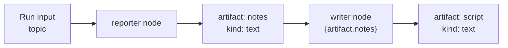

# Atlas — นิยามและเอกสารอ้างอิง

[English](concepts-en.md) · **ภาษาไทย**

เอกสารนี้เป็นจุดอ้างอิงเดียวสำหรับนิยามทุกตัวที่ระบบ Atlas ใช้จริง ค่าที่แสดง
(ชนิด node, mode, condition, kind, policy, state) คือค่าตรงตัวที่ API รับและ engine
ตรวจสอบ ทุกค่าดึงมาจากซอร์สโค้ดจริง ไม่ใช่การคาดเดา

> ดูเพิ่ม: [ตัวอย่าง Workflow](workflow-examples.md) ·
> [Architecture](architecture.md) · [คู่มือเว็บ (ไทย)](guides/web-user-guide-th.md)

## สารบัญ

1. [วัตถุหลัก](#1-วัตถุหลัก)
2. [ลำดับการ route](#2-ลำดับการ-route)
3. [สถานะ job](#3-สถานะ-job)
4. [สถานะ workflow run](#4-สถานะ-workflow-run)
5. [ชนิด node](#5-ชนิด-node)
6. [โหมด join](#6-โหมด-join)
7. [เงื่อนไข edge](#7-เงื่อนไข-edge)
8. [ตัวแปรใน prompt](#8-ตัวแปรใน-prompt)
9. [ชนิด artifact](#9-ชนิด-artifact)
10. [นโยบายและ guard](#10-นโยบายและ-guard)
11. [การตัดสินใจของ manager](#11-การตัดสินใจของ-manager-manager_decision_v1)
12. [ทริกเกอร์](#12-ทริกเกอร์)
13. [การตัดสินใจและการอนุมัติโดยผู้ใช้](#13-การตัดสินใจและการอนุมัติโดยผู้ใช้)
14. [Usage metering](#14-usage-metering)
15. [Fleet, packs, BYOK และ health](#15-fleet-packs-byok-และ-health)

---

## 1. วัตถุหลัก

Atlas เป็น control plane ส่วน thClaws worker เป็นตัวทำงานจริง ด้านล่างคือเรกคอร์ดที่
Atlas เก็บใน SQLite

| วัตถุ | ความหมาย |
| --- | --- |
| **worker** | thClaws API หนึ่ง endpoint ต่อหนึ่งเครื่อง/รันไทม์ |
| **workspace** | directory ของโปรเจกต์จริงที่ผูกกับ worker |
| **conversation** | ตัวระบุบทสนทนาในระดับ Atlas |
| **session binding** | จับคู่ conversation ของ Atlas กับ `session_id` ของ thClaws |
| **job** | การรันหนึ่งครั้งที่ถูก route ไปยัง worker |
| **job event** | event แบบเขียนต่อท้าย เก็บจากสตรีม SSE ของ worker |
| **workflow definition** | graph + policy JSON ที่มีเวอร์ชัน |
| **workflow run** | การรัน definition หนึ่งครั้ง |
| **workflow node / edge** | สถานะรันไทม์ของ node และ edge ในกราฟ |
| **workflow event** | ไทม์ไลน์ lifecycle ของ run แบบเขียนต่อท้าย |
| **artifact** | ข้อมูลผลลัพธ์แบบมี kind บนกระดาน (blackboard) ของ workflow |
| **trigger / trigger event** | แหล่ง automation และประวัติการ dedupe/รัน |
| **audit log** | บันทึก action ของผู้ใช้และระบบ |
| **usage event** | raw usage แบบ idempotent สำหรับ terminal job หรือ workflow run หนึ่งรายการ |

---

## 2. ลำดับการ route

เมื่อมีการส่ง job, Atlas เลือก worker/workspace ตามลำดับนี้ กฎข้อแรกที่ตอบได้คือผู้ชนะ

1. ระบุ `workspace_id` ตรง ๆ
2. ระบุ `worker_id` ตรง ๆ
3. ใช้ session binding ของ conversation เดิม
4. route อัตโนมัติจากสถานะ online, workspace key, company, tags และคำใบ้ใน prompt (ถ้าระบุ
   `role` มาด้วย จะเป็น hard filter ที่กรองก่อน: ถ้าไม่มี candidate ตัวไหนประกาศ role นั้น
   request จะล้มเหลว แทนที่จะ fallback ไป worker อันดับรองลงมา)

ดู flowchart ได้ใน [คู่มือเว็บ §4](guides/web-user-guide-th.md#4-command-ส่งงานเดี่ยวและ-handoff)

---

## 3. สถานะ job

| สถานะ | ความหมาย |
| --- | --- |
| `queued` | รอเริ่ม |
| `running` | worker กำลังทำงาน |
| `cancel_requested` | Atlas รับคำขอยกเลิกแล้ว |
| `succeeded` | สำเร็จ |
| `failed` | ล้มเหลว; ดู event/error |
| `cancelled` | ยกเลิกแล้ว |

การยกเลิกเป็น best effort: job จะเป็น `cancel_requested` ก่อน และ worker อาจทำ
side effect ไปแล้ว

---

## 4. สถานะ workflow run

| สถานะ | ความหมาย |
| --- | --- |
| `running` | กำลังรัน node |
| `paused` | ผู้ใช้สั่งหยุด; resume ทำต่อโดยไม่ทำ node ที่เสร็จแล้วซ้ำ |
| `waiting_for_human` | หยุดรอการตัดสินใจจากผู้ใช้ที่ `human_gate` |
| `recovery_required` | Atlas restart กลางคัน; node ที่ค้างต้อง retry เอง |
| `succeeded` | node ที่ไปถึงได้เสร็จทั้งหมด |
| `failed` | node ล้มเหลวหรือ guard ทำงาน |
| `cancelled` | ผู้ใช้ยกเลิก |

หลัง restart, node ที่ค้างจะ **ไม่** ถูก retry อัตโนมัติ — ใช้ **Retry interrupted**
หลังตรวจความเสี่ยง side effect ซ้ำเท่านั้น ดู diagram lifecycle ได้ใน
[คู่มือเว็บ §7](guides/web-user-guide-th.md#7-monitor-ติดตาม-workflow)

---

## 5. ชนิด node

ทุก node มี `id` และ `type` เฉพาะ `worker` และ `manager` ที่สร้าง job บน thClaws และ
ใช้ budget ส่วน `join` และ `human_gate` ทำงานในชั้น control plane เท่านั้น

### `worker`

สร้าง job บน thClaws worker

| ฟิลด์ | ความหมาย |
| --- | --- |
| `role` | role สำหรับ route เช่น `reporter` |
| `worker_id` / `workspace_id` | ระบุ worker/workspace ตรง ๆ |
| `prompt` | งานที่สั่ง; ใช้ตัวแปร prompt ได้ |
| `outputs` | คีย์ artifact ที่ node นี้เขียน |
| `output_format` | `json` จะ parse คำตอบเป็น JSON (parse ไม่ได้ = node fail) |
| `budget_units` | ต้นทุนเทียบ `max_budget_units` (ค่าเริ่มต้น `1`) |

คำตอบถูกเก็บไว้ที่คีย์ `outputs` **ตัวแรก** (เป็น JSON ที่ parse แล้วถ้าตั้ง
`output_format: json`)

### `manager`

เสนอ node ถัดไปภายใต้ข้อจำกัด; Atlas ตรวจสอบและตัดสิน

| ฟิลด์ | ความหมาย |
| --- | --- |
| `worker_id` | worker ที่รัน manager |
| `schema` | สัญญา output — `manager_decision_v1` |
| `prompt` / `budget_units` | เหมือน node แบบ worker |

ดู [§11](#11-การตัดสินใจของ-manager-manager_decision_v1)

### `join`

รวม branch ที่แตกออก ไม่สร้าง job มี `mode` (ดู [§6](#6-โหมด-join)) และถ้าเป็น quorum
ต้องมี `quorum` (จำนวนเต็ม) edge ขาเข้าซ้ำนับ upstream เพียงครั้งเดียว

### `human_gate`

จุดที่ workflow หยุดรอการตัดสินใจจากผู้ใช้ เช่น อนุมัติ ปฏิเสธ หรือเลือกขั้นตอนถัดไป
โดยไม่สร้าง job

| ฟิลด์ | ความหมาย |
| --- | --- |
| `label` | ข้อความที่แสดงให้ผู้ใช้ |
| `reason` | เหตุผลที่ต้องอนุมัติ |
| `choices` | สำหรับจุดตัดสินใจแบบมีตัวเลือก: รายการ `{id, label}` |

ดู [§13](#13-การตัดสินใจและการอนุมัติโดยผู้ใช้)

---

## 6. โหมด join

join จะไปต่อ downstream เมื่อ branch ขาเข้าครบตามโหมด และ downstream ถูก schedule
เพียงครั้งเดียว

| โหมด | พร้อมเมื่อ… |
| --- | --- |
| `all` *(ค่าเริ่มต้น)* | upstream ที่ประกาศไว้ **ทุกตัว** complete |
| `any` | upstream **อย่างน้อยหนึ่งตัว** complete |
| `quorum` | จำนวน upstream ที่ complete **≥ `quorum`** |

โหมด `any` และ `quorum`: branch ที่เหลือยังรันต่อ แต่ join และ downstream ไม่ถูก
schedule ซ้ำ node ที่ fail จะไม่เดินผ่าน edge ขาออกของตัวเอง

---

## 7. เงื่อนไข edge

ทุก edge มี `condition` ถ้าไม่ใส่จะเป็น `always` **เงื่อนไขเป็นอิสระต่อกัน** — สอง edge
ที่ออกจาก node เดียวกันคือ OR ไม่ใช่ AND ไม่มี expression engine มีแค่หกชนิดนี้

| ชนิด | ตรงเมื่อ… | ฟิลด์ที่ต้องมี |
| --- | --- | --- |
| `always` | ตรงเสมอ | — |
| `artifact_equals` | `artifact[path]` **เท่ากับ** `value` | `artifact`, `value` (`path` ไม่บังคับ) |
| `artifact_in` | `artifact[path]` **อยู่ใน** `values[]` | `artifact`, `values` (`path` ไม่บังคับ) |
| `manager_selected` | manager เลือก `target` | `target` (node id) |
| `human_selected` | คนเลือก `choice` | `choice` (string) |
| `max_iterations_below` | `node` ถูกรัน **น้อยกว่า** `max` ครั้ง | `node` (node id), `max` (จำนวนเต็มบวก) |

`path` เดินเข้า JSON ของ artifact แบบ dot-path เช่น `verdict` หรือ `items.0.id`
สำหรับ list

`max_iterations_below` อ่านจำนวนครั้งที่ node ถูกรัน ใช้ทำลูปแบบมีขอบเขต อย่าสับสนกับ
`max_iterations` ที่เป็น guard ระดับ policy ([§10](#10-นโยบายและ-guard))

---

## 8. ตัวแปรใน prompt

prompt ของ worker/manager แทนค่า `{...}` จากสองราก:

| ตัวแปร | แหล่งข้อมูล |
| --- | --- |
| `{input.X}` | JSON ของ run input |
| `{artifact.KEY}` | เนื้อหา artifact ตามคีย์ |

- dot-path เข้า JSON ซ้อนได้ เช่น `{artifact.fact_check.verdict}`
- ค่า dict/list จะถูกใส่เป็น JSON แบบกระชับ
- รากที่ไม่รู้จัก → `unknown prompt variable`; path ที่ไม่มี → `missing prompt variable`

node แบบ `manager` ยังพิจารณาสถานะ run (`graph`, `current_node`, `artifacts`,
`counters`, `policy`) และต้องตอบเป็น JSON `manager_decision_v1`

---

## 9. ชนิด artifact

### จำแบบสั้นที่สุด

**Artifact คือผลลัพธ์ที่ตั้งชื่อและบันทึกไว้กับ workflow run เพื่อให้ขั้นตอนอื่นนำไปใช้ต่อ**

ตัวอย่าง: node `reporter` ตอบข้อความข่าวออกมา Atlas บันทึกข้อความนั้นเป็น artifact
ชื่อ `notes` จากนั้น node `writer` อ่านด้วย `{artifact.notes}` โดยไม่ต้องคัดลอก output
หรือส่ง log ทั้งก้อนด้วยมือ



คำที่คล้ายกันแต่ไม่ใช่สิ่งเดียวกัน:

| สิ่งนี้ | คืออะไร | ใช้ซ้ำใน node ถัดไปอย่างไร |
| --- | --- | --- |
| **Run input** | ข้อมูลที่ส่งเข้าตอนเริ่ม run เช่น `{"topic":"AI"}` | `{input.topic}` |
| **Job output** | คำตอบดิบของ worker หนึ่ง job และข้อความที่เห็นในหน้า Jobs | ยังไม่เป็น artifact ถ้า node ไม่ประกาศ `outputs` |
| **Artifact** | สำเนาผลลัพธ์ที่ตั้ง key และเก็บกับ run | `{artifact.KEY}` หรือ edge condition |
| **File artifact (`file_ref`)** | ตัวชี้ไปไฟล์ binary ที่ Atlas เก็บ | คนดาวน์โหลด หรือระบบภายนอกเรียก content API; worker ไม่ได้อ่านอัตโนมัติ |

artifact ใช้ร่วมกันเฉพาะ node ใน **run เดียวกัน** แต่ละชิ้นเก็บเป็น
`{key, kind, content, metadata}` — prompt (`{artifact.KEY}`), edge condition และ
trigger `artifact_created` อ่านข้อมูลนี้ได้ และหน้า **Monitor → Artifacts** ใช้ตรวจย้อนหลัง

### Artifact เกิดจาก worker output อย่างไร

node ต้องประกาศ `outputs` อย่างน้อยหนึ่ง key:

```json
{
  "id": "reporter",
  "type": "worker",
  "prompt": "สรุปข่าวเรื่อง {input.topic}",
  "outputs": ["notes"]
}
```

เมื่อ job สำเร็จ Atlas จะนำ `assistant_text` ทั้งก้อนไปเก็บเป็น artifact `notes`
ชนิด `text` ถ้าไม่มี `outputs` งานยังสำเร็จได้ แต่จะไม่มี artifact จาก node นั้น

> Engine รุ่นปัจจุบันใช้ **key ตัวแรก** ใน `outputs` เท่านั้น ถ้าต้องการ JSON หลาย field
> ให้เก็บเป็น artifact `json` หนึ่งชิ้นแล้วอ่านด้วย dot-path

| kind | พฤติกรรม |
| --- | --- |
| `json` | **ถูก parse ตอนโหลด** — ใช้ dot-path ใน condition/prompt ได้ |
| `file_ref` | **ตัวชี้ไปไฟล์ที่อัปโหลด** (ไม่ใช่ตัวไฟล์) |
| `text` | string ล้วน; ค่าเริ่มต้นของ output |
| `markdown` | string ล้วน ติดป้ายว่า markdown |
| `summary` | string ล้วน ติดป้ายว่าบทสรุป |
| `decision` | string ล้วน ติดป้ายว่าการตัดสินใจ |

มีแค่สอง kind ที่เปลี่ยนพฤติกรรมของ engine: **`json`** (content ถูก `json.loads`
จึงใช้ `{artifact.fact_check.verdict}` และ condition แบบ `path` ได้) และ **`file_ref`**
(ไฟล์ binary ที่ Atlas เก็บและส่งให้เมื่อขอ) ส่วน `text`, `markdown`, `summary`,
`decision` เป็น **ป้ายเชิงความหมายเท่านั้น** — engine มองเป็น string ทั้งก้อน แต่ป้าย
ยังใช้เป็น filter ของ trigger `artifact_created` ได้

### การตั้ง kind

- **output ของ worker** เป็น `text` โดยปริยาย; ตั้ง `output_format: "json"` เพื่อ parse
  คำตอบทั้งก้อนและเก็บเป็น `json` (คำตอบต้องเป็น JSON ที่ถูกต้องล้วน ๆ มิฉะนั้น node fail)
- **สร้างเอง** — `POST /api/artifacts` ระบุ `kind` และ `content` ได้เลย
- **การอัปโหลดไฟล์** ได้ `file_ref` เสมอ (ดูด้านล่าง)

### การอัปโหลดไฟล์ (`file_ref`)

`POST /api/workflow-runs/{run_id}/files?key=...` (หรือ **Monitor → เลือก run →
Upload file**) แนบไฟล์ binary เข้ากับ run ที่มีอยู่ในรูป `file_ref` พร้อมบันทึก
filename, ขนาด, SHA-256 ดาวน์โหลดด้วย `GET /api/artifacts/{id}/content` ดีฟอลต์ 10 MiB
(`ATLAS_MAX_UPLOAD_BYTES`)

> **สำคัญ:** worker จะ **ไม่** อ่านไฟล์ที่อัปโหลดให้อัตโนมัติ — `{artifact.KEY}` ของ
> `file_ref` ได้แค่ตัวชี้ ไม่ใช่เนื้อไฟล์ การอัปโหลดมีไว้ให้ **คน** (ผู้ตรวจสอบดาวน์โหลดดู
> ตอน workflow หยุดที่ `human_gate`) หรือ **ระบบภายนอก** ที่เรียก content API เอง
> โดยมี hash ผูกไฟล์กับ run ไว้ตรวจสอบ

สิ่งที่ Upload/Download ทำจริง:

1. **Upload** คัดลอกไฟล์จาก browser ไปเก็บในพื้นที่ upload ของ Atlas แล้วสร้าง
   `file_ref` ผูกกับ run ที่เลือก; ไม่ได้คัดลอกไฟล์เข้า workspace ของ worker
2. **File key** เช่น `contract` หรือ `evidence` คือชื่อที่ใช้หา artifact ใน run
3. **Download** ส่ง byte ของไฟล์ที่ Atlas เก็บกลับมา; ไม่ได้อ่านไฟล์อื่นจากเครื่อง worker

เหมาะกับการแนบสัญญาให้คนอนุมัติ, เก็บหลักฐาน/ไฟล์ผลลัพธ์เพื่อ audit หรือให้ระบบภายนอก
มารับไฟล์ ไม่เหมาะกับการอัปโหลด PDF แล้วคาดหวังให้ worker อ่านเอง หรือใช้แทน file manager
ทั่วไป

### ตัวอย่าง 1 — artifact `json` ใช้ตัดสินเส้นทาง

node `fact_checker` ตั้ง `output_format: "json"` แล้วตอบ `{"verdict":"approved"}`
Atlas เก็บเป็น artifact `json` ทำให้ edge ขาออกอ่าน field ด้วย `path` ได้:

```json
{"from":"fact_checker","to":"anchor","condition":{"type":"artifact_equals","artifact":"fact_check","path":"verdict","value":"approved"}}
```

ถ้าไม่ตั้ง `output_format: "json"` content จะเป็น string ทั้งก้อน และ `path: "verdict"`
จะ resolve ไม่ได้ ดู graph เต็ม:
[Fact Checker Approved Branch](workflow-examples.md#fact-checker-approved-branch)

### ตัวอย่าง 2 — อัปโหลด `file_ref` ให้คนรีวิว

run อนุมัติสัญญาหยุดที่จุดรอการตัดสินใจ (`human_gate`) มีคนอัปโหลดไฟล์สัญญา
ผู้ตรวจสอบดาวน์โหลดไปดูแล้วกดอนุมัติ — worker ไม่ได้อ่าน PDF เลย คนเป็นคนอ่าน

```bash
# 1) run รอการตัดสินใจจากผู้ใช้ (waiting_for_human)
curl -sS -X POST 'http://127.0.0.1:8787/api/workflow-runs/wfr_xxx/files?key=contract' \
  -H 'content-type: application/pdf' \
  -H 'x-filename: contract.pdf' \
  --data-binary @contract.pdf
# 2) รีวิวเวอร์ดาวน์โหลดไปอ่าน
curl -sS http://127.0.0.1:8787/api/artifacts/art_xxx/content -o contract.pdf
# 3) กด Approve ใน Monitor แล้ว run ไปต่อ
```

ไฟล์พร้อม SHA-256 ผูกกับ run ไว้ตรวจสอบย้อนหลัง

---

## 10. นโยบายและ guard

policy กำหนดขอบเขตของ run เมื่อ guard ทำงาน Atlas จะ pause หรือ fail แบบชัดเจน

| คีย์ | ความหมาย |
| --- | --- |
| `max_jobs` | จำนวน job สูงสุดต่อ run |
| `max_iterations` | จำนวนรอบรวมสูงสุด |
| `max_attempts_per_node` | จำนวนครั้งสูงสุดต่อ node |
| `max_minutes` | เวลารวมสูงสุด (นาที) |
| `requires_human_after_iterations` | บังคับอนุมัติหนึ่งครั้งเมื่อ job เริ่มครบจำนวนนี้ |
| `max_budget_units` | budget รวม; เป็นหน่วยนามธรรม **ไม่ใช่** เงินหรือ token |
| `allowed_worker_ids` | allowlist ของ worker id |
| `allowed_workspace_ids` | allowlist ของ workspace id |
| `stop_on_first_failure` | หยุด run เมื่อ branch แรก fail; **ค่าเริ่มต้น `true`** |

ถ้า `stop_on_first_failure: false` branch อิสระยังรันต่อ แต่ run ยังจบเป็น `failed`
ถ้ามี node ใด fail แต่ละ node แบบ worker/manager ใช้ `budget_units` (ค่าเริ่มต้น `1`)
เทียบกับ `max_budget_units`

---

## 11. การตัดสินใจของ manager (`manager_decision_v1`)

node แบบ manager ต้องตอบเป็น JSON นี้เท่านั้น manager เป็นผู้เสนอ; Atlas ตรวจสอบ
(worker/workspace ที่อนุญาต, guard เรื่อง iteration/budget, artifact ที่ต้องมี,
ห้ามใช้ edge ต้องห้าม) แล้วจึงตัดสิน

| ฟิลด์ | ความหมาย |
| --- | --- |
| `stop` | `true` = จบ run; `next` ต้องว่าง |
| `reason` | เหตุผลของการตัดสินใจ |
| `next[]` | action ที่เลือก แต่ละตัว `{node, input_artifacts[], instructions}` |

เลือกได้เฉพาะ node ที่มี edge `manager_selected` ออกจาก manager เท่านั้น

```json
{
  "stop": false,
  "reason": "Research artifact is ready.",
  "next": [
    {"node": "writer", "input_artifacts": ["research"], "instructions": "Produce one concise draft."}
  ]
}
```

---

## 12. ทริกเกอร์

trigger ใช้เริ่ม workflow run ชนิด `manual`, `schedule`, `webhook` ยิงจากภายนอก ส่วน
internal event สามชนิดยิงโดย Atlas เท่านั้น Atlas กันการ self-trigger ที่ไม่มี guard
เพื่อไม่ให้เกิดลูปไม่รู้จบ

| ชนิด | ทำงานเมื่อ… | Config / filter |
| --- | --- | --- |
| `manual` | กด Fire เอง | `{}` |
| `schedule` | ทุก ๆ ช่วงเวลา หรือเวลา local รายวัน | `{"interval_minutes": N}` หรือ `{"daily_time": "HH:MM"}` |
| `webhook` | มี POST จากภายนอกเข้ามา | `{}`; ใช้ `dedupe_key` คงที่ต่อหนึ่ง event |
| `workflow_run_completed` | run อื่นจบ | filter: `source_workflow_definition_id`, `state` |
| `artifact_created` | มี artifact ถูกสร้าง | filter: `source_workflow_definition_id`, `key`, `kind` |
| `worker_status_changed` | worker เปลี่ยนสถานะ | filter: `worker_id`, `status` |

trigger event ไล่สถานะ `received` → `started` หรือ `ignored` (เช่น `dedupe_key` ซ้ำ)
หรือ `failed`

ตัวอย่าง API อยู่ใน [ตัวอย่าง Workflow](workflow-examples.md)

---

## 13. การตัดสินใจและการอนุมัติโดยผู้ใช้

node `human_gate` คือจุดที่ workflow หยุดรอการตัดสินใจจากผู้ใช้ ทำให้ run เป็น
`waiting_for_human` และไม่สร้าง job ผู้ใช้ตัดสินใจได้ **ครั้งเดียว**

- **จุดอนุมัติแบบปกติ** → **Approve** (สถานะ `approved`, ไปต่อ) หรือ **Reject** (สถานะ
  `rejected`, run fail)
- **จุดตัดสินใจแบบมีตัวเลือก** → ปุ่มตามแต่ละ `choice`; id ที่เลือกจับคู่กับ edge `human_selected`
  พร้อมปุ่ม **Reject**
- policy `requires_human_after_iterations` เพิ่มจุดรออนุมัติหนึ่งครั้งหลัง job เริ่มครบจำนวน
  ที่กำหนด แยกจาก node `human_gate` ที่ประกาศไว้

สถานะ approval: `pending` → `approved` / `rejected` (หรือ choice ที่เลือก) ถ้า run
ถูกยกเลิก approval ที่ค้างจะถูกยกเลิกด้วย

---

## 14. Usage metering

Atlas เขียน usage event `job` หนึ่งรายการต่อ terminal job และ `workflow_run`
หนึ่งรายการต่อ terminal workflow run คีย์ unique `job:<id>` / `run:<id>` ป้องกัน
การนับซ้ำจาก retry และ restart recovery

- จำนวน workflow-run event เป็น headline consumption measure
- จำนวน job, `budget_units`, wall seconds ของ run/job และ status เป็น raw measures
- `metadata.billable` เป็น true เฉพาะ workflow run ที่สำเร็จ
- model/token มีไว้เพื่อ visibility เท่านั้นภายใต้ BYOK ไม่นำไปคิดเงิน
- metering error ถูก log หลัง persist outcome และไม่เปลี่ยนผลลัพธ์
- Atlas ส่งออก raw JSON/CSV หรือ signed offline JSON; Fleet/ระบบ NT ทำ
  aggregation, rating และ invoicing ภายหลัง

## 15. Fleet, packs, BYOK และ health

คอมโพเนนต์เหล่านี้อยู่ที่ขอบของ control plane แต่ละตัวมี spec ที่เป็นแหล่งอ้างอิงหลัก
ส่วนนี้คือนิยามสั้น ๆ หนึ่งย่อหน้า

- **Fleet** — คอมโพเนนต์แยกต่างหาก (`fleet/`) ที่มี SQLite registry ของตัวเอง ใช้
  provision, ตรวจ health และดึง usage จาก Atlas instance ผ่าน HTTP โดย Atlas core
  ไม่รู้จัก Fleet และไม่มี tenant logic
- **Instance-per-tenant (silo)** — แต่ละ tenant รัน Atlas instance + database ของตัวเอง
  instance *คือ* tenant ตารางใน core จึงไม่มี `tenant_id` ส่วน pooled tenancy ถูกเลื่อนไว้
  ดู [ADR 0001](adr/0001-multi-tenancy-silo-vs-pooled.md)
- **Solution pack** — bundle ของ workflow definition + trigger (และ role ที่ประกาศไว้)
  ที่เซ็นลายเซ็นและพกพาได้ import แบบ atomic ผ่าน engine validator จริง ดู
  [Solution Pack Format](specs/pack-format.md)
- **CDR export** — Fleet รวม `usage_events` ที่ดึงมาเป็น CDR CSV ราย tenant ราย period
  สำหรับการคิดเงินของ NT (export อย่างเดียว schema ยังเป็นข้อเสนอ) ดู
  [CDR Record Schema](specs/cdr-schema.md)
- **BYOK key injection** — helper แบบเขียนอย่างเดียวที่ติดตั้ง provider key ลง env/config
  ของ worker และ audit การกระทำ โดยไม่เก็บ ไม่ log และไม่คืนค่า key ดู
  [BYOK Key Injection](specs/byok-key-injection.md) และเอกสารความพร้อม
  [Managed Inference Gateway](specs/managed-inference.md)
- **Health (`/healthz`)** — endpoint liveness แบบไม่ต้อง auth คืนสถานะ + version ใช้โดย
  Fleet ในการ provision และติดตาม instance
