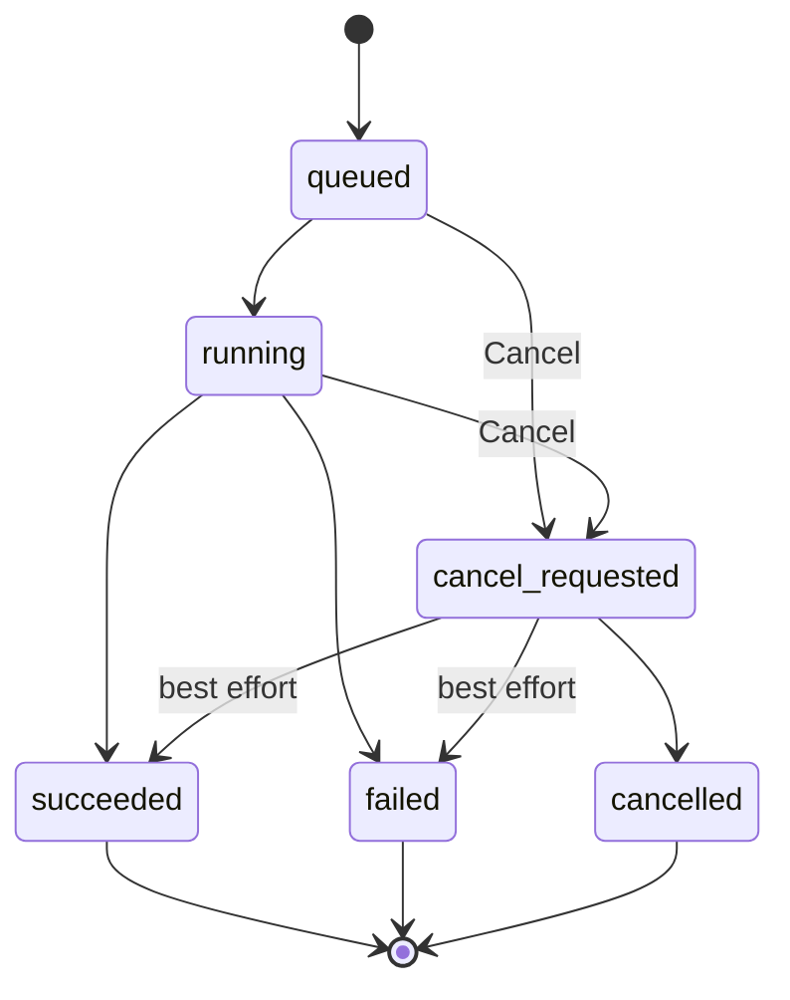
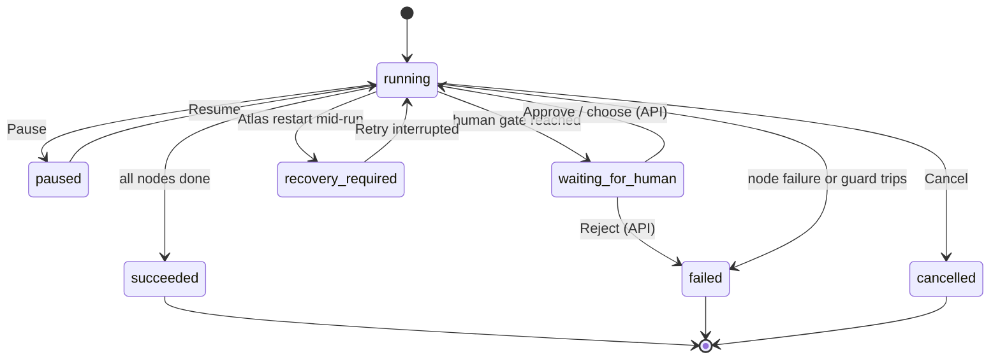

# Atlas Web User Guide

This guide covers the embedded Atlas Control Plane web UI — a minimal ops
console for registering thClaws workers, monitoring jobs and workflow runs,
reviewing audit/usage, and managing accounts.

> Atlas is the control plane; thClaws workers perform the work. A workspace path
> must therefore exist on the worker machine, not necessarily on the Atlas host.

> **Scope.** The embedded UI is deliberately minimal. Building and editing
> workflows, deciding approvals, and managing triggers and deliveries are done
> through **[flow-designer](https://github.com/kaebmoo/flow-designer)** — the
> full operator frontend for Atlas; see its
> [Web User Guide](https://github.com/kaebmoo/flow-designer/blob/main/docs/guides/web-user-guide-en.md) —
> or directly through the REST API (see
> [API Reference](../specs/api-reference-en.md) and
> [Workflow Examples](../workflow-examples.md)). Submitting an ad-hoc job with
> routing/handoff, uploading a file to a run, and importing or exporting a
> solution pack have no UI in either frontend today; they remain API-only. This
> console focuses on what an operator needs at a glance: fleet health, live job
> output (including a per-job tool-call timeline), run progress, audit, usage,
> and identities.

## 1. Start the system

Start at least one thClaws worker:

```bash
THCLAWS_API_TOKEN="dev-token-1" \
thclaws --serve --bind 127.0.0.1 --port 4317
```

Use a different port for each additional worker. Assign meaningful roles and
tags such as `reporter`, `reviewer`, `coder`, or `workflow_builder` in Atlas.

Before the first production login, create the administrator (the initial API
token is printed once):

```bash
python3 -m atlas.admin create-admin admin
```

Start Atlas:

```bash
cd /Users/seal/Documents/GitHub/atlas-control-plane
python3 -m atlas --host 127.0.0.1 --port 8787
```

Alternatively, run `./scripts/run.sh`. Open `http://127.0.0.1:8787`, sign in with
the per-instance username/password, and stop the server with `Ctrl+C`. Atlas uses
`data/atlas.sqlite` by default.

## 2. Web UI overview

| View | Purpose |
| --- | --- |
| **Overview** | Default landing dashboard: fleet, job, run, and approval stat tiles (each links to its detail view) plus recent jobs |
| **Monitor** | Inspect workflow runs: progress, node status, timeline, artifacts, recovery controls |
| **Jobs** | Inspect jobs, live output, tool timeline, events, files, and cancellation |
| **Audit** | Review recent control-plane actions |
| **Usage** | Per-period run/job/budget totals, a quota-threshold alert, and JSON/CSV download |
| **Fleet** | Manage workers and workspaces |
| **Accounts** | Admin-only: manage users and API tokens (see [§9](#9-accounts-users-and-api-tokens)) |

The sidebar counters show workers, active jobs, and pending approvals. The
Monitor badge counts pending approvals (decide them via
`POST /api/approvals/{id}/approve|reject|choose`); the Jobs badge counts
`queued`, `running`, and `cancel_requested` jobs.

The topbar's health chip shows whether the browser can currently reach Atlas.
**Dark/Light** toggles the console's theme; the choice is saved in the browser
and restored on reload.

**Refresh & poll** reloads data and polls every worker immediately. The UI also
reloads data every 5 seconds and polls workers every 60 seconds.

For first-time setup, use **Fleet** to register workers and workspaces, submit
work via the API, and watch it in **Jobs** or **Monitor**.

## 3. Fleet: workers and workspaces

### Add a worker

Open **Fleet**, click **Add worker**, and complete:

| Field | Meaning |
| --- | --- |
| **Name** | Human-readable name, for example `Reporter` |
| **Base URL** | thClaws URL, for example `http://127.0.0.1:4317` |
| **Token** | The worker's `THCLAWS_API_TOKEN` |
| **Role** | Primary routing role, for example `reporter` |
| **Tags** | Comma-separated routing hints, for example `local,news,thai` |

Click **Save Worker**. Atlas immediately polls the worker; a reachable worker
with a valid token becomes `online`.

Each worker card provides:

- **Poll** — refresh that worker's health and capabilities.
- **Edit** — update it; leave Token blank to retain the stored token.
- **Delete** — delete the worker and its workspaces after confirmation.
- **Poll all workers** — the arrow button in the Workers header.

Common states are `online`, `offline`, and `unknown`. Poll failures are visible
in **Audit**.

### Add a workspace

Click **Add workspace** after at least one worker exists:

| Field | Meaning |
| --- | --- |
| **Worker** | Worker that owns the directory |
| **Key** | Routing key such as `atlas` or `company-a` |
| **Directory** | Absolute path on the worker machine |
| **Company** | Organization/data scope used as a routing hint |
| **Tags** | Comma-separated routing hints |

Click **Save Workspace**. Workspace cards provide **Edit** and confirmed
**Delete** actions.

**Cancel**, the **×** button, or `Escape` closes an Add/Edit modal without saving.

## 4. Jobs: output and events

Jobs are created via `POST /api/jobs` (see
[API Reference](../specs/api-reference-en.md)); the Jobs view is where you watch
and manage them.

The Jobs list shows worker, state, timestamp, short ID, handoff relationships,
and prompt. Select a card to open it. When any listed job belongs to a
workflow run, filter chips above the list narrow it to one run (or **Manual**
for jobs not started by a workflow).

**Live stream** replays and follows worker output. **Timeline** shows a per-job
tool and skill call timeline — each call's name, status (started/ok/error/denied),
duration, and byte sizes, with per-job counters (tools run / denied / failed).
It is built from **structural metadata only**: tool inputs and outputs are never
stored or shown (only their byte size and SHA-256), so a payload can never leak a
secret. **Events** shows the raw event log — route, session, state, error,
completion, cancellation, handoff, message, close, and the worker's structured
events (`thinking`, `tool_use_*`, `skill_*`, `usage`, and any others). **Files**
lists downloads for any job artifacts collected via `collect_files`.

**Cancel** is available while a job is active. Cancellation is best effort at
the Atlas layer: the job first becomes `cancel_requested`, and the worker may
already have performed side effects.



| State | Meaning |
| --- | --- |
| `queued` | Waiting to start |
| `running` | Worker is executing |
| `cancel_requested` | Atlas accepted a cancellation request |
| `succeeded` | Completed successfully |
| `failed` | Failed; inspect events and error data |
| `cancelled` | Cancelled |

If the stream disconnects, select the job card again to replay events.

## 5. Monitor: workflow runs

### Runs and controls

**Runs** lists all workflow runs. Select a run to inspect state, jobs, budget,
completed/failed nodes, join progress, per-node status chips, the recent event
timeline, and full detail JSON. Click a node's status chip to open that node's
job in **Jobs**, filtered to this run.

- **Pause** pauses a running run.
- **Resume** continues a paused run without repeating completed nodes.
- **Cancel** cancels a non-terminal run.
- **Retry interrupted** is only for `recovery_required` and requires explicit
  confirmation of duplicate-side-effect risk.



After an Atlas restart, interrupted worker/manager nodes are not retried
automatically. Review the warning's node and job IDs before authorizing retry.

A run in `waiting_for_human` is decided through the API:
`POST /api/approvals/{id}/approve`, `/reject`, or `/choose` — the node chips show
which gate is waiting.

### Artifacts

An artifact is a named result saved on a workflow run so a later node, condition,
trigger, or reviewer can use it. For example, a reporter creates `notes`, a
writer reads `{artifact.notes}`, and then creates `script`.

**Artifacts** displays the selected run's keys, kinds, content, and metadata,
and offers a download for every `file_ref` artifact:

| Displayed value | Meaning |
| --- | --- |
| `notes` / `script` | Keys used by the workflow to address results |
| `text` / `json` | Data available to later nodes as `{artifact.KEY}` |
| `file_ref` | A pointer to binary bytes stored by Atlas, not file content inserted into a prompt |
| filename, size, SHA-256 | Metadata used to identify and verify a file |

To attach a file to a run (for example a contract PDF for a human gate), upload
it via the API: `POST /api/workflow-runs/{id}/files?key=<key>`. The default limit
is 10 MiB; administrators can change it with `ATLAS_MAX_UPLOAD_BYTES`. Download
returns the exact file Atlas stored; it does not browse a worker's filesystem.
See [Concepts: Artifact kinds](../concepts-en.md#9-artifact-kinds) for the full
model.

## 6. Audit

**Audit** shows recent control-plane actions such as `worker.poll`, `job.create`,
`job.succeeded`, and `session.bind`, with timestamps and JSON details. Use it to
trace state changes and poll/run errors. Filter chips (**All**, `job`,
`workflow`, `worker`, `approval`) narrow the list; the UI renders up to 30
matching entries from the latest fetched batch. A row for a job or workflow run
is clickable and jumps straight to that job in **Jobs** (and opens its stream)
or that run in **Monitor**; a worker-related row jumps to **Fleet**.

## 7. Security and remote access

- Atlas requires a valid per-user API token by default. The dashboard login
  exchanges username/password for a token stored in browser local storage;
  **Sign out** revokes that token.
- Assign least privilege: `viewer` reads, `operator` runs work, `auditor` reads
  audit/usage, and `admin` manages identities and all resources.
- Use real, separate worker tokens.
- Worker tokens are stored in SQLite and are never returned by the dashboard
  API; responses only expose `token_set`.
- `ATLAS_LOOPBACK_NO_AUTH=false` is the secure default. Set it to `true` only for
  explicit local development; bypass is limited to `127.0.0.1` and `::1`.
- `ATLAS_API_TOKEN`, when configured, remains a legacy bootstrap admin token.
- Set a high-entropy `ATLAS_SECRET_KEY` to encrypt worker tokens at rest and sign
  offline usage exports.
- Do not expose Atlas or thClaws publicly without authentication and TLS.

## 8. Usage metering and offline export

### Usage view (dashboard)

Administrators and auditors see a **Usage** view. Set an optional **From**/**To**
range and click **Load** to show five metric tiles for the period — workflow
runs, jobs, budget units, Tokens (prompt · output), and Est. cost (USD) — plus a
7-day workflow-runs bar chart, with **Download JSON** / **Download CSV** buttons.
Tokens and Est. cost are visibility-only, non-billable estimates counted from
worker usage; they are not an invoice. Enter an **Expected runs**
target and an **Alert at %** threshold to get a read-only quota alert (e.g. "7 / 10
expected runs used (70%)") that turns red once the run volume crosses the threshold.
The alert is a volume signal only — it never affects `budget_units`, which stays the
per-run cost guard.

Atlas records one event per terminal job and one per terminal workflow run.
Administrators and auditors can export a date range:

```bash
curl -H 'Authorization: Bearer <token>' \
  'http://127.0.0.1:8787/api/usage?from=2026-06-01&to=2026-06-30&format=csv'
```

On the Atlas host, create and verify an air-gapped signed JSON file:

```bash
ATLAS_SECRET_KEY='<secret>' python3 -m atlas.usage export usage.json \
  --from 2026-06-01 --to 2026-06-30
ATLAS_SECRET_KEY='<secret>' python3 -m atlas.usage verify usage.json
```

The file contains raw usage only. Atlas does not calculate prices or invoices,
and BYOK model/token counts are visibility-only. Protect the file and signing
key as billing/audit material.

## 9. Accounts: users and API tokens

Administrators see an **Accounts** view for creating and managing users and API
tokens directly from the dashboard — a browser-based alternative to the raw
`/api/users` and `/api/tokens` endpoints.

### Users

| Field | Usage |
| --- | --- |
| **Username** | Login name |
| **Password** | Set on creation; there is no in-place password-change action here |
| **Role** | `viewer`, `operator`, `auditor`, or `admin` |

Click **Add user** to create the account. Each user card shows status, token
count, and creation time, and provides:

- **Suspend / Enable** — toggle between `active` and `disabled`; disabled for
  your own account.
- **Delete** — remove the user after confirmation; disabled for your own
  account.

### API tokens

| Field | Usage |
| --- | --- |
| **Name** | Label for the token, for example `ci-deploy` |
| **User** | Account the token authenticates as |

Click **Create token**. Atlas shows the full token value once in a reveal
panel — copy it immediately, since it is never shown again (see [§7](#7-security-and-remote-access)).
Token cards show creation time and provide confirmed **Revoke**.

## 10. Troubleshooting

| Symptom | Check |
| --- | --- |
| Worker is `offline` | Process/port, Base URL, firewall, and worker token |
| `No workers registered` | Add and poll a worker in Fleet |
| `role has no matching worker` | Add a matching role/tag via the API's suggest-workers helper |
| `unknown worker_id` | Graph references a deleted or incorrect worker ID |
| `missing prompt variable` | Verify referenced input and artifact paths |
| `output_format=json` fails | Worker must return parseable JSON only |
| Run does not start | Validate the workflow and run input via the API |
| Resume is disabled | Resume is for `paused`; use Retry interrupted for recovery |

For workflow authoring, approvals, triggers, and deliveries, see
[flow-designer's Web User Guide](https://github.com/kaebmoo/flow-designer/blob/main/docs/guides/web-user-guide-en.md).
For everything reachable only through the API today (ad-hoc jobs with handoff,
run file uploads, solution packs, draft/explain/repair, and worker/trigger
suggestions), see [Workflow Examples](../workflow-examples.md),
[API Reference](../specs/api-reference-en.md), and
[Concepts & Reference](../concepts-en.md).
