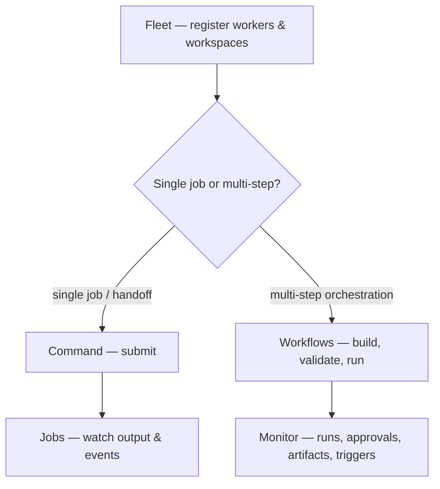
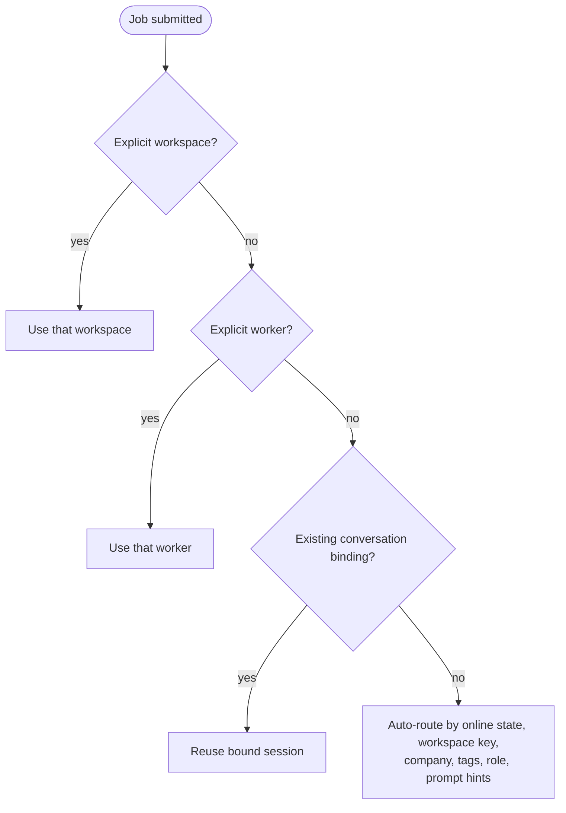
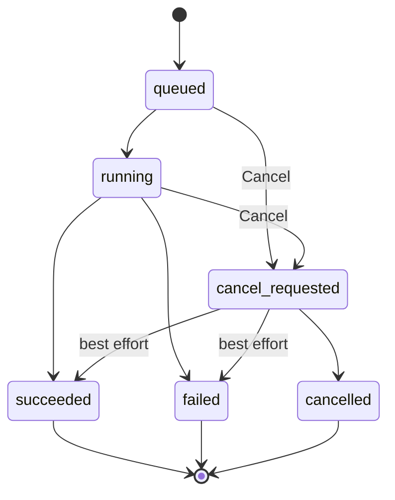
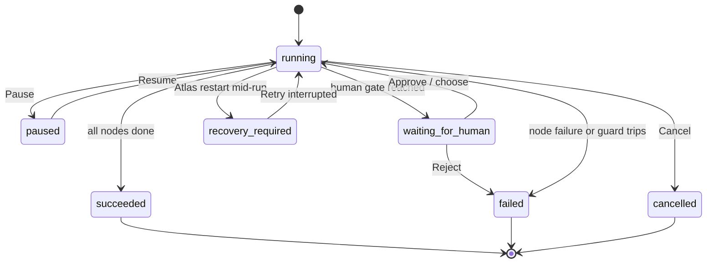

# Atlas Web User Guide

This guide covers the current Atlas Control Plane web UI end to end, from
registering thClaws workers to running and monitoring workflows.

> Atlas is the control plane; thClaws workers perform the work. A workspace path
> must therefore exist on the worker machine, not necessarily on the Atlas host.

## 1. Start the system

Start at least one thClaws worker:

```bash
THCLAWS_API_TOKEN="dev-token-1" \
thclaws --serve --bind 127.0.0.1 --port 4317
```

Use a different port for each additional worker. Assign meaningful roles and
tags such as `reporter`, `reviewer`, `coder`, or `workflow_builder` in Atlas.

Before the first production login, create the administrator (the initial API
token is printed once):

```bash
python3 -m atlas.admin create-admin admin
```

Start Atlas:

```bash
cd /Users/seal/Documents/GitHub/atlas-control-plane
python3 -m atlas --host 127.0.0.1 --port 8787
```

Alternatively, run `./scripts/run.sh`. Open `http://127.0.0.1:8787`, sign in with
the per-instance username/password, and stop the server with `Ctrl+C`. Atlas uses
`data/atlas.sqlite` by default.

## 2. Web UI overview

| View | Purpose |
| --- | --- |
| **Overview** | Default landing dashboard: fleet, job, run, and approval stat tiles plus recent jobs |
| **Command** | Submit a single job or a two-stage handoff |
| **Workflows** | Create, validate, explain, repair, and run workflows |
| **Monitor** | Inspect workflow runs, approvals, artifacts, and triggers |
| **Jobs** | Inspect jobs, live output, events, and cancellation |
| **Audit** | Review recent control-plane actions |
| **Usage** | Per-period run/job/budget totals, a quota-threshold alert, and JSON/CSV download |
| **Fleet** | Manage workers and workspaces |
| **Accounts** | Admin-only: manage users and API tokens (see [§11](#11-accounts-users-and-api-tokens)) |

The sidebar counters show workers, active jobs, and pending approvals. The Monitor
badge counts pending approvals; the Jobs badge counts `queued`, `running`, and
`cancel_requested` jobs.

**Refresh & poll** reloads data and polls every worker immediately. The UI also
reloads data every 5 seconds and polls workers every 60 seconds.

For first-time setup, use **Fleet → Command → Jobs**. Use **Workflows → Monitor**
for multi-step orchestration.

Administrators and auditors also get the **Usage** view (period totals, a quota
alert, and downloads); the API and host CLI in
[§10](#10-usage-metering-and-offline-export) remain available for automation and
air-gapped signed exports.



## 3. Fleet: workers and workspaces

### Add a worker

Open **Fleet**, click **Add worker**, and complete:

| Field | Meaning |
| --- | --- |
| **Name** | Human-readable name, for example `Reporter` |
| **Base URL** | thClaws URL, for example `http://127.0.0.1:4317` |
| **Token** | The worker's `THCLAWS_API_TOKEN` |
| **Role** | Primary routing role, for example `reporter` |
| **Tags** | Comma-separated routing hints, for example `local,news,thai` |

Click **Save Worker**. Atlas immediately polls the worker; a reachable worker
with a valid token becomes `online`.

Each worker card provides:

- **Poll** — refresh that worker's health and capabilities.
- **Edit** — update it; leave Token blank to retain the stored token.
- **Delete** — delete the worker and its workspaces after confirmation.
- **Poll all workers** — the arrow button in the Workers header.

Common states are `online`, `offline`, and `unknown`. Poll failures are visible
in **Audit**.

### Add a workspace

Click **Add workspace** after at least one worker exists:

| Field | Meaning |
| --- | --- |
| **Worker** | Worker that owns the directory |
| **Key** | Routing key such as `atlas` or `company-a` |
| **Directory** | Absolute path on the worker machine |
| **Company** | Organization/data scope used as a routing hint |
| **Tags** | Comma-separated routing hints |

Click **Save Workspace**. Workspace cards provide **Edit** and confirmed
**Delete** actions.

**Cancel**, the **×** button, or `Escape` closes an Add/Edit modal without saving.

## 4. Command: jobs and handoffs

### Submit a job

| Field | Usage |
| --- | --- |
| **Prompt** | Required task for the worker |
| **Conversation** | Start a new conversation or reuse an existing session binding |
| **Worker** | Auto-route or force a worker |
| **Workspace** | Auto-route or force a workspace |
| **Model** | Optional model override; blank uses the worker default |
| **Collect files** | Optional comma-separated relative paths to freeze as job artifacts on success; see [API Reference: Frozen Job Artifacts](../specs/api-reference-en.md#frozen-job-artifacts-collect_files-t9a) |
| **Async (callback)** | Opt in to fire-and-forget `execution: "callback"` dispatch; requires `ATLAS_PUBLIC_BASE_URL` on the server; see [API Reference: Async execution](../specs/api-reference-en.md#async-execution-execution-callback) |

The route preview under the Command heading reflects precedence:

1. An explicit workspace wins.
2. Otherwise, an explicit worker wins.
3. An existing conversation prefers its existing binding.
4. Full auto-routing considers online state, workspace key, company, tags, role,
   and prompt hints.



Click **Run**. Atlas creates the job, clears Prompt, opens **Jobs**, and selects
the new job.

### Handoff after success

Enable **Hand off after success** when job B should start only after job A
succeeds.

| Field | Usage |
| --- | --- |
| **Send to worker** | Destination worker |
| **Send to workspace** | Destination workspace; takes precedence over worker |
| **Handoff prompt** | Child-job prompt |

Handoff prompt variables are `{result}`, `{source_prompt}`, and
`{source_job_id}`. Select at least one destination worker or workspace. Job cards
show `handoff armed`, `handoff ->`, `child of`, or `handoff error` as applicable.

## 5. Jobs: output and events

The Jobs list shows worker, state, workspace, timestamp, short ID, handoff
relationships, and prompt. Select a card to open it.

**Live stream** replays and follows worker output. **Timeline** shows a per-job
tool and skill call timeline — each call's name, status (started/ok/error/denied),
duration, and byte sizes, with per-job counters (tools run / denied / failed).
It is built from **structural metadata only**: tool inputs and outputs are never
stored or shown (only their byte size and SHA-256), so a payload can never leak a
secret. **Events** shows the raw event log — route, session, state, error,
completion, cancellation, handoff, message, close, and the worker's structured
events (`thinking`, `tool_use_*`, `skill_*`, `usage`, and any others). **Files**
lists downloads for any job artifacts collected via `collect_files`.

**Cancel** is available while a job is active. Cancellation is best effort at
the Atlas layer: the job first becomes `cancel_requested`, and the worker may
already have performed side effects.



| State | Meaning |
| --- | --- |
| `queued` | Waiting to start |
| `running` | Worker is executing |
| `cancel_requested` | Atlas accepted a cancellation request |
| `succeeded` | Completed successfully |
| `failed` | Failed; inspect events and error data |
| `cancelled` | Cancelled |

If the stream disconnects, select the job card again to replay events.

## 6. Workflows: multi-step work

Below the graph canvas, the editor is split into four section tabs — **Design**
(Graph JSON and Builder Lite), **Policy**, **Run** (run input and worker
resolution), and **Assist** (Draft from plain language) — and only the active
tab's fields are shown.

### Definitions and templates

- **New** resets the editor for a new definition.
- Select an item under **Definitions** to edit it.
- The dot beside the Workflows title indicates unsaved editor changes.
- Select a template and click **Copy template to editor**. This creates an
  unsaved preview.

Available templates are News Desk, Researcher → Writer → Reviewer, Coder →
Tester → Reviewer, and Manager-directed loop.

Save anything you need before clicking New, selecting another definition,
copying a template, or drafting: these actions can replace the preview, and the
current UI does not confirm when switching definitions. This UI version has no
workflow-definition delete action.

### Packs

The rail's **Packs** list shows portable `atlas.pack.v1` files available on the
server. Click **Import pack from file (.json)** to load a pack, which creates
its workflow definition(s) and trigger(s) after validating the graph as usual.
Select a workflow and click **Export this workflow as a pack** to download it
as a shareable JSON file. See [Solution Pack Format](../specs/pack-format.md)
for the file structure.

### Definition and Graph JSON

Enter **Name**, optional **Description**, and **Graph JSON**. A graph needs
`start`, `nodes`, and `edges`:

```json
{
  "start": "reporter",
  "nodes": [
    {
      "id": "reporter",
      "type": "worker",
      "role": "reporter",
      "prompt": "Research {input.topic}",
      "outputs": ["notes"]
    },
    {
      "id": "writer",
      "type": "worker",
      "role": "writer",
      "prompt": "Write from {artifact.notes}"
    }
  ],
  "edges": [
    {"from": "reporter", "to": "writer", "condition": {"type": "always"}}
  ]
}
```

Here, `outputs: ["notes"]` means that after the reporter succeeds, Atlas saves
its entire response as the run's `notes` artifact. The writer reads it through
`{artifact.notes}`. Without `outputs`, the response remains visible in Jobs but
no artifact with that key exists for a later node. The current engine uses the
first key in `outputs`.

| Node type | Purpose |
| --- | --- |
| `worker` | Creates a thClaws job |
| `manager` | Proposes allowed next nodes under graph and policy constraints |
| `join` | Joins fan-out with `all`, `any`, or `quorum`; creates no job |
| `human_gate` | Waits for approval or a choice; creates no job |

Join modes: `all` waits for **every** upstream branch, `any` continues after the
**first** branch finishes, and `quorum` continues once **`quorum`** branches
finish.

UI-supported conditions are `always`, `artifact_equals`, `artifact_in`,
`manager_selected`, `human_selected`, and `max_iterations_below`.

Use `{input.topic}` for run input and `{artifact.notes}` for artifacts. See
[Workflow Examples](../workflow-examples.md) for complete graphs, and
[Concepts & Reference](../concepts-en.md) for full definitions of every node type,
join mode, condition, artifact kind, policy field, and trigger.

### Builder Lite

Expand **Builder Lite — add nodes & edges...** to update the Graph JSON preview.
It does not save automatically.

Add node fields include Node ID, Node type, Role/label, Prompt/reason, Outputs,
Collect files (frozen job artifacts, comma-separated globs), Budget units,
Human choices (`publish:Publish, revise:Revise`), Join mode, and Join quorum.
Add edge fields include From, To, Condition, Artifact/node, Path, Value(s)/max,
and Push files (artifact-key globs handed to the downstream node; requires the
Policy **File handoff** toggle); the selected condition determines which
condition fields are used.

Click **Suggest workers** to diagnose unresolved worker nodes. Where a suggestion
is available, **Apply To JSON** adds its `worker_id`/`workspace_id` to the
preview. Review it before saving.

### Policy

The form and **Policy JSON** remain synchronized while JSON is valid.

| Field | Constraint |
| --- | --- |
| **Max jobs** | Maximum jobs per run |
| **Max iterations** | Maximum iterations |
| **Max attempts / node** | Maximum executions per node |
| **Max minutes** | Overall runtime limit |
| **Human after iterations** | Require one human approval after the threshold |
| **Max budget units** | Integer budget limit; not money or token usage |
| **Allowed worker IDs** | Comma-separated allowlist |
| **Allowed workspace IDs** | Comma-separated allowlist |
| **Stop on first failure** | Stop on the first failed branch when enabled |
| **File handoff** | Must be enabled for any edge's `push_files` to take effect; off by default |

Invalid raw JSON is preserved and does not update the form; repair its syntax
before continuing.

### Editor actions

| Action | Result |
| --- | --- |
| **Save** | Create or update the definition |
| **Validate** | Validate the current graph/policy; requires a saved definition |
| **Explain** | Explain the saved definition without changing it |
| **Repair** | Copy a validated repair into previews; never saves automatically |

Review Repair output and explicitly click **Save** if it should become active.

### Run a workflow

Save the definition first. Enter **Run input JSON**, for example:

```json
{"topic": "technology news"}
```

Click **Run workflow**. Atlas creates the run and opens **Monitor**.

### Draft from plain language

Register a worker whose role or tag is `workflow_builder`. Enter a description
in the Draft **Prompt** and click **Draft**. Graph and policy previews are loaded
into the editor; explanation, warnings, and trigger drafts appear below. Nothing
is saved automatically.

## 7. Monitor: workflow operations

### Runs and controls

**Runs** shows runs for the selected workflow, or all runs when no definition is
selected. Select a run to inspect state, jobs, budget, completed/failed nodes,
join progress, and full detail JSON.

- **Pause** pauses a running run.
- **Resume** continues a paused run without repeating completed nodes.
- **Cancel** cancels a non-terminal run.
- **Retry interrupted** is only for `recovery_required` and requires explicit
  confirmation of duplicate-side-effect risk.



After an Atlas restart, interrupted worker/manager nodes are not retried
automatically. Review the warning's node and job IDs before authorizing retry.

### Artifacts

An artifact is a named result saved on a workflow run so a later node, condition,
trigger, or reviewer can use it. For example, a reporter creates `notes`, a
writer reads `{artifact.notes}`, and then creates `script`.

**Artifacts** displays the selected run's keys, kinds, content, and metadata:

| Displayed value | Meaning |
| --- | --- |
| `notes` / `script` | Keys used by the workflow to address results |
| `text` / `json` | Data available to later nodes as `{artifact.KEY}` |
| `file_ref` | A pointer to binary bytes stored by Atlas, not file content inserted into a prompt |
| filename, size, SHA-256 | Metadata used to identify and verify a file |

To upload, select a run, enter **File key**, choose **File**, and click
**Upload file**. The default limit is 10 MiB; administrators can change it with
`ATLAS_MAX_UPLOAD_BYTES`.

Example: a contract-approval workflow pauses at a human gate. Select that run,
use key `contract`, and upload `contract.pdf`. The reviewer downloads it from
Artifacts, reads it, and then chooses Approve or Reject.

> Upload stores the file in Atlas and ties it to the run; it does not place the
> file in a worker workspace, and a worker does not automatically read the PDF,
> image, or other file. Download returns the exact file Atlas stored; it does not
> browse a worker's filesystem.

Use file artifacts for human document review, auditable evidence, deliverables,
or an external integration that fetches the file. Worker-side file analysis
requires a separate integration that downloads and reads it for the worker. See
[Concepts: Artifact kinds](../concepts-en.md#9-artifact-kinds) for the full model.

### Approvals, manager decisions, and timeline

For `waiting_for_human` runs, a normal gate provides **Approve** and **Reject**;
a choice gate provides one button per choice plus **Reject**. A gate can be
decided only once.

**Manager decisions** shows proposals and acceptance/rejection reasons.
**Timeline** shows ordered workflow events and payloads.

### Triggers

Select a saved workflow definition before creating a trigger.

| Quick trigger | Quick value | Generated config |
| --- | --- | --- |
| `manual` | unused | `{}` |
| `webhook` | unused | `{}` |
| `schedule interval` | minutes, e.g. `15` | `{"interval_minutes": 15}` |
| `schedule daily` | local time, e.g. `09:30` | `{"daily_time": "09:30"}` |

Click **Apply to JSON**, then review Name, Type, Enabled, and Config JSON before
clicking **Create trigger**.

Supported types are `manual`, `schedule`, `webhook`,
`workflow_run_completed`, `artifact_created`, and `worker_status_changed`.

Optional internal-event filters are:

- `workflow_run_completed`: `source_workflow_definition_id`, `state`
- `artifact_created`: `source_workflow_definition_id`, `key`, `kind`
- `worker_status_changed`: `worker_id`, `status`

For a webhook, create a `webhook` trigger and send its payload to the trigger
endpoint described in [Workflow Examples](../workflow-examples.md). Reuse a
stable `dedupe_key` when retrying the same event. Atlas emits the three internal
event types; their cards do not provide Fire.

**Suggest triggers** asks the workflow builder for validated configurations,
using the Draft prompt when present. The first suggestion is copied into the
form but is not created.

Trigger cards provide **Enable/Disable**, **Fire** for manual/schedule/webhook,
and confirmed **Delete**. Fire uses the current Run input JSON as payload. Select
the card itself to inspect recent `received`, `started`, `ignored`, or `failed`
events.

### Deliveries

The **Deliveries** panel lists outbound webhook delivery attempts (the signed
result Atlas POSTs to a run's `_meta.reply.callback_url`), each with its status
— `delivered`, `pending`, `failed`, or `blocked` — attempt count, and last
error. A **Retry** button is offered for `failed` and `blocked` deliveries.

## 8. Audit

**Audit** shows recent control-plane actions such as `worker.poll`, `job.create`,
`job.succeeded`, and `session.bind`, with timestamps and JSON details. Use it to
trace state changes and poll/run errors. The UI renders a subset of the latest
30 fetched audit entries.

## 9. Security and remote access

- Atlas requires a valid per-user API token by default. The dashboard login
  exchanges username/password for a token stored in browser local storage;
  **Sign out** revokes that token.
- Assign least privilege: `viewer` reads, `operator` runs work, `auditor` reads
  audit/usage, and `admin` manages identities and all resources.
- Use real, separate worker tokens.
- Worker tokens are stored in SQLite and are never returned by the dashboard
  API; responses only expose `token_set`.
- `ATLAS_LOOPBACK_NO_AUTH=false` is the secure default. Set it to `true` only for
  explicit local development; bypass is limited to `127.0.0.1` and `::1`.
- `ATLAS_API_TOKEN`, when configured, remains a legacy bootstrap admin token.
- Set a high-entropy `ATLAS_SECRET_KEY` to encrypt worker tokens at rest and sign
  offline usage exports.
- Do not expose Atlas or thClaws publicly without authentication and TLS.

## 10. Usage metering and offline export

### Usage view (dashboard)

Administrators and auditors see a **Usage** view. Set an optional **From**/**To**
range and click **Load** to show five metric tiles for the period — workflow
runs, jobs, budget units, Tokens (prompt · output), and Est. cost (USD) — plus a
7-day workflow-runs bar chart, with **Download JSON** / **Download CSV** buttons.
Tokens and Est. cost are visibility-only, non-billable estimates counted from
worker usage; they are not an invoice. Enter an **Expected runs**
target and an **Alert at %** threshold to get a read-only quota alert (e.g. "7 / 10
expected runs used (70%)") that turns red once the run volume crosses the threshold.
The alert is a volume signal only — it never affects `budget_units`, which stays the
per-run cost guard.

Atlas records one event per terminal job and one per terminal workflow run.
Administrators and auditors can export a date range:

```bash
curl -H 'Authorization: Bearer <token>' \
  'http://127.0.0.1:8787/api/usage?from=2026-06-01&to=2026-06-30&format=csv'
```

On the Atlas host, create and verify an air-gapped signed JSON file:

```bash
ATLAS_SECRET_KEY='<secret>' python3 -m atlas.usage export usage.json \
  --from 2026-06-01 --to 2026-06-30
ATLAS_SECRET_KEY='<secret>' python3 -m atlas.usage verify usage.json
```

The file contains raw usage only. Atlas does not calculate prices or invoices,
and BYOK model/token counts are visibility-only. Protect the file and signing
key as billing/audit material.

## 11. Accounts: users and API tokens

Administrators see an **Accounts** view for creating and managing users and API
tokens directly from the dashboard — a browser-based alternative to the raw
`/api/users` and `/api/tokens` endpoints.

### Users

| Field | Usage |
| --- | --- |
| **Username** | Login name |
| **Password** | Set on creation; there is no in-place password-change action here |
| **Role** | `viewer`, `operator`, `auditor`, or `admin` |

Click **Add user** to create the account. Each user card shows status, token
count, and creation time, and provides:

- **Suspend / Enable** — toggle between `active` and `disabled`; disabled for
  your own account.
- **Delete** — remove the user after confirmation; disabled for your own
  account.

### API tokens

| Field | Usage |
| --- | --- |
| **Name** | Label for the token, for example `ci-deploy` |
| **User** | Account the token authenticates as |

Click **Create token**. Atlas shows the full token value once in a reveal
panel — copy it immediately, since it is never shown again (see [§9](#9-security-and-remote-access)).
Token cards show creation time and provide confirmed **Revoke**.

## 12. Troubleshooting

| Symptom | Check |
| --- | --- |
| Worker is `offline` | Process/port, Base URL, firewall, and worker token |
| `No workers registered` | Add and poll a worker in Fleet |
| `role has no matching worker` | Add a matching role/tag or apply a suggestion |
| `unknown worker_id` | Graph references a deleted or incorrect worker ID |
| `missing prompt variable` | Verify referenced input and artifact paths |
| `output_format=json` fails | Worker must return parseable JSON only |
| Manager is invalid/rejected | Inspect schema, edge, artifact, allowlist, and guard reasons |
| Run does not start | Save first; validate Run input JSON and the workflow |
| Resume is disabled | Resume is for `paused`; use Retry interrupted for recovery |
| Upload fails | Select a run, supply a key, and check the size limit |

For schemas and API examples, see [Workflow Examples](../workflow-examples.md)
and [Architecture](../architecture.md).
