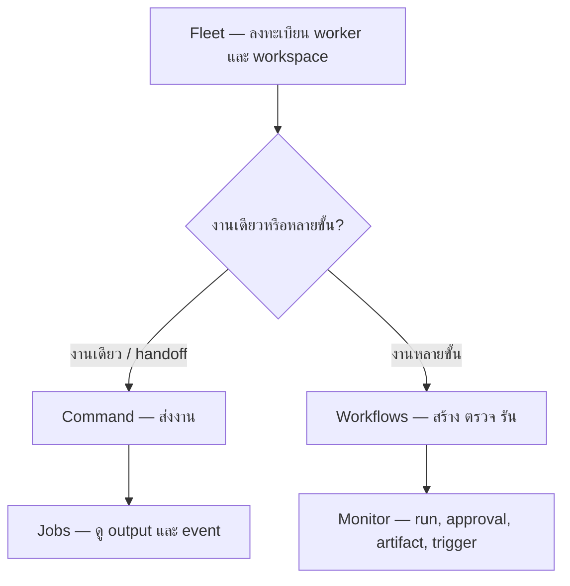
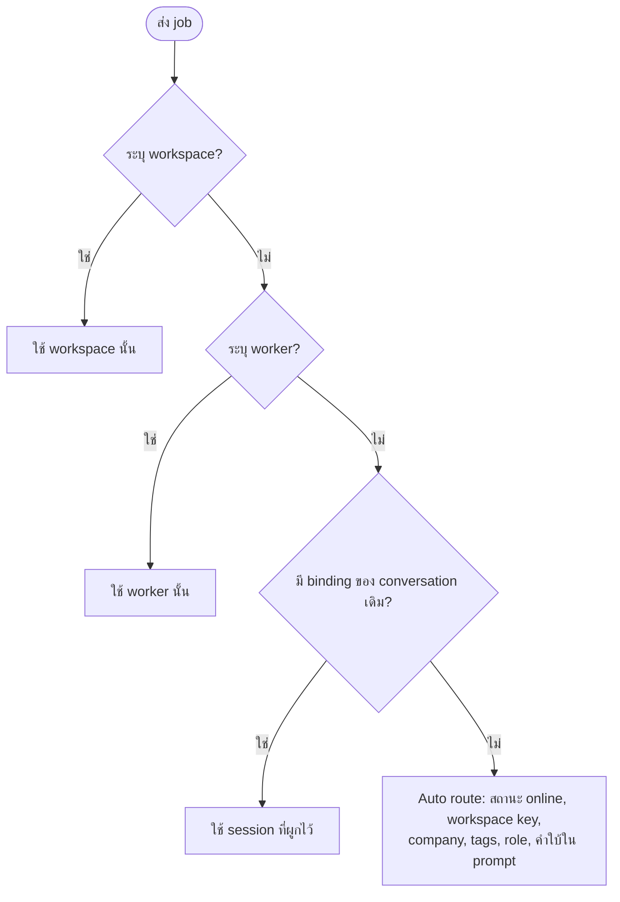
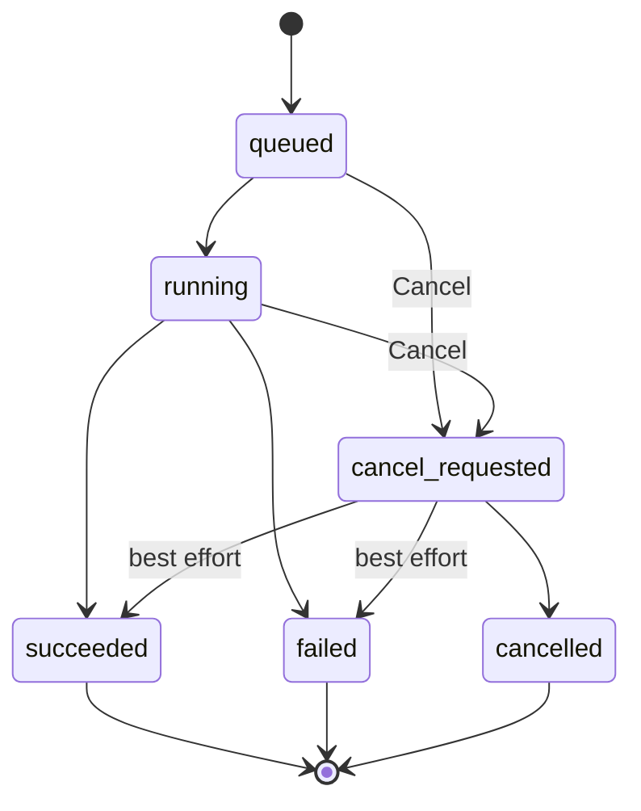
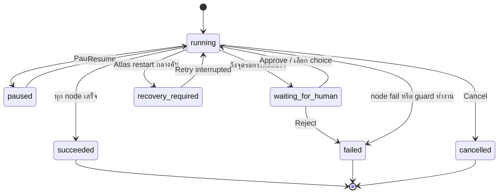

# คู่มือใช้งาน Atlas ผ่านเว็บ

คู่มือนี้อธิบายหน้าเว็บ Atlas Control Plane รุ่นปัจจุบันครบทุกเมนู ตั้งแต่เพิ่ม
thClaws worker ไปจนถึงสร้างและติดตาม workflow

> Atlas เป็น control plane ส่วน thClaws worker เป็นตัวประมวลผลงานจริง
> path ของ workspace จึงต้องมีอยู่บนเครื่อง worker ไม่ใช่เครื่องที่เปิด Atlas

## 1. เริ่มระบบ

### 1.1 เปิด thClaws worker

เปิดอย่างน้อยหนึ่ง worker และกำหนด token:

```bash
THCLAWS_API_TOKEN="dev-token-1" \
thclaws --serve --bind 127.0.0.1 --port 4317
```

ถ้ามีหลาย worker ให้ใช้คนละ port และตั้ง role/tags ให้สื่อถึงหน้าที่ เช่น
`reporter`, `reviewer`, `coder` หรือ `workflow_builder`

ก่อน login ครั้งแรกใน production ให้สร้าง administrator (ระบบแสดง initial API token
เพียงครั้งเดียว):

```bash
python3 -m atlas.admin create-admin admin
```

### 1.2 เปิด Atlas

```bash
cd /Users/seal/Documents/GitHub/atlas-control-plane
python3 -m atlas --host 127.0.0.1 --port 8787
```

หรือ:

```bash
./scripts/run.sh
```

จากนั้นเปิด `http://127.0.0.1:8787`, login ด้วย username/password ของ instance
และหยุดระบบด้วย `Ctrl+C`

Atlas ใช้ SQLite ที่ `data/atlas.sqlite` โดยปริยาย ไม่ต้องติดตั้งฐานข้อมูลเพิ่ม

## 2. ภาพรวมหน้าเว็บ

เมนูหลักมี 7 หน้า:

| เมนู | ใช้ทำอะไร |
| --- | --- |
| **Command** | ส่ง prompt แบบงานเดียวหรือ handoff สองช่วง |
| **Workflows** | สร้าง ตรวจสอบ อธิบาย ซ่อม และสั่งรัน workflow |
| **Monitor** | ติดตาม workflow run, approval, artifact และ trigger |
| **Jobs** | ดู job, output แบบสด, event และยกเลิก job |
| **Audit** | ตรวจสอบ action ล่าสุดของ control plane |
| **Usage** | ยอด run/job/budget ต่อช่วงเวลา, แจ้งเตือน quota และดาวน์โหลด JSON/CSV |
| **Fleet** | จัดการ worker และ workspace |

แถบด้านซ้ายแสดงจำนวน worker, job ที่กำลังทำงาน และ job ที่จบแล้ว ป้ายตัวเลข
ที่ **Monitor** คือ approval ที่รอคนตัดสิน ส่วนป้ายที่ **Jobs** คือ job สถานะ
`queued`, `running` หรือ `cancel_requested`

ปุ่ม **Refresh & poll** โหลดข้อมูลใหม่และ poll worker ทุกตัวทันที หน้าเว็บโหลดข้อมูล
ใหม่อัตโนมัติทุก 5 วินาที และ poll worker ทุก 60 วินาที

ลำดับเริ่มใช้งานที่แนะนำคือ **Fleet → Command → Jobs** และค่อยใช้
**Workflows → Monitor** เมื่อต้องการงานหลายขั้น

`admin` และ `auditor` มีหน้า **Usage** (ยอดต่อช่วงเวลา, แจ้งเตือน quota และดาวน์โหลด)
ส่วน API และ CLI ตาม [§10](#10-usage-metering-และ-offline-export) ยังใช้ได้สำหรับงานอัตโนมัติ
และไฟล์ signed export แบบ air-gap



## 3. Fleet: จัดการ worker และ workspace

### 3.1 เพิ่ม worker

ไปที่ **Fleet** แล้วกด **Add worker** กรอกข้อมูลดังนี้:

| ช่อง | ความหมาย |
| --- | --- |
| **Name** | ชื่อที่อ่านง่าย เช่น `Reporter` |
| **Base URL** | URL ของ thClaws เช่น `http://127.0.0.1:4317` |
| **Token** | ค่า `THCLAWS_API_TOKEN` ของ worker |
| **Role** | หน้าที่หลักที่ใช้ route งาน เช่น `reporter` |
| **Tags** | คำช่วย route คั่นด้วย comma เช่น `local,news,thai` |

กด **Save Worker** แล้ว Atlas จะ poll ทันที ถ้า URL เข้าถึงได้และ token ถูกต้อง
สถานะจะเป็น `online`

การ์ด worker มีคำสั่ง:

- **Poll** ตรวจสุขภาพและ capability ของ worker ตัวนั้น
- **Edit** แก้ข้อมูลเดิม; เว้น Token ว่างเพื่อเก็บ token เดิม
- **Delete** ลบ worker พร้อม workspace ของ worker นั้น ต้องยืนยันก่อนลบ
- ปุ่มลูกศร **Poll all workers** ที่หัวการ์ดตรวจ worker ทุกตัว

สถานะที่พบบ่อยคือ `online`, `offline` และ `unknown` ข้อผิดพลาดการเชื่อมต่อจะดูได้
จาก **Audit**

### 3.2 เพิ่ม workspace

กด **Add workspace** (ต้องมี worker ก่อน) แล้วกรอก:

| ช่อง | ความหมาย |
| --- | --- |
| **Worker** | worker เจ้าของ directory นี้ |
| **Key** | ชื่ออ้างอิงสำหรับ route เช่น `atlas` หรือ `company-a` |
| **Directory** | absolute path บนเครื่อง worker |
| **Company** | ชื่อองค์กรหรือขอบเขตข้อมูล ใช้ช่วย auto route |
| **Tags** | คำช่วย route คั่นด้วย comma |

กด **Save Workspace** การ์ด workspace มี **Edit** และ **Delete** การลบต้องยืนยัน
ก่อนทุกครั้ง

ปุ่ม **Cancel**, ปุ่ม **×** หรือปุ่ม `Escape` ปิด modal Add/Edit โดยไม่บันทึก

## 4. Command: ส่งงานเดี่ยวและ handoff

### 4.1 ช่องส่งงาน

| ช่อง | วิธีใช้ |
| --- | --- |
| **Prompt** | งานที่ต้องการให้ worker ทำ; เป็นช่องบังคับ |
| **Conversation** | เลือก `New conversation` หรือบทสนทนาเดิมเพื่อใช้ session binding เดิม |
| **Worker** | `Auto route` หรือระบุ worker โดยตรง |
| **Workspace** | `Auto route` หรือระบุ workspace โดยตรง |
| **Model** | model override แบบ optional; เว้นว่างเพื่อใช้ค่าของ worker |

ข้อความใต้หัว **Command** เป็น route preview:

- เลือก workspace: workspace มีลำดับสูงสุด
- เลือก worker: route ไป worker นั้น
- เลือก conversation เดิม: Atlas พยายามใช้ binding เดิมก่อน
- Auto ทั้งหมด: Atlas พิจารณาสถานะ online, workspace key, company, tags, role
  และคำใบ้ใน prompt



กด **Run** แล้ว Atlas จะสร้าง job, ล้างช่อง Prompt, เปิดหน้า **Jobs** และเลือก job
ใหม่ให้อัตโนมัติ

### 4.2 Handoff หลังงานสำเร็จ

เปิด **Hand off after success** เมื่อต้องการให้ job B เริ่มหลัง job A สำเร็จ:

| ช่อง | วิธีใช้ |
| --- | --- |
| **Send to worker** | worker ปลายทาง |
| **Send to workspace** | workspace ปลายทาง; ถ้าเลือกช่องนี้จะมีผลเหนือ worker |
| **Handoff prompt** | prompt ของ job ลูก |

ตัวแปรที่ใช้ใน Handoff prompt:

- `{result}` — output ของ job ต้นทาง
- `{source_prompt}` — prompt ต้นทาง
- `{source_job_id}` — ID ของ job ต้นทาง

ต้องเลือก worker หรือ workspace ปลายทางอย่างน้อยหนึ่งอย่าง Handoff จะไม่เริ่มถ้า job
ต้นทางไม่สำเร็จ และสถานะ `handoff armed`, `handoff ->`, `child of` หรือ
`handoff error` จะปรากฏบนการ์ด job

## 5. Jobs: ดูผลและ event

รายการด้านซ้ายแสดง worker, state, workspace, เวลา, ID แบบย่อ, ความสัมพันธ์ handoff
และ prompt กดการ์ดใดก็ได้เพื่อเปิดรายละเอียดด้านขวา

ส่วน **Live stream** แสดง output ที่ส่งมาจาก worker แบบต่อเนื่อง ส่วน **Events** แสดง
เหตุการณ์ เช่น `route`, `session`, `state`, `error`, `done`, `handoff_started`
และ `close`

ปุ่ม **Cancel** ใช้ได้กับ job ที่ยังไม่จบ การยกเลิกเป็น best effort ที่ชั้น Atlas:
สถานะจะเปลี่ยนเป็น `cancel_requested` ก่อน และ worker อาจทำ side effect ไปแล้ว



สถานะ job ที่พบบ่อย:

| สถานะ | ความหมาย |
| --- | --- |
| `queued` | รอเริ่ม |
| `running` | worker กำลังทำงาน |
| `cancel_requested` | Atlas รับคำขอยกเลิกแล้ว |
| `succeeded` | สำเร็จ |
| `failed` | ล้มเหลว; ดู event/error เพิ่มเติม |
| `cancelled` | ยกเลิกแล้ว |

ถ้า stream หลุด ให้เลือกการ์ด job อีกครั้งเพื่อ replay event ตั้งแต่ต้น

## 6. Workflows: สร้างงานหลายขั้น

### 6.1 เลือกหรือเริ่ม definition

- **New** ล้าง editor เพื่อเริ่ม definition ใหม่
- กด definition ในรายการ **Definitions** เพื่อโหลดมาแก้ไข
- จุดสีข้างชื่อหน้า Workflows หมายถึงมี preview ที่แก้แล้วแต่ยังไม่ได้บันทึก
- เลือก **Template** แล้วกด **Copy template to editor** เพื่อคัดลอก template มาเป็น
  preview; ยังไม่บันทึกจนกว่าจะกด **Save**

Template ที่มีให้คือ News Desk, Researcher → Writer → Reviewer,
Coder → Tester → Reviewer และ Manager-directed loop

ก่อนกด New, เลือก definition อื่น, คัดลอก template หรือ Draft ให้บันทึกข้อความที่
ต้องการเก็บก่อน เพราะ action เหล่านี้อาจแทนที่ preview และหน้าเว็บยังไม่ถามยืนยัน
ตอนสลับ definition ไม่มีปุ่มลบ workflow definition ใน UI รุ่นนี้

### 6.2 Definition และ Graph JSON

กรอก **Name**, **Description** และ **Graph JSON** โดย graph ต้องมี `start`, `nodes`
และ `edges` ตัวอย่างขั้นต่ำ:

```json
{
  "start": "reporter",
  "nodes": [
    {
      "id": "reporter",
      "type": "worker",
      "role": "reporter",
      "prompt": "Research {input.topic}",
      "outputs": ["notes"]
    },
    {
      "id": "writer",
      "type": "worker",
      "role": "writer",
      "prompt": "Write from {artifact.notes}"
    }
  ],
  "edges": [
    {"from": "reporter", "to": "writer", "condition": {"type": "always"}}
  ]
}
```

ในตัวอย่างนี้ `outputs: ["notes"]` หมายถึง เมื่อ reporter สำเร็จ Atlas จะเก็บคำตอบ
ทั้งก้อนเป็น artifact ชื่อ `notes` ของ run นี้ แล้ว writer อ่านด้วย
`{artifact.notes}` ถ้าไม่ใส่ `outputs` คำตอบยังดูได้ในหน้า Jobs แต่ node ถัดไปจะไม่มี
artifact ชื่อนี้ให้เรียกใช้ Engine รุ่นปัจจุบันใช้ key ตัวแรกใน `outputs`

ชนิด node:

| Type | หน้าที่ |
| --- | --- |
| `worker` | สร้าง job บน thClaws worker |
| `manager` | ให้ worker เสนอ node ถัดไปภายใต้ edge/policy ที่กำหนด |
| `join` | รวม fan-out แบบ `all`, `any` หรือ `quorum`; ไม่สร้าง job |
| `human_gate` | หยุดรอผู้ใช้อนุมัติ ปฏิเสธ หรือเลือกขั้นตอนถัดไป; ไม่สร้าง job |

โหมด join: `all` รอ upstream **ทุกตัว**, `any` ไปต่อเมื่อ branch **แรก** เสร็จ และ
`quorum` ไปต่อเมื่อมี branch เสร็จครบ **`quorum`** ตัว

ชนิด condition ใน UI คือ `always`, `artifact_equals`, `artifact_in`,
`manager_selected`, `human_selected` และ `max_iterations_below`

Prompt อ้าง input ด้วย `{input.topic}` และ artifact ด้วย `{artifact.notes}` ดู graph
ฉบับเต็มใน [Workflow Examples](../workflow-examples.md) และดูนิยามทุกตัว (node type,
join mode, condition, artifact kind, policy, trigger) ใน
[Concepts & Reference](../concepts-th.md)

### 6.3 Builder Lite

เปิด **Builder Lite — add nodes & edges...** เพื่อเพิ่มข้อมูลลง Graph JSON preview
โดยไม่บันทึกอัตโนมัติ

ส่วน Add node มี:

- **Node ID**, **Node type**, **Role / label**, **Prompt / reason**
- **Outputs** สำหรับ worker, **Budget units** สำหรับ worker/manager
- **Human choices** รูปแบบ `publish:Publish, revise:Revise`
- **Join mode** และ **Join quorum** สำหรับ join

ส่วน Add edge มี **From**, **To**, **Condition**, **Artifact / node**, **Path** และ
**Value(s) / max** ช่องที่ถูกใช้ขึ้นกับ condition ที่เลือก

กด **Suggest workers** เพื่อวิเคราะห์ node ที่ยัง resolve worker ไม่ได้ ถ้ามีข้อเสนอ
กด **Apply To JSON** เพื่อใส่ `worker_id`/`workspace_id` ลง preview แล้วตรวจสอบก่อน Save

### 6.4 Policy

ฟอร์ม Policy และ **Policy JSON** sync กันเมื่อ JSON ถูกต้อง:

| ช่อง | ข้อจำกัด |
| --- | --- |
| **Max jobs** | จำนวน job สูงสุดต่อ run |
| **Max iterations** | จำนวนรอบสูงสุด |
| **Max attempts / node** | จำนวนครั้งสูงสุดต่อ node |
| **Max minutes** | เวลารวมสูงสุด |
| **Human after iterations** | บังคับรอคนหลังครบจำนวน iteration |
| **Max budget units** | budget จำนวนเต็มสูงสุด; ไม่ใช่เงินหรือ token |
| **Allowed worker IDs** | allowlist คั่นด้วย comma |
| **Allowed workspace IDs** | allowlist คั่นด้วย comma |
| **Stop on first failure** | หยุดทันทีเมื่อ branch แรก fail; ปิดเพื่อให้ branch อิสระไปต่อ |

ถ้าแก้ raw JSON จน parse ไม่ได้ ฟอร์มจะไม่เขียนทับ JSON นั้น ให้แก้ syntax ก่อน

### 6.5 ปุ่มด้านบน

| ปุ่ม | ผลลัพธ์ |
| --- | --- |
| **Save** | สร้างหรืออัปเดต definition |
| **Validate** | ตรวจ graph/policy ใน editor; ต้อง Save ให้มี definition ก่อน |
| **Explain** | อธิบาย definition ที่บันทึกไว้; แสดงผลอย่างเดียว |
| **Repair** | ขอฉบับซ่อมที่ validate แล้วและคัดลอกลง preview; ไม่ Save อัตโนมัติ |

ตรวจ preview จาก Repair ทุกครั้ง แล้วกด **Save** เองหากต้องการใช้จริง

### 6.6 Draft from plain language

ต้องมี worker ที่ role หรือ tag เป็น `workflow_builder` ใส่คำอธิบาย workflow ในช่อง
**Prompt** แล้วกด **Draft** ผลลัพธ์ graph/policy จะเข้า editor และ explanation,
warning, trigger draft จะแสดงด้านล่าง ทั้งหมดยังเป็น preview

### 6.7 รัน workflow

ต้อง **Save** ก่อน ใส่ **Run input JSON** เช่น:

```json
{"topic": "technology news"}
```

กด **Run workflow** ระบบจะสร้าง run และเปิด **Monitor** ให้ทันที

## 7. Monitor: ติดตาม workflow

### 7.1 Runs และ Run detail

รายการ **Runs** แสดง run ล่าสุดของ workflow ที่เลือก หรือทุก run ถ้าไม่ได้เลือก
definition กดการ์ดเพื่อดู state, jobs, budget, node ที่สำเร็จ/ล้มเหลว, join progress
และ JSON รายละเอียด

คำสั่งควบคุม:

- **Pause** หยุด run ที่กำลังทำงาน
- **Resume** ทำ run ที่ pause ไว้ต่อ โดยไม่ทำ completed node ซ้ำ
- **Cancel** ยกเลิก run ที่ยังไม่จบ
- **Retry interrupted** ใช้เฉพาะ `recovery_required` และต้องยืนยันความเสี่ยง side
  effect ซ้ำก่อน



หลัง Atlas restart, worker/manager node ที่ขาดช่วงจะไม่ถูก retry อัตโนมัติ ให้ตรวจ
node/job ใน warning ก่อนอนุญาต **Retry interrupted**

### 7.2 Artifacts

Artifact คือผลลัพธ์ที่ตั้งชื่อและเก็บกับ workflow run เพื่อให้ node ถัดไป, condition,
trigger หรือคนตรวจสอบนำไปใช้ต่อ ตัวอย่างเช่น reporter สร้าง artifact `notes`, writer
อ่าน `{artifact.notes}` แล้วสร้าง artifact `script`

ส่วน **Artifacts** แสดง key, kind, content และ metadata ของ run ที่เลือก:

| สิ่งที่เห็น | ความหมาย |
| --- | --- |
| `notes` / `script` | key ที่ workflow ใช้อ้างผลลัพธ์ |
| `text` / `json` | ข้อมูลที่ node ถัดไปอ่านผ่าน `{artifact.KEY}` ได้ |
| `file_ref` | ตัวชี้ไปไฟล์ binary ที่ Atlas เก็บ ไม่ใช่เนื้อไฟล์ใน prompt |
| filename, size, SHA-256 | metadata สำหรับตรวจชื่อ ขนาด และความถูกต้องของไฟล์ |

อัปโหลดไฟล์โดยเลือก run, ใส่ **File key**, เลือก **File** แล้วกด **Upload file**
ค่าเริ่มต้นจำกัด 10 MiB และผู้ดูแลเปลี่ยนได้ด้วย `ATLAS_MAX_UPLOAD_BYTES`

ตัวอย่าง: workflow อนุมัติสัญญาหยุดที่จุดรอการตัดสินใจ (`human_gate`) ผู้ใช้เลือก run, ใส่ key
`contract`, อัปโหลด `contract.pdf`; ผู้อนุมัติกดลิงก์ดาวน์โหลดจาก Artifacts เพื่ออ่าน
แล้วจึงกด Approve หรือ Reject

> Upload เป็นการเก็บไฟล์กับ Atlas และผูกไว้กับ run ไม่ได้วางไฟล์ใน workspace ของ worker
> และ worker จะไม่อ่าน PDF/รูป/ไฟล์นั้นอัตโนมัติ Download คือการรับไฟล์ชิ้นเดิมที่ Atlas
> เก็บไว้ ไม่ใช่การ browse ไฟล์ในเครื่อง worker

ใช้ file artifact เมื่อให้คนตรวจเอกสาร, เก็บหลักฐานสำหรับ audit หรือส่งมอบไฟล์ให้ระบบ
ภายนอก ถ้าต้องการให้ worker วิเคราะห์ไฟล์ ต้องเพิ่ม integration ที่ดาวน์โหลดและอ่านไฟล์
ให้ worker โดยเฉพาะ ดูรายละเอียดและตัวอย่างครบใน
[Concepts: ชนิด artifact](../concepts-th.md#9-ชนิด-artifact)

### 7.3 Approvals และ Manager decisions

เมื่อ run อยู่ `waiting_for_human`:

- จุดอนุมัติแบบปกติมี **Approve** และ **Reject**
- จุดตัดสินใจแบบมีตัวเลือกมีปุ่มตาม choice และ **Reject**
- ตัดสินใจได้ครั้งเดียว; downstream จะเริ่มหลังบันทึกการตัดสินใจ

**Manager decisions** แสดง proposal, state และเหตุผลที่ Atlas ยอมรับหรือปฏิเสธ
ส่วน **Timeline** แสดง event ตามลำดับพร้อม payload

### 7.4 Triggers

ต้องเลือก workflow definition ที่บันทึกแล้วก่อนสร้าง trigger

Quick trigger ช่วยสร้าง Config JSON:

| Quick trigger | Quick value | Config ที่ได้ |
| --- | --- | --- |
| `manual` | ไม่ใช้ | `{}` |
| `webhook` | ไม่ใช้ | `{}` |
| `schedule interval` | นาที เช่น `15` | `{"interval_minutes": 15}` |
| `schedule daily` | เวลา local เช่น `09:30` | `{"daily_time": "09:30"}` |

กด **Apply to JSON** แล้วตรวจ **Name**, **Type**, **Enabled**, **Config JSON** ก่อนกด
**Create trigger**

Type ที่รองรับ:

- `manual`, `schedule`, `webhook`
- `workflow_run_completed`, `artifact_created`, `worker_status_changed`

Config ของ internal event ใช้ filter แบบ optional:

- `workflow_run_completed`: `source_workflow_definition_id`, `state`
- `artifact_created`: `source_workflow_definition_id`, `key`, `kind`
- `worker_status_changed`: `worker_id`, `status`

สำหรับ webhook ให้สร้าง type `webhook` แล้วส่ง payload ไปยัง endpoint ของ trigger ตาม
ตัวอย่างใน [Workflow Examples](../workflow-examples.md) พร้อม `dedupe_key` ที่คงที่เมื่อ
retry event เดิม Internal event ทั้งสามชนิดทำงานจาก event ของ Atlas และไม่มีปุ่ม Fire

กด **Suggest triggers** เพื่อให้ workflow builder เสนอ config ที่ validate แล้ว โดยใช้
ข้อความจาก Draft prompt ถ้ามี; ระบบใส่ข้อเสนอแรกลงฟอร์มแต่ยังไม่สร้าง

การ์ด trigger มี:

- **Enable/Disable** เปลี่ยนสถานะ
- **Fire** เริ่มด้วย payload จาก Run input JSON; มีเฉพาะ manual/schedule/webhook
- **Delete** ลบหลังยืนยัน
- กดตัวการ์ดเพื่อดู event ล่าสุด เช่น `received`, `started`, `ignored`, `failed`

## 8. Audit

หน้า **Audit** แสดง action ล่าสุดของ control plane เช่น `worker.poll`, `job.create`,
`job.succeeded`, `session.bind` และ workflow action พร้อมเวลาและรายละเอียด JSON
ใช้หน้านี้ตรวจว่าใคร/อะไรเปลี่ยน state และอ่านข้อความ error จากการ poll หรือ run

หน้าเว็บแสดงรายการล่าสุดบางส่วนจากข้อมูล audit 30 รายการล่าสุด

## 9. ความปลอดภัยและการใช้งานระยะไกล

- Atlas ต้องใช้ per-user API token โดยปริยาย หน้า login แลก username/password
  เป็น token ที่เก็บใน browser local storage และ **Sign out** จะ revoke token นั้น
- กำหนดสิทธิ์เท่าที่จำเป็น: `viewer` อ่าน, `operator` รันงาน, `auditor` อ่าน audit/usage
  และ `admin` จัดการ identity และ resource ทั้งหมด
- ใช้ token จริงและแยก token ต่อ worker
- worker token ถูกเก็บใน SQLite และ API หน้าเว็บไม่ส่งค่ากลับมา มีเพียง `token_set`
- `ATLAS_LOOPBACK_NO_AUTH=false` เป็นค่าปริยายที่ปลอดภัย ตั้งเป็น `true` เฉพาะ dev local
  โดย bypass มีผลกับ `127.0.0.1` และ `::1` เท่านั้น
- `ATLAS_API_TOKEN` ถ้ากำหนด ยังใช้เป็น legacy bootstrap admin token
- กำหน `ATLAS_SECRET_KEY` แบบ high-entropy เพื่อเข้ารหัส worker token at rest และลงลายเซ็น
  offline usage export
- อย่าเปิด Atlas หรือ thClaws สู่ public network โดยไม่มี authentication และ TLS

## 10. Usage metering และ offline export

### หน้า Usage (dashboard)

`admin` และ `auditor` จะเห็นหน้า **Usage** ตั้งช่วง **From**/**To** (ไม่บังคับ) แล้วกด
**Load** เพื่อดูยอด workflow run, job และ budget unit ของช่วงนั้น พร้อมปุ่ม **Download JSON** /
**Download CSV** กรอก **Expected runs** และ **Alert at %** เพื่อให้แสดงแจ้งเตือน quota แบบ
อ่านอย่างเดียว (เช่น "7 / 10 expected runs used (70%)") ซึ่งจะเปลี่ยนเป็นสีแดงเมื่อปริมาณ run
เกิน threshold การแจ้งเตือนนี้เป็นสัญญาณปริมาณเท่านั้น ไม่กระทบ `budget_units` ที่เป็นตัวคุม
ต้นทุนต่อ run

Atlas บันทึกหนึ่ง event ต่อ terminal job และหนึ่ง event ต่อ terminal workflow run
`admin` และ `auditor` ส่งออกช่วงวันที่ได้:

```bash
curl -H 'Authorization: Bearer <token>' \
  'http://127.0.0.1:8787/api/usage?from=2026-06-01&to=2026-06-30&format=csv'
```

บนเครื่อง Atlas สร้างและตรวจ signed JSON สำหรับ air-gapped:

```bash
ATLAS_SECRET_KEY='<secret>' python3 -m atlas.usage export usage.json \
  --from 2026-06-01 --to 2026-06-30
ATLAS_SECRET_KEY='<secret>' python3 -m atlas.usage verify usage.json
```

ไฟล์นี้เป็น raw usage เท่านั้น Atlas ไม่คำนวณราคาหรือ invoice และ model/token
ภายใต้ BYOK มีไว้เพื่อ visibility เท่านั้น ควรป้องไฟล์และ signing key
เหมือนข้อมูล billing/audit

## 11. แก้ปัญหาเบื้องต้น

| อาการ | ตรวจสอบ |
| --- | --- |
| Worker เป็น `offline` | process/port, Base URL, firewall และ `THCLAWS_API_TOKEN` |
| `No workers registered` | เพิ่ม worker ที่ Fleet และ Poll |
| `role has no matching worker` | เพิ่ม role/tag ให้ตรง node หรือ Apply worker suggestion |
| `unknown worker_id` | graph อ้าง worker ที่ถูกลบหรือ ID ผิด |
| `missing prompt variable` | ตรวจ `{input.*}` และ `{artifact.*}` ว่ามีจริง |
| `output_format=json` fail | worker ต้องคืน JSON ล้วนที่ parse ได้ |
| manager invalid/rejected | ดู Manager decisions และตรวจ schema, edge, artifact, allowlist, guard |
| Run ไม่เริ่ม | Save ก่อน, ตรวจ Run input JSON และ Validate |
| ปุ่ม Resume ใช้ไม่ได้ | ใช้ได้เฉพาะ `paused`; `recovery_required` ต้อง Retry interrupted |
| Upload ไม่ผ่าน | ต้องเลือก run, มี File key และไฟล์ไม่เกินขนาดที่กำหนด |

รายละเอียด schema และตัวอย่าง API เพิ่มเติมอยู่ใน
[Workflow Examples](../workflow-examples.md) และ [Architecture](../architecture.md)
