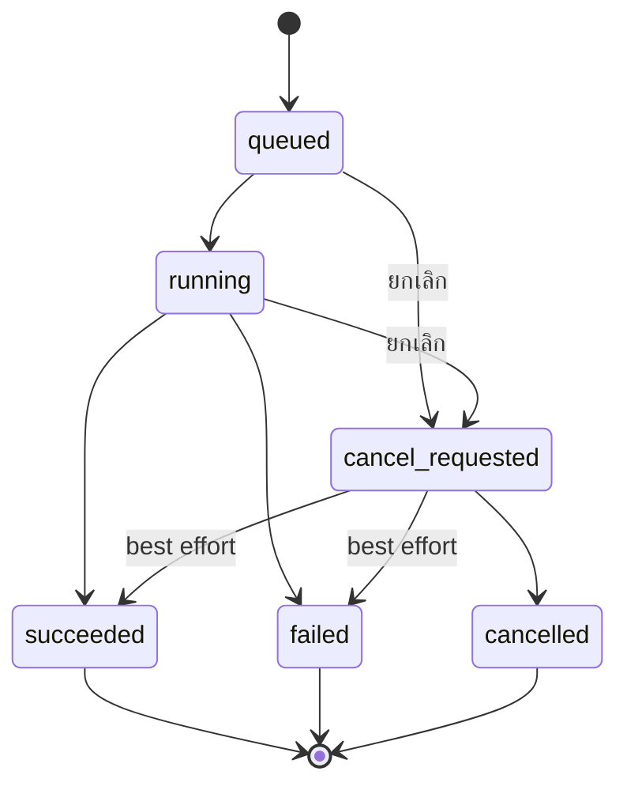
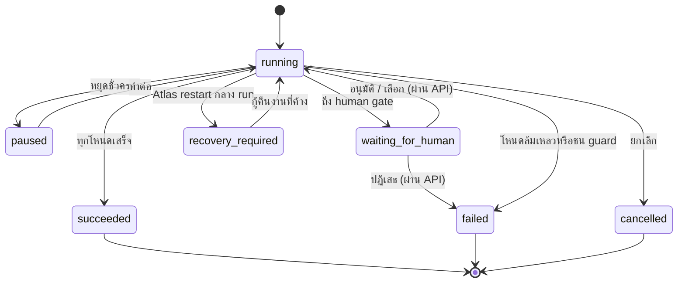

# คู่มือใช้งาน Atlas ผ่านเว็บ

คู่มือนี้อธิบาย web UI ที่ฝังมากับ Atlas Control Plane — คอนโซลปฏิบัติการ
(ops console) แบบมินิมอล สำหรับลงทะเบียน thClaws worker, ติดตามงานและ workflow
run, ดู audit/usage และจัดการบัญชีผู้ใช้

> Atlas เป็น control plane ส่วน thClaws worker เป็นตัวประมวลผลงานจริง
> path ของ workspace จึงต้องมีอยู่บนเครื่อง worker ไม่ใช่เครื่องที่เปิด Atlas

> **ขอบเขต** — UI ที่ฝังมาตั้งใจให้มินิมอล การสร้าง/แก้ไข workflow, การตัดสิน
> approval และการจัดการ triggers/deliveries ทำผ่าน
> **[flow-designer](https://github.com/kaebmoo/flow-designer)** — frontend
> เต็มรูปแบบสำหรับ Atlas — ดู
> [คู่มือใช้งานผ่านเว็บของ flow-designer](https://github.com/kaebmoo/flow-designer/blob/main/docs/guides/web-user-guide-th.md)
> — หรือเรียก REST API ตรง ๆ (ดู [API Reference](../specs/api-reference-th.md)
> และ [Workflow Examples](../workflow-examples.md)) ส่วนการสั่งงานเดี่ยวแบบ
> ad-hoc พร้อม routing/handoff, การอัปโหลดไฟล์เข้า run และการ import/export
> solution pack ยังไม่มี UI ใน frontend ทั้งสองตัว ต้องเรียกผ่าน API เท่านั้น
> คอนโซลนี้เน้นสิ่งที่ operator ต้องเห็นได้ทันที: สุขภาพฟลีต, ผลงานแบบสด
> (รวมไทม์ไลน์การเรียกเครื่องมือต่อ job), ความคืบหน้าของ run, audit, usage
> และการจัดการผู้ใช้

## 1. เริ่มระบบ

### 1.1 เปิด thClaws worker

เปิดอย่างน้อยหนึ่ง worker และกำหนด token:

```bash
THCLAWS_API_TOKEN="dev-token-1" \
thclaws --serve --bind 127.0.0.1 --port 4317
```

ถ้ามีหลาย worker ให้ใช้คนละ port และตั้ง role/tags ให้สื่อถึงหน้าที่ เช่น
`reporter`, `reviewer`, `coder` หรือ `workflow_builder`

ก่อน login ครั้งแรกใน production ให้สร้าง administrator (ระบบแสดง initial API token
เพียงครั้งเดียว):

```bash
python3 -m atlas.admin create-admin admin
```

### 1.2 เปิด Atlas

```bash
cd /Users/seal/Documents/GitHub/atlas-control-plane
python3 -m atlas --host 127.0.0.1 --port 8787
```

หรือ:

```bash
./scripts/run.sh
```

จากนั้นเปิด `http://127.0.0.1:8787`, login ด้วย username/password ของ instance
และหยุดระบบด้วย `Ctrl+C`

Atlas ใช้ SQLite ที่ `data/atlas.sqlite` โดยปริยาย ไม่ต้องติดตั้งฐานข้อมูลเพิ่ม

## 2. ภาพรวมหน้าเว็บ

เมนูหลักมี 7 หน้า:

| เมนู | ใช้ทำอะไร |
| --- | --- |
| **ภาพรวม (Overview)** | หน้าแรกเริ่มต้น: สรุป fleet, job, run และ approval แบบ stat tile (แต่ละอันกดเพื่อไปหน้ารายละเอียดได้) พร้อมงานล่าสุด |
| **ติดตาม (Monitor)** | ดู workflow run: ความคืบหน้า สถานะรายโหนด ไทม์ไลน์ artifacts และปุ่มกู้คืน |
| **งาน (Jobs)** | ดู job, output แบบสด, ไทม์ไลน์เครื่องมือ, event, ไฟล์ และยกเลิก job |
| **ตรวจสอบ (Audit)** | ตรวจสอบ action ล่าสุดของ control plane |
| **การใช้งาน (Usage)** | ยอด run/job/budget ต่อช่วงเวลา, แจ้งเตือน quota และดาวน์โหลด JSON/CSV |
| **ฟลีต (Fleet)** | จัดการ worker และ workspace |
| **บัญชี (Accounts)** | เฉพาะ admin: จัดการผู้ใช้และ API token (ดู [§9](#9-บัญชี-ผู้ใช้และ-api-token)) |

ตัวเลข badge บน sidebar แสดงจำนวน worker, งานที่ยัง active และรายการรออนุมัติ
badge ของหน้า ติดตาม นับรายการรออนุมัติ (ตัดสินผ่าน
`POST /api/approvals/{id}/approve|reject|choose`) ส่วน badge ของหน้า งาน นับ
job สถานะ `queued`, `running` และ `cancel_requested`

health chip บน topbar แสดงว่าเบราว์เซอร์ติดต่อ Atlas ได้อยู่หรือไม่ ปุ่ม
**Dark/Light** สลับธีมของคอนโซล ระบบจำค่าที่เลือกไว้ในเบราว์เซอร์และคืนค่าเมื่อโหลดใหม่

ปุ่ม **รีเฟรช** โหลดข้อมูลใหม่และ poll worker ทุกตัวทันที นอกจากนี้ UI โหลด
ข้อมูลใหม่ทุก 5 วินาที และ poll worker ทุก 60 วินาทีโดยอัตโนมัติ

การตั้งค่าครั้งแรก: ใช้ **ฟลีต** ลงทะเบียน worker และ workspace แล้วสั่งงานผ่าน
API จากนั้นดูผลใน **งาน** หรือ **ติดตาม**

## 3. ฟลีต: worker และ workspace

### เพิ่ม worker

เปิด **ฟลีต** กด **เพิ่ม worker** แล้วกรอก:

| ฟิลด์ | ความหมาย |
| --- | --- |
| **Name** | ชื่อที่อ่านง่าย เช่น `Reporter` |
| **Base URL** | URL ของ thClaws เช่น `http://127.0.0.1:4317` |
| **Token** | ค่า `THCLAWS_API_TOKEN` ของ worker |
| **Role** | role หลักสำหรับ routing เช่น `reporter` |
| **Tags** | คำใบ้ routing คั่นด้วย comma เช่น `local,news,thai` |

กด **Save Worker** — Atlas จะ poll ทันที ถ้าเข้าถึงได้และ token ถูกต้อง
สถานะจะเป็น `online`

การ์ด worker แต่ละใบมี:

- **Poll** — รีเฟรชสุขภาพและความสามารถของ worker ตัวนั้น
- **แก้ไข** — อัปเดตข้อมูล; เว้น Token ว่างเพื่อคง token เดิม
- **ลบ** — ลบ worker และ workspace ของมันหลังยืนยัน
- **Poll ทุกเครื่อง** — ปุ่มลูกศรที่หัวรายการ Workers

สถานะที่พบบ่อยคือ `online`, `offline`, `unknown` — ความล้มเหลวของการ poll
ดูได้ใน **ตรวจสอบ (Audit)**

### เพิ่ม workspace

กด **เพิ่ม workspace** หลังมี worker อย่างน้อยหนึ่งตัว:

| ฟิลด์ | ความหมาย |
| --- | --- |
| **Worker** | worker ที่เป็นเจ้าของไดเรกทอรี |
| **Key** | key สำหรับ routing เช่น `atlas` หรือ `company-a` |
| **Directory** | path สัมบูรณ์บนเครื่อง worker |
| **Company** | ขอบเขตองค์กร/ข้อมูล ใช้เป็นคำใบ้ routing |
| **Tags** | คำใบ้ routing คั่นด้วย comma |

กด **Save Workspace** — แถว workspace มีปุ่ม **แก้ไข** และ **ลบ** (ยืนยันก่อน)

ปุ่ม **Cancel**, ปุ่ม **×** หรือ `Escape` ปิดหน้าต่าง Add/Edit โดยไม่บันทึก

## 4. งาน: ผลลัพธ์และเหตุการณ์

job ถูกสร้างผ่าน `POST /api/jobs` (ดู
[API Reference](../specs/api-reference-th.md)) — หน้าจอ งาน คือที่สำหรับดูและ
จัดการ job เหล่านั้น

รายการ job แสดง worker สถานะ เวลา ID สั้น ความสัมพันธ์ handoff และ prompt
เลือกการ์ดเพื่อเปิดดู ถ้า job ในรายการเป็นของ workflow run ด้วย จะมี filter chip
เหนือรายการให้กรองเหลือ run เดียว (หรือ **Manual** สำหรับ job ที่ไม่ได้มาจาก
workflow)

**สตรีมสด** เล่นย้อนและตาม output ของ worker แบบสด **ไทม์ไลน์** แสดงการเรียก
เครื่องมือ/สกิลรายตัว — ชื่อ สถานะ (started/ok/error/denied) ระยะเวลา และขนาด
ไบต์ พร้อมตัวนับต่อ job (เรียก / ปฏิเสธ / ล้มเหลว) ไทม์ไลน์สร้างจาก
**structural metadata เท่านั้น**: ไม่เก็บและไม่แสดง input/output ของเครื่องมือ
(เก็บเพียงขนาดไบต์และ SHA-256) จึงไม่มีทางที่ payload จะรั่วความลับ
**เหตุการณ์** แสดง event log ดิบ — route, session, state, error, completion,
cancellation, handoff, message, close และ structured events ของ worker
(`thinking`, `tool_use_*`, `skill_*`, `usage` ฯลฯ) **ไฟล์** แสดงรายการ
ดาวน์โหลดของ job artifacts ที่เก็บผ่าน `collect_files`

**ยกเลิกงาน** ใช้ได้ระหว่าง job ยัง active การยกเลิกเป็น best effort ที่ชั้น
Atlas: job เปลี่ยนเป็น `cancel_requested` ก่อน และ worker อาจทำ side effect
ไปแล้ว



| สถานะ | ความหมาย |
| --- | --- |
| `queued` | รอเริ่ม |
| `running` | worker กำลังทำงาน |
| `cancel_requested` | Atlas รับคำขอยกเลิกแล้ว |
| `succeeded` | สำเร็จ |
| `failed` | ล้มเหลว; ดู event และข้อมูล error |
| `cancelled` | ถูกยกเลิก |

ถ้าสตรีมหลุด เลือกการ์ด job อีกครั้งเพื่อเล่น event ย้อนหลัง

## 5. ติดตาม: workflow run

### รายการ run และปุ่มควบคุม

**Runs** แสดง workflow run ทั้งหมด เลือก run เพื่อดูสถานะ งาน budget โหนดที่
เสร็จ/ล้มเหลว ความคืบหน้าของ join ชิปสถานะรายโหนด ไทม์ไลน์เหตุการณ์ล่าสุด
และ JSON รายละเอียดเต็ม กดชิปสถานะของโหนดเพื่อเปิด job ของโหนดนั้นในหน้า
**งาน** โดยกรองเหลือเฉพาะ run นี้

- **หยุดชั่วคราว** — หยุด run ที่กำลังทำงาน
- **ทำต่อ** — เดินต่อ run ที่หยุดไว้ โดยไม่ทำโหนดที่เสร็จแล้วซ้ำ
- **ยกเลิก** — ยกเลิก run ที่ยังไม่จบ
- **กู้คืนงานที่ค้าง** — เฉพาะสถานะ `recovery_required` และต้องยืนยันความเสี่ยง
  ที่ side effect ฝั่ง worker อาจซ้ำ



หลัง Atlas restart โหนด worker/manager ที่ค้างอยู่จะไม่ถูก retry อัตโนมัติ
ตรวจ node และ job ID ในคำเตือนก่อนอนุญาตให้ retry

run ที่อยู่สถานะ `waiting_for_human` ตัดสินผ่าน API:
`POST /api/approvals/{id}/approve`, `/reject` หรือ `/choose` — ชิปโหนดจะบอกว่า
gate ไหนกำลังรอ

### Artifacts

artifact คือผลลัพธ์ที่ตั้งชื่อและบันทึกไว้กับ workflow run เพื่อให้โหนดถัดไป
เงื่อนไข trigger หรือผู้ตรวจนำไปใช้ เช่น reporter สร้าง `notes` แล้ว writer
อ่านผ่าน `{artifact.notes}` และสร้าง `script`

**Artifacts** แสดง key ชนิด เนื้อหา และ metadata ของ run ที่เลือก พร้อมปุ่ม
ดาวน์โหลดสำหรับ artifact ชนิด `file_ref` ทุกรายการ:

| ค่าที่แสดง | ความหมาย |
| --- | --- |
| `notes` / `script` | key ที่ workflow ใช้อ้างผลลัพธ์ |
| `text` / `json` | ข้อมูลที่โหนดถัดไปใช้ได้ผ่าน `{artifact.KEY}` |
| `file_ref` | ตัวชี้ไปยังไบต์ไบนารีที่ Atlas เก็บ ไม่ใช่เนื้อไฟล์ที่แทรกใน prompt |
| filename, size, SHA-256 | metadata สำหรับระบุและตรวจสอบไฟล์ |

การแนบไฟล์เข้า run (เช่น PDF สัญญาสำหรับ human gate) ทำผ่าน API:
`POST /api/workflow-runs/{id}/files?key=<key>` ขนาดเริ่มต้นไม่เกิน 10 MiB
(ผู้ดูแลปรับได้ด้วย `ATLAS_MAX_UPLOAD_BYTES`) การดาวน์โหลดคืนไฟล์ตามที่ Atlas
เก็บไว้เป๊ะ ๆ ไม่ได้ browse ระบบไฟล์ของ worker ดูโมเดลเต็มที่
[Concepts & Reference (ไทย)](../concepts-th.md)

## 6. ตรวจสอบ (Audit)

**ตรวจสอบ** แสดง action ล่าสุดของ control plane เช่น `worker.poll`,
`job.create`, `job.succeeded`, `session.bind` พร้อมเวลาและรายละเอียด JSON
ใช้ไล่การเปลี่ยนสถานะและ error ของการ poll/run — filter chip (**All**, `job`,
`workflow`, `worker`, `approval`) ช่วยกรองรายการ UI แสดงสูงสุด 30 รายการที่
ตรงเงื่อนไขจากชุดล่าสุดที่ดึงมา แถวของ job หรือ workflow run กดได้และพาไปยัง
job นั้นในหน้า **งาน** (พร้อมเปิด stream) หรือ run นั้นในหน้า **ติดตาม** ส่วนแถว
ที่เกี่ยวกับ worker จะพาไปหน้า **ฟลีต**

## 7. ความปลอดภัยและการเข้าถึงระยะไกล

- โดยค่าเริ่มต้น Atlas ต้องใช้ API token ต่อผู้ใช้ที่ถูกต้อง หน้า login ของ
  dashboard แลก username/password เป็น token เก็บใน local storage ของเบราว์เซอร์
  ปุ่ม **ออกจากระบบ** เพิกถอน token นั้น
- ให้สิทธิ์น้อยที่สุด: `viewer` อ่าน, `operator` สั่งงาน, `auditor` อ่าน
  audit/usage, `admin` จัดการทุกอย่าง
- ใช้ worker token จริงและแยกกันต่อเครื่อง
- worker token เก็บใน SQLite และ API ของ dashboard ไม่ส่งคืนค่า token;
  response แสดงเพียง `token_set`
- `ATLAS_LOOPBACK_NO_AUTH=false` คือค่าเริ่มต้นที่ปลอดภัย ตั้ง `true` เฉพาะ
  พัฒนาบนเครื่องเท่านั้น; การ bypass จำกัดที่ `127.0.0.1` และ `::1`
- `ATLAS_API_TOKEN` (ถ้าตั้ง) เป็น bootstrap admin token แบบ legacy
- ตั้ง `ATLAS_SECRET_KEY` ที่คาดเดายากเพื่อเข้ารหัส worker token ตอนเก็บ และ
  เซ็นไฟล์ usage export แบบออฟไลน์
- อย่าเปิด Atlas หรือ thClaws สู่สาธารณะโดยไม่มี authentication และ TLS

## 8. การวัดการใช้งานและ export แบบออฟไลน์

### หน้าจอ การใช้งาน (dashboard)

admin และ auditor เห็นหน้าจอ **การใช้งาน** — ตั้งช่วง **From**/**To** แล้วกด
**โหลด** เพื่อดูตัวเลข 5 ช่องของช่วงนั้น: workflow runs, jobs, budget units,
Tokens (prompt · output) และ Est. cost (USD) พร้อมกราฟแท่ง run ราย 7 วัน และ
ปุ่ม **JSON** / **CSV** — Tokens และ Est. cost เป็นตัวเลขประมาณการเพื่อการ
มองเห็นเท่านั้น ไม่ใช่บิลเรียกเก็บ ใส่ **Expected runs** และ **Alert at %**
เพื่อดูการแจ้งเตือนโควตาแบบอ่านอย่างเดียว (เช่น "7 / 10 expected runs used
(70%)") ซึ่งเปลี่ยนเป็นสีแดงเมื่อเกินเกณฑ์ การแจ้งเตือนเป็นสัญญาณปริมาณ
เท่านั้น — ไม่กระทบ `budget_units` ที่ยังเป็นตัวคุมต้นทุนต่อ run

Atlas บันทึกหนึ่งเหตุการณ์ต่อ job ที่จบ และหนึ่งต่อ workflow run ที่จบ
admin/auditor สามารถ export ตามช่วงวันที่:

```bash
curl -H 'Authorization: Bearer <token>' \
  'http://127.0.0.1:8787/api/usage?from=2026-06-01&to=2026-06-30&format=csv'
```

บนเครื่อง Atlas สร้างและตรวจไฟล์ JSON แบบเซ็นสำหรับงาน air-gapped:

```bash
ATLAS_SECRET_KEY='<secret>' python3 -m atlas.usage export usage.json \
  --from 2026-06-01 --to 2026-06-30
ATLAS_SECRET_KEY='<secret>' python3 -m atlas.usage verify usage.json
```

ไฟล์มีเฉพาะข้อมูลการใช้งานดิบ Atlas ไม่คำนวณราคา/ใบแจ้งหนี้ และตัวเลข
BYOK model/token มีไว้เพื่อการมองเห็นเท่านั้น เก็บไฟล์และ signing key อย่าง
ระมัดระวังเช่นเดียวกับเอกสารบิล/audit

## 9. บัญชี: ผู้ใช้และ API token

admin เห็นหน้าจอ **บัญชี** สำหรับสร้างและจัดการผู้ใช้กับ API token จาก
dashboard โดยตรง — ทางเลือกบนเบราว์เซอร์แทนการเรียก `/api/users` และ
`/api/tokens` ตรง ๆ

### ผู้ใช้

| ฟิลด์ | การใช้ |
| --- | --- |
| **ชื่อผู้ใช้** | ชื่อสำหรับ login |
| **รหัสผ่าน** | ตั้งตอนสร้าง; ไม่มีปุ่มเปลี่ยนรหัสผ่านในหน้านี้ |
| **บทบาท** | `viewer`, `operator`, `auditor` หรือ `admin` |

กด **เพิ่มผู้ใช้** เพื่อสร้าง การ์ดผู้ใช้แสดงสถานะ จำนวน token เวลาสร้าง และมี:

- **ระงับ / เปิดใช้** — สลับระหว่าง `active` และ `disabled`; ปิดสำหรับบัญชี
  ของตัวเอง
- **ลบ** — ลบผู้ใช้หลังยืนยัน; ปิดสำหรับบัญชีของตัวเอง

### API token

| ฟิลด์ | การใช้ |
| --- | --- |
| **ชื่อ** | ป้ายกำกับ token เช่น `ci-deploy` |
| **ผู้ใช้** | บัญชีที่ token ใช้ยืนยันตัวตน |

กด **สร้าง token** — Atlas แสดงค่า token เต็ม **ครั้งเดียว** ในแผงเปิดเผย
คัดลอกเก็บทันทีเพราะจะไม่แสดงอีก (ดู [§7](#7-ความปลอดภัยและการเข้าถึงระยะไกล))
การ์ด token แสดงเวลาสร้างและมีปุ่ม **เพิกถอน** (ยืนยันก่อน)

## 10. แก้ปัญหา

| อาการ | สิ่งที่ต้องตรวจ |
| --- | --- |
| worker เป็น `offline` | โปรเซส/พอร์ต, Base URL, firewall และ token ของ worker |
| `No workers registered` | เพิ่มและ poll worker ในหน้าฟลีต |
| `role has no matching worker` | เพิ่ม role/tag ที่ตรง ผ่านตัวช่วย suggest-workers ของ API |
| `unknown worker_id` | graph อ้าง worker ID ที่ถูกลบหรือผิด |
| `missing prompt variable` | ตรวจ path ของ input และ artifact ที่อ้างถึง |
| `output_format=json` ล้มเหลว | worker ต้องคืน JSON ที่ parse ได้เท่านั้น |
| run ไม่เริ่ม | ตรวจ workflow และ run input ผ่าน API |
| ปุ่มทำต่อกดไม่ได้ | ทำต่อใช้กับ `paused`; สถานะกู้คืนใช้ปุ่มกู้คืนงานที่ค้าง |

สำหรับการสร้าง/แก้ไข workflow, การตัดสิน approval, triggers และ deliveries ดู
[คู่มือใช้งานผ่านเว็บของ flow-designer](https://github.com/kaebmoo/flow-designer/blob/main/docs/guides/web-user-guide-th.md)
ส่วนสิ่งที่เข้าถึงได้เฉพาะผ่าน API ในตอนนี้ (สั่งงานเดี่ยวแบบ ad-hoc พร้อม
handoff, อัปโหลดไฟล์เข้า run, solution pack, draft/explain/repair และ
suggest-workers/suggest-triggers) ดู [Workflow Examples](../workflow-examples.md),
[API Reference](../specs/api-reference-th.md) และ
[Concepts & Reference (ไทย)](../concepts-th.md)
