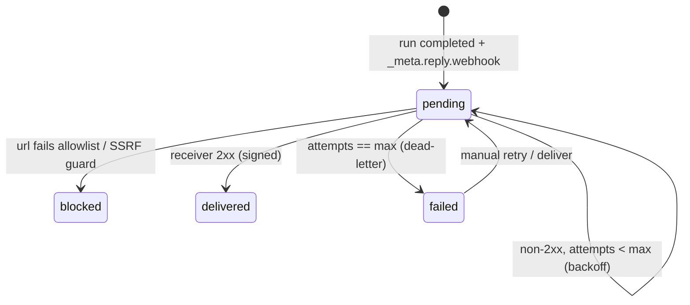

# Input Adapter & Return Path Plan

Turn "anything can send input to Atlas, and the answer can get back to the user" into two
additive milestones with hermetic checks. The design target is
[Input Adapter Contract](../specs/input-adapter-contract.md); this plan is the buildable
sequence and Definition of Done.

Both milestones **formalize existing seams** rather than add subsystems:

- **IA-1** standardizes the JSON envelope that already flows through
  `POST /api/workflow-triggers/{id}/fire` and `POST /api/workflow-runs`, and records
  provenance. No new endpoint, no schema change.
- **OB-1** adds an *external subscriber* to the `workflow_run_completed` internal event
  Atlas already emits — a signed outbound delivery — plus a `deliveries` ledger and API.

## House rules (non-negotiable — same as the rest of the repo)

- Atlas core: **Python standard library only**; dashboard is browser-native, no build step.
  Outbound HTTP uses `urllib` (already the thClaws client transport) — no new dependency.
- All `/api/*` changes are **additive**; never change an existing path or response shape.
  Existing check scripts must keep passing.
- **Silo:** the instance is the tenant. Add **no `tenant_id`** to any table
  (`scripts/check_silo.py` guards this).
- **BYOK / metering unchanged:** provenance and deliveries are visibility/operational only;
  they never rate, bill, or touch `budget_units`.
- **One hermetic check per milestone**, appended to the completion gate. Never tick a DoD
  item early.
- Delivery is a **failure-isolated side effect** (same discipline as usage metering): it is
  attempted only after the run outcome is persisted and can never change that outcome.

## Scope & tiers

| Milestone | Scope | Tier | Depends on |
| --- | --- | --- | --- |
| **IA-1** | Input envelope (`_meta.source` / `_meta.reply`), validation, provenance→audit | A (build to full DoD) | — |
| **OB-1** | Signed outbound delivery on run completion; SSRF allowlist; bounded retries; `deliveries` table + API | A (build to full DoD) | IA-1, M3 migrations, `ATLAS_SECRET_KEY` |

Neither is externally blocked. Out of scope here (recorded in §External decisions): streaming
per-artifact delivery, per-trigger ingress HMAC secret storage, and any pooled-tenancy work.

---

## IA-1 — Input Adapter Contract (envelope + provenance)

Implement the contract in [../specs/input-adapter-contract.md](../specs/input-adapter-contract.md).

**Build:**

- Parse the reserved `_meta` object out of run input on **both** ingress paths
  (`fire_trigger` payload → input, and `POST /api/workflow-runs` input). Keep `_meta`
  optional; a payload without it behaves exactly as today.
- Validate `_meta` when present: it must be an object; `source.channel` ∈
  `{line, email, web_form, api, schedule, other}` (unknown → reject, fail closed);
  if `reply.callback_url` is present it must be a syntactically valid URL **and** pass the
  OB-1 allowlist check (reuse the same validator so a run cannot be created promising an
  undeliverable reply). Reject invalid envelopes with a clear error and **create no run**.
- Persist `_meta` with the run input (so OB-1 can read `_meta.reply` later).
- On run start, write an audit entry capturing `source.{channel,adapter,form,external_id}`
  and the `run_id`. Visibility only; do not log secrets (there are none by design).

**Definition of Done:**

- [x] `_meta` parsed/validated on both ingress paths; legacy payloads unchanged.
- [x] Business fields still resolve in prompts (`{input.*}`).
- [x] `_meta.source` recorded in `audit_log` with `run_id`.
- [x] Invalid envelope rejected pre-run with a clear error.
- [x] Spec's Guarantees section matches behavior; docs synced (spec status, concepts if needed).

**Check — `scripts/check_input_adapter.py` (hermetic: temp DB, ephemeral port, mock thClaws):**

- [x] `/fire` with an envelope → run created; `_meta.source` present in audit; a business
      field reaches the mock worker's prompt.
- [x] `/fire` **without** `_meta` (legacy) → still works end-to-end.
- [x] `POST /api/workflow-runs` with `_meta` in `input` → same provenance recorded.
- [x] Invalid `_meta` (non-object / unknown channel / non-allowlisted `callback_url`) →
      rejected, no run created.
- [x] `_meta.reply` round-trips: readable from the persisted run input.

---

## OB-1 — Outbound delivery (the return path)

Deliver the run result back to the originating adapter so it can answer the user. Subscribe
to the **existing** `workflow_run_completed` emission (in the workflow runner, where the
internal trigger fan-out already happens) and add delivery as a failure-isolated step.

**Config (secure defaults):**

| Env | Default | Meaning |
| --- | --- | --- |
| `ATLAS_OUTBOUND_ALLOWLIST` | *empty* | Comma-separated host / CIDR patterns. **Empty = outbound disabled.** A `callback_url` whose resolved host is not allowlisted is refused. |
| `ATLAS_OUTBOUND_MAX_ATTEMPTS` | `5` | Bounded total attempts per delivery, then dead-letter (`failed`). |
| `ATLAS_OUTBOUND_TIMEOUT` | `10` | Per-attempt seconds. |
| `ATLAS_SECRET_KEY` | *(existing)* | Required to sign deliveries; without it, outbound is refused (never send unsigned). |

**Build:**

- **`deliveries` table** (via the M3 versioned-migration runner; **no `tenant_id`**):
  `id, run_id, url, correlation_id, status, attempts, max_attempts, last_error,
  created_at, updated_at, delivered_at`. `status ∈ {pending, delivered, failed, blocked}`.
- **Trigger point:** on `workflow_run_completed` (states `succeeded` **and** `failed`), if
  the run's `_meta.reply.mode == "webhook"` and `callback_url` is set, enqueue one delivery.
- **SSRF guard (reused by IA-1 validation):** require `https` (allow `http` only on
  loopback for dev); resolve the host and reject loopback/private/link-local/cloud-metadata
  targets unless the host explicitly matches `ATLAS_OUTBOUND_ALLOWLIST`; connect to the
  resolved address you validated. A blocked URL → `status = blocked`, audited, never sent.
- **Signed body:** POST JSON `{delivery_id, run_id, state, correlation_id, artifacts[],
  signed_at}` where `artifacts[]` carries terminal artifacts (`key, kind, content`;
  `file_ref` stays a pointer, not bytes). Sign the exact bytes with HMAC-SHA256 over
  `ATLAS_SECRET_KEY` (reuse the usage-export signing helper) → header
  `X-Atlas-Signature: sha256=<hex>`.
- **Semantics:** at-least-once; `delivery_id` lets the receiver dedupe. Bounded retries with
  backoff up to `max_attempts`, then `failed` (dead-letter, visible). A non-2xx or timeout
  never changes the run outcome.
- **Restart:** `pending` deliveries may be re-attempted (bounded) because the receiver
  dedupes on `delivery_id`. This is distinct from the worker-job rule ("never auto-retry an
  interrupted worker job") — deliveries are Atlas-side idempotent notifications, not worker
  side effects. Document this explicitly.
- **Endpoints (additive, RBAC-guarded):**
  `GET /api/deliveries?run_id=&status=` (operator/auditor);
  `POST /api/deliveries/{id}/retry` (operator; bounded);
  `POST /api/workflow-runs/{id}/deliver` (operator; manual (re)send, e.g. after fixing a relay).



**Definition of Done:**

- [ ] `deliveries` table added via a numbered migration; `init()` twice is a no-op; no `tenant_id`.
- [ ] Delivery fires on `workflow_run_completed` only when `_meta.reply` requests it.
- [ ] SSRF allowlist enforced; non-allowlisted / private targets are `blocked`, not sent.
- [ ] Body signed with `X-Atlas-Signature`; missing `ATLAS_SECRET_KEY` refuses to send.
- [ ] Bounded retries → `failed`; run outcome provably unchanged on delivery failure.
- [ ] `GET /api/deliveries`, `POST /api/deliveries/{id}/retry`, `POST /api/workflow-runs/{id}/deliver` work under RBAC.
- [ ] Docs synced: this plan ticked, spec §7 confirmed, `openapi.yaml` + `api-reference-en.md` + `api-reference-th.md` updated for the new routes (EN+TH parity), `docs/README.md` linked.

**Check — `scripts/check_outbound.py` (hermetic: temp DB, ephemeral port, mock thClaws, plus a mock receiver on an ephemeral loopback port added to the allowlist):**

- [ ] Run completes with `_meta.reply.webhook` → receiver gets one POST with a **valid**
      `X-Atlas-Signature` and correct `run_id`/`state`/`correlation_id`/artifacts.
- [ ] `callback_url` not in allowlist (and a private-IP literal) → `blocked`, no POST sent.
- [ ] Receiver returns 500 → retried up to `max_attempts` then `failed`; the run is still
      `succeeded`; a second identical `delivery_id` is not processed twice.
- [ ] No `ATLAS_SECRET_KEY` → delivery refused (never sent unsigned), recorded with reason.
- [ ] `POST /api/deliveries/{id}/retry` re-attempts a `failed` delivery within the bound.

---

## External decisions (resolve before/with production, not blockers to building)

| # | Decision | Default taken | Revisit trigger |
| --- | --- | --- | --- |
| 1 | Production `ATLAS_OUTBOUND_ALLOWLIST` contents (which relay hosts) | empty = disabled until set | first real adapter deployment |
| 2 | Deliver on `artifact_created` (streaming partials), not just completion | deferred; completion only | a channel needs mid-run updates |
| 3 | Per-trigger ingress HMAC secret (adds a column) | bearer-only today; scheme defined in spec §6 | an untrusted internet-facing relay |
| 4 | Retry backoff schedule + `max_attempts` value | fixed bounded backoff, `max=5` | delivery SLA feedback |

## Progress ledger

| Milestone | Status | Check | Notes |
| --- | --- | --- | --- |
| IA-1 | ✅ done | `scripts/check_input_adapter.py` | additive; no schema change; `atlas/outbound.py` added (SSRF/allowlist validator shared with OB-1) |
| OB-1 | ☐ not started | `scripts/check_outbound.py` | needs IA-1 + M3 migrations + `ATLAS_SECRET_KEY` |

## Order

```text
IA-1 (envelope + provenance) → OB-1 (signed outbound delivery + deliveries API)
```

Driver prompts: [../prompts/input-adapter-return-path-spin-prompts.md](../prompts/input-adapter-return-path-spin-prompts.md).
