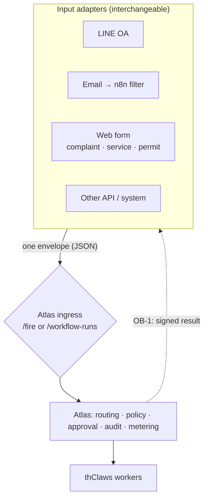

# Input Adapter Contract

> **TL;DR (ไทย):** ชั้นรับเข้าของ Atlas ไม่ใช่ "n8n" แต่เป็น **สัญญา (contract)** —
> อะไรก็ตาม (LINE, email ที่คัดกรองผ่าน n8n, เว็บฟอร์มร้องเรียน/ขอใช้บริการ/ขออนุญาต,
> ระบบภายในอื่น) ที่ normalize เป็น JSON แล้วยิงเข้า **สองประตูเดิมที่มีอยู่แล้ว**
> (`POST /api/workflow-triggers/{id}/fire` หรือ `POST /api/workflow-runs`) ก็เป็น
> adapter ได้ทันที เอกสารนี้กำหนด "ซอง" (envelope) มาตรฐาน: ฟิลด์ธุรกิจอยู่ระดับบนสุด
> (อ่านด้วย `{input.*}` เหมือนเดิม) และ key สงวน `_meta` เก็บ **ที่มา** (`source`) ไว้
> audit และ **ที่อยู่สำหรับตอบกลับ** (`reply`) ไว้ให้ขากลับ (OB-1) ใช้ Atlas ยังเป็น
> จุดคุม governance/audit/metering จุดเดียว ไม่ว่าเข้ามาทางไหน สัญญานี้ **เพิ่มอย่างเดียว
> (additive)** — payload เดิมที่ไม่มี `_meta` ต้องทำงานได้เหมือนเดิมทุกประการ

Atlas already accepts external input through two endpoints. This contract does **not**
add a new ingress endpoint; it standardizes the JSON body those endpoints accept so that
every channel is a thin, interchangeable adapter and so a reply can later be routed back
to the originating user. Atlas remains the single place where policy, approval, audit, and
metering are enforced — independent of the channel.

**Status:** **IA-1 and OB-1 implemented.** IA-1 (envelope + provenance + audit) is verified by
`scripts/check_input_adapter.py`; OB-1 (the signed return path that consumes `_meta.reply`) is
verified by `scripts/check_outbound.py`. Both are tracked in
[Input Adapter & Return Path Plan](../plans/input-adapter-return-path-plan.md).

## 1. The boundary



An adapter's only job is to (1) turn a channel event into the envelope below, (2) POST it
to one ingress endpoint with a bearer token, and (3) optionally receive the signed result
(OB-1) and render it back to the user. No channel-specific logic lives in Atlas core.

## 2. Two ingress endpoints (reuse — nothing new)

| Endpoint | Use when | Body wrapper | Becomes run input |
| --- | --- | --- | --- |
| `POST /api/workflow-triggers/{id}/fire` | The workflow is fronted by a `manual`/`webhook`/`schedule` trigger; you want dedupe and trigger-event history (LINE, webhook relays). | `{"payload": {…envelope…}, "dedupe_key": "…"}` | the whole `payload` |
| `POST /api/workflow-runs` | You hold the `workflow_definition_id` and want to start a run directly (server-rendered web forms, internal systems). | `{"workflow_definition_id": "wfd_…", "input": {…envelope…}}` | the `input` object |

The **envelope shape is identical** in both; only the wrapper key differs (`payload` vs
`input`). Both paths require `Authorization: Bearer <per-user API token>` (an `operator`
token is the least-privilege fit). Internal-event trigger types
(`workflow_run_completed`, `artifact_created`, `worker_status_changed`) are fired by Atlas
only and are **not** ingress points for adapters.

## 3. The envelope

Business fields stay at the top level so existing prompts (`{input.topic}`,
`{input.complaint_text}`) are unchanged. Atlas-reserved data lives under a single reserved
key, `_meta`. `_meta` is **optional**; every field inside it is optional.

```json
{
  "complaint_text": "ไฟถนนดับหน้าซอย 7 มา 3 วัน",
  "citizen_name": "…",
  "contact": "…",

  "_meta": {
    "source": {
      "channel": "line",
      "adapter": "n8n",
      "form": "gov_complaint",
      "external_id": "line-msg-4f2a…",
      "received_at": "2026-07-01T09:12:00+07:00"
    },
    "reply": {
      "mode": "webhook",
      "callback_url": "https://relay.internal.nt.th/atlas/reply",
      "correlation_id": "line:U1234:msg-4f2a"
    }
  }
}
```

`_meta` follows the same reserved-key convention Atlas already uses inside run input (e.g.
`_trigger_chain`): the engine treats it as ordinary input JSON, workers normally read only
the business fields, and it is persisted with the run so OB-1 can consume `_meta.reply`.

### 3.1 `_meta.source` (provenance — recorded for audit)

| Field | Type | Meaning |
| --- | --- | --- |
| `channel` | enum | Originating channel: `line`, `email`, `web_form`, `api`, `schedule`, `other`. Unknown value is rejected (fail closed) so audit stays clean. |
| `adapter` | string (opt) | Relay/tool that produced the envelope, e.g. `n8n`, `web-backend`. Free-form label. |
| `form` | string (opt) | Logical form/use-case id, e.g. `gov_complaint`, `service_request`, `permit_request`. |
| `external_id` | string (opt) | Upstream message/record id; a good `dedupe_key` seed. |
| `received_at` | RFC 3339 (opt) | When the adapter received the event (adapter clock, informational). |

### 3.2 `_meta.reply` (return addressing — consumed by OB-1)

| Field | Type | Meaning |
| --- | --- | --- |
| `mode` | enum | `webhook` = Atlas should POST the result to `callback_url` (OB-1). `none` (default) = adapter will poll instead. |
| `callback_url` | URL (opt) | Where OB-1 delivers the signed result. **Must** match `ATLAS_OUTBOUND_ALLOWLIST` or delivery is refused (SSRF guard). |
| `correlation_id` | string (opt) | Opaque handle the adapter maps back to the end user (e.g. LINE user + message). Atlas echoes it in the delivery, never interprets it. |

## 4. Dedupe conventions

`dedupe_key` (on the `/fire` path) makes ingestion idempotent: a repeated key is recorded
`ignored` and starts no second run (atomic claim via `claim_trigger_dedupe`). Recommended
key = the channel's own event id, so a webhook retry from LINE/n8n cannot double-process:

```
dedupe_key = "<channel>:<external_id>"     e.g.  "line:line-msg-4f2a"
```

The direct `/api/workflow-runs` path has no dedupe; a server-rendered form should guard
against double submit itself (or use the `/fire` path).

## 5. Provenance & audit

On run start, Atlas records an audit entry capturing `_meta.source`
(`channel`, `adapter`, `form`, `external_id`) plus the resulting `run_id`. This is
**visibility only** — it answers "which channel drove this run" for audit and, later,
per-channel volume — and it never rates or bills anything (consistent with the BYOK /
metering rules: [Concepts §14](../concepts-en.md#14-usage-metering)). Atlas does not audit
the full business payload beyond what the run already stores as its input.

## 6. Ingress authentication

- **Baseline (today):** every ingress call carries `Authorization: Bearer <token>`; RBAC
  applies. Do not expose Atlas directly to the internet — front adapters with a gateway,
  VPN, or Tailscale (see [Deployment](../ops/deployment.md)).
- **Optional per-trigger signature (defined; build gated in the plan):** for a webhook
  trigger reachable by a less-trusted relay, an optional per-trigger shared secret enables
  HMAC-SHA256 verification of the raw body via header `X-Atlas-Signature: sha256=<hex>`
  (same HMAC primitive as the signed usage export). When a trigger has no secret set,
  behavior is exactly as today (bearer only). This keeps the change additive.

## 7. Return path (forward reference)

`_meta.reply` is the bridge to **OB-1**. When present with `mode: "webhook"` and an
allowlisted `callback_url`, OB-1 delivers a signed result on `workflow_run_completed`:

```json
{
  "delivery_id": "dlv_…",
  "run_id": "wfr_…",
  "state": "succeeded",
  "correlation_id": "line:U1234:msg-4f2a",
  "artifacts": [{"key": "reply_letter", "kind": "text", "content": "…"}],
  "signed_at": "2026-07-01T09:13:11Z"
}
```

signed with `X-Atlas-Signature`. If `_meta.reply` is absent or `mode: "none"`, the adapter
instead **polls** `GET /api/workflow-runs/{id}` until terminal, then reads
`GET /api/workflow-runs/{id}/artifacts`. Full delivery semantics (allowlist, bounded
retries, failure isolation, `deliveries` table + API) are in the
[plan](../plans/input-adapter-return-path-plan.md) §OB-1.

## 8. Examples

### 8.1 LINE OA (fronted by n8n, webhook trigger, push reply)

```bash
curl -sS -X POST http://127.0.0.1:8787/api/workflow-triggers/wtr_complaint/fire \
  -H 'authorization: Bearer <operator-token>' \
  -H 'content-type: application/json' \
  -d '{
    "payload": {
      "complaint_text": "ไฟถนนดับหน้าซอย 7",
      "_meta": {
        "source": {"channel": "line", "adapter": "n8n", "form": "gov_complaint",
                   "external_id": "line-msg-4f2a"},
        "reply": {"mode": "webhook",
                  "callback_url": "https://relay.internal.nt.th/atlas/reply",
                  "correlation_id": "line:U1234:msg-4f2a"}
      }
    },
    "dedupe_key": "line:line-msg-4f2a"
  }'
```

### 8.2 Email intake filtered by n8n (webhook trigger, poll reply)

Same shape; `source.channel = "email"`, omit `_meta.reply` (n8n polls the returned
`run.id` and emails the result itself).

### 8.3 Web form — complaint / service request / permit (direct run, poll reply)

```bash
curl -sS -X POST http://127.0.0.1:8787/api/workflow-runs \
  -H 'authorization: Bearer <operator-token>' \
  -H 'content-type: application/json' \
  -d '{
    "workflow_definition_id": "wfd_service_request",
    "input": {
      "service": "น้ำประปา", "citizen_name": "…", "detail": "…",
      "_meta": {"source": {"channel": "web_form", "adapter": "web-backend",
                           "form": "service_request", "external_id": "req-90211"}}
    }
  }'
```

The web backend keeps the returned `run.id`, polls it, and updates the same page when the
run reaches `succeeded` / `waiting_for_human`.

## 9. Guarantees (verified by `scripts/check_input_adapter.py`)

- A payload **without** `_meta` behaves exactly as today (backward compatible).
- Business fields remain reachable via `{input.*}` in worker/manager prompts.
- `_meta.source` is recorded in the audit log with the resulting `run_id`; the raw model
  key or any secret is never written (there is none in the envelope by design).
- An invalid envelope (`_meta` not an object, unknown `source.channel`, or a
  `reply.callback_url` outside `ATLAS_OUTBOUND_ALLOWLIST`) is rejected with a clear error
  and **no run is created**.
- `_meta.reply` is persisted with the run so OB-1 can address the delivery.

## 10. Out of scope

Atlas does not host the adapters, render channel replies, or interpret `correlation_id`;
those belong to the adapter/relay layer. This contract does not change any existing
endpoint path or response shape, adds no `tenant_id` (the instance is the tenant), and
never rates or bills — it only standardizes ingress and provenance and hands the reply
address to OB-1.
