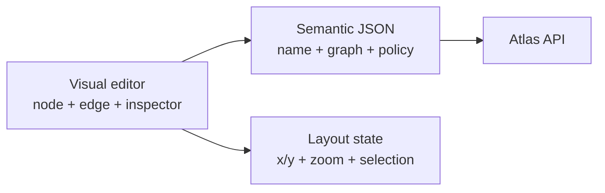
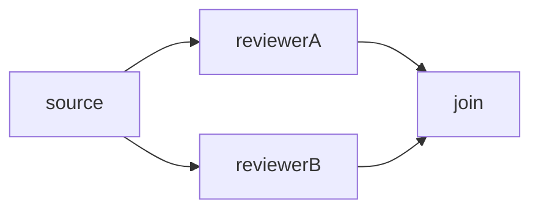
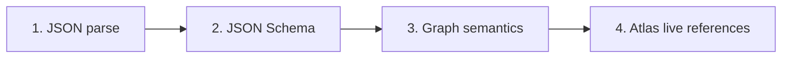

# Atlas Visual Workflow Builder Specification

**English** · [ภาษาไทย](workflow-visual-builder-spec-th.md)

Status: **Implementation specification v1.0**<br>
System baseline: Atlas as of 2026-06-29<br>
Audience: UX/UI designers, frontend programmers, backend programmers, QA, and AI workflow builders

This document specifies how to build a drag-and-drop graphical workflow editor
and convert its graph into the JSON Atlas actually executes. The goal is for the
visual editor, raw JSON editor, API, and AI builder to produce equivalent
semantics and round-trip without data loss.

Machine-readable validation files:

- [Workflow Definition JSON Schema](workflow-definition.schema.json)
- [Workflow Trigger JSON Schema](workflow-trigger.schema.json)
- [AI Workflow Draft JSON Schema](workflow-ai-draft.schema.json)

The schema `$id` values are identifiers, not download URLs. Validators must
preload all three files into their schema registry and resolve references
without making network requests.

Related documentation:

- [Concepts and Reference](../concepts-en.md)
- [Workflow Examples](../workflow-examples.md)
- [Web User Guide](../guides/web-user-guide-en.md)

## 1. Normative language

- **MUST** — mandatory; an implementation that omits it does not conform
- **SHOULD** — strongly recommended unless a documented technical reason applies
- **MAY** — optional capability
- **Semantic JSON** — JSON that defines workflow behavior and is sent to the Atlas API
- **Layout state** — node positions, zoom, viewport, selection, and UI state that do not affect execution
- **Canonical JSON** — normalized JSON exported by the visual editor

## 2. Core decision

Yes—the graph users manipulate must become JSON, but the editor must keep two
data layers separate:



1. **Semantic JSON** is sent to Atlas and is the source of truth for behavior.
2. **Layout state** is stored separately. Never put `x`, `y`, colors, or other UI data in `graph.nodes`.
3. Moving a node changes layout only and must not change Semantic JSON.
4. Connecting edges, changing conditions or the start node, editing policy, or editing node fields changes Semantic JSON.

## 3. Version 1 scope

The visual builder must cover every currently supported capability:

- nodes: `worker`, `manager`, `join`, `human_gate`
- join modes: `all`, `any`, `quorum`
- conditions: `always`, `artifact_equals`, `artifact_in`, `manager_selected`,
  `human_selected`, `max_iterations_below`
- worker-produced artifacts: `text` and `json`
- routing: worker, workspace, role, and routing hints
- worker/manager job execution mode (`execution`: `stream` or `callback`) and
  post-run file collection (`collect_files`, T9a)
- edge-level file handoff to the downstream node (`push_files`, T9b), gated by
  `policy.file_handoff`
- every policy/guard field currently accepted by the backend
- triggers: `manual`, `schedule`, `webhook`, `workflow_run_completed`,
  `artifact_created`, `worker_status_changed`
- templates, JSON import/export, validation, worker suggestions, AI draft/repair, and run input

The following are not part of a definition's Semantic JSON:

- workflow-run state, job state, approval state, and event timeline
- artifacts created during a run
- node positions, viewport, selected item, and panel state
- worker/workspace inventory, which must be loaded live from Fleet

## 4. Screen structure and visual grammar

### 4.1 Minimum screen structure

A desktop screen should contain four regions:

1. **Toolbar** — New, template, undo/redo, auto-layout, import/export, Validate, Save, Run
2. **Node palette** — the four node types with short descriptions
3. **Canvas** — nodes, ports, edges, start marker, and minimap/zoom when useful
4. **Inspector** — forms for the selected workflow, node, edge, policy, or trigger

The error panel must remain discoverable without hover. Selecting an error must
focus the affected node, edge, or field.

### 4.2 Node representation

Color must never be the only node-type encoding. Repeat the distinction with an
icon, shape, or visible label:

| Node | Display label | Recommended shape | Ports |
| --- | --- | --- | --- |
| `worker` | Worker | Rounded rectangle | one input, one output |
| `manager` | Manager | Hexagon or rectangle with a decision symbol | one input, one output |
| `join` | Join: all/any/quorum | Merge diamond or circle | multiple inputs, one output |
| `human_gate` | Human decision point | Diamond with a person icon | one or more inputs and outputs |

Every node must show at least its `id`, type, and validation state. Worker and
manager nodes should also show a short routing summary and output artifact, when present.

### 4.3 Edge representation

- Every edge must have a directional arrow for `from → to`.
- Display the condition directly on the edge, such as `always` or `fact_check.verdict = approved`.
- A loop/back edge must be visibly routed as a return path.
- A selected edge needs a focus treatment that does not depend on color alone.
- Execution edges and artifact dependencies are different. The UI may show artifact
  dependencies as a dotted overlay, but it must not serialize them as extra `graph.edges`.

### 4.4 Start node

- A graph has exactly one start node.
- The canvas must show a clear **Start** badge.
- A context menu or inspector must provide **Set as start**.
- The start node cannot be deleted until another start is selected, unless the
  user confirms that the editor should select a replacement.

### 4.5 Accessibility and mobile

- Every drag action must have a keyboard/menu alternative, including Add node, Connect to, and Move up/down.
- Touch hit targets must be at least 44×44 CSS px.
- Tooltips are insufficient for essential information; it must also be available by focus or tap.
- Mobile portrait must provide a list/step editor and inspector fallback rather than requiring canvas dragging.
- Undo/redo must cover add, delete, connect, disconnect, field editing, and auto-layout.

## 5. Canonical Workflow Definition JSON

The visual editor sends this payload to `POST /api/workflows` or
`PUT /api/workflows/{id}`:

```json
{
  "name": "Research approval",
  "description": "Research, review, and request a publishing decision.",
  "default_reply": {"mode": "none"},
  "graph": {
    "start": "researcher",
    "nodes": [],
    "edges": []
  },
  "policy": {
    "max_jobs": 20,
    "max_iterations": 5,
    "max_attempts_per_node": 3,
    "max_minutes": 30,
    "stop_on_first_failure": true
  }
}
```

Canonical rules:

- The root must contain `name`, `graph`, and `policy`; `description` and `default_reply` are optional.
- `default_reply`, when present, uses the `input._meta.reply` shape. It is copied to a new
  run only when that run does not provide `_meta.reply`; `webhook` requires a non-empty,
  allowlisted `callback_url`, while `none` may omit it. The inspector must allow clearing it.
- `graph` must contain `start`, `nodes`, and `edges`, even when `edges` is `[]`.
- The serializer must write `condition` on every edge; normalize a missing value to `{"type":"always"}`.
- `join.mode` must always be written; import defaults a missing value to `all`.
- `manager.schema` must be `manager_decision_v1` and must always be written.
- Write `output_format` only when it is `json`; omission means `text`.
- Never send layout state or unknown fields to the API.

The JSON Schema is a canonical editor profile and is deliberately stricter than
the backend in a few places: it requires name/graph/policy, writes
condition/mode/schema and trigger fields explicitly, and limits `outputs` to one
key because the current runtime only uses the first key. The backend accepts
some shorthand forms, but the importer must normalize them before schema validation.

## 6. Common node rules

Every node must contain:

```json
{"id":"unique_node_id","type":"worker"}
```

Rules:

1. `id` must be a non-empty string and unique within the graph.
2. The recommended pattern is `^[A-Za-z_][A-Za-z0-9_]*$` for readable, safe refactoring.
3. Renaming a node ID must atomically update:
   - `graph.start`
   - edge `from` / `to`
   - `manager_selected.target`
   - `max_iterations_below.node`
4. Deleting a node requires confirmation before deleting its incident edges.
5. Changing a node type must preview the fields and edges that will be removed; never migrate silently.
6. `budget_units`, when present, must be an integer greater than zero; runtime accounting applies only to worker/manager nodes.

## 7. Node specification

### 7.1 Worker node

Example:

```json
{
  "id": "fact_checker",
  "type": "worker",
  "role": "fact_checker",
  "prompt": "Return JSON for {artifact.notes}",
  "outputs": ["fact_check"],
  "output_format": "json",
  "budget_units": 1
}
```

Inspector fields:

| Field | Required | Rule |
| --- | --- | --- |
| `id` | yes | unique non-empty string |
| `prompt` | recommended | string; backend permits empty, but the UI should warn |
| `worker_id` | no | explicit worker ID |
| `workspace_id` | no | explicit workspace ID; takes routing precedence |
| `role` | no | route to a worker with a matching role/tag |
| `workspace_key` | no | advanced routing hint |
| `company` | no | advanced routing hint |
| `tags` | no | array of routing tags |
| `model` | no | model override |
| `outputs` | no | canonical v1 supports one artifact key |
| `output_format` | no | omit = text; `json` = parse the entire response as JSON |
| `budget_units` | no | integer > 0; runtime default = 1 |
| `execution` | no | `stream` (default) or `callback`; job execution mode |
| `collect_files` | no | array of relative glob patterns; collects real output files as `file_ref` artifacts after the job succeeds (T9a), capped by the backend's `artifact_max_files_cap()` |

Routing precedence is `workspace_id` → `worker_id` → auto-route by role/hints.
The selected workspace must belong to the selected worker and must not violate
policy allowlists.

Artifact rules:

- Without `outputs`, the job may succeed but creates no artifact.
- With `outputs: ["notes"]`, Atlas stores the entire `assistant_text` as artifact `notes`.
- The current runtime uses only the first output key.
- `output_format: "json"` requires a JSON-only parseable response; otherwise the node fails.
- Output keys should match `^[A-Za-z_][A-Za-z0-9_]*$` so `{artifact.KEY}` can reference them.

See [api-reference-en.md](api-reference-en.md), section "Frozen Job Artifacts
(`collect_files`, T9a)", for collection timing, deadlines, and caps.

### 7.2 Manager node

```json
{
  "id": "manager",
  "type": "manager",
  "role": "manager",
  "schema": "manager_decision_v1",
  "prompt": "Choose the next bounded action.",
  "budget_units": 1
}
```

A manager uses the same routing fields and budget behavior as a worker, but it
does not directly create an output artifact. A manager also accepts the same
`execution` and `collect_files` fields described in 7.1. Every outgoing edge
must use `manager_selected`, and `target` must equal the edge's `to`.

The manager worker must return JSON only:

```json
{
  "stop": false,
  "reason": "Research is ready for review.",
  "next": [
    {
      "node": "reviewer",
      "input_artifacts": ["research"],
      "instructions": "Check facts and return concise corrections."
    }
  ]
}
```

`manager_decision_v1` rules:

- `stop` is boolean, `reason` is string, and `next` is an array.
- `stop: true` requires `next: []`.
- `stop: false` requires at least one `next` item.
- Every item requires `node`, `input_artifacts[]`, and `instructions`.
- The target must have an outgoing manager edge, artifacts must exist, and route/policy/guard checks must pass.
- Duplicate targets run once; if any item is invalid, the entire proposal is rejected.
- The AI/manager proposes; Atlas enforces policy and decides what may be scheduled.

### 7.3 Join node

```json
{"id":"reviews_join","type":"join","mode":"quorum","quorum":2}
```

| Mode | Behavior |
| --- | --- |
| `all` | Wait for every upstream node that reaches the join |
| `any` | Continue after the first successful upstream arrives |
| `quorum` | Continue after `quorum` distinct upstream nodes succeed |

Rules:

- A join creates no worker job and consumes no budget.
- Import may omit `mode`; normalize it to `all`.
- `quorum` must be an integer > 0 and cannot exceed the number of **distinct incoming upstreams**.
- Duplicate incoming edges from the same source count once.
- If upstream failures make quorum impossible, the join fails explicitly.
- Changing away from quorum must remove the `quorum` field.

### 7.4 Human gate node

Recommended UI label: **Human decision point**.

Approve/Reject form:

```json
{
  "id": "publish_approval",
  "type": "human_gate",
  "label": "Approve publication",
  "reason": "Review the content before publication"
}
```

Choice form:

```json
{
  "id": "publish_decision",
  "type": "human_gate",
  "label": "Choose the next step",
  "reason": "Review the draft",
  "choices": [
    {"id": "publish", "label": "Publish"},
    {"id": "revise", "label": "Send back for revision"}
  ]
}
```

Rules:

- The node creates no job and changes the run to `waiting_for_human`.
- `choices`, when present, must be a non-empty array with unique choice IDs.
- Without choices, Approve evaluates outgoing conditions; Reject fails the run.
- With choices, every outgoing edge must use `human_selected` and reference a declared choice.
- Renaming a choice ID must atomically refactor every `human_selected.choice` reference.
- Deleting a referenced choice must be blocked or require deleting its edges at the same time.

## 8. Edge and condition specification

Canonical edge:

```json
{
  "from": "reporter",
  "to": "writer",
  "condition": {"type": "always"}
}
```

`from` and `to` must reference existing nodes. The visual editor should ask for
confirmation before creating a self-loop, even though the backend accepts one
when a loop guard exists. An edge may also declare `push_files` to hand off
previously-collected files to its target node; see 8.4.

### 8.1 Condition table

| Type | Inspector fields | Matches when |
| --- | --- | --- |
| `always` | none | always |
| `artifact_equals` | artifact, optional path, value | actual equals value |
| `artifact_in` | artifact, optional path, values[] | actual is in values |
| `manager_selected` | target | manager selected the target |
| `human_selected` | choice | user selected the choice |
| `max_iterations_below` | node, max | the node execution count is still below max |

### 8.2 Condition JSON

```json
{"type":"always"}
```

```json
{
  "type": "artifact_equals",
  "artifact": "fact_check",
  "path": "verdict",
  "value": "approved"
}
```

```json
{
  "type": "artifact_in",
  "artifact": "fact_check",
  "path": "verdict",
  "values": ["approved", "minor_changes"]
}
```

```json
{"type":"manager_selected","target":"writer"}
```

```json
{"type":"human_selected","choice":"publish"}
```

```json
{"type":"max_iterations_below","node":"researcher","max":3}
```

Runtime details:

- A missing artifact or unresolved path produces `null`/`None`, so the condition normally does not match.
- Condition paths walk objects by dot-path and arrays by numeric index, for example `items.0.id`.
- `artifact_in.values` should contain at least one item even though the backend accepts an empty array.
- An edge from a manager must use `manager_selected`.
- `manager_selected.target` must equal the edge's `to`.
- `human_selected` is valid only when the source is a `human_gate` that declares the choice.
- `max_iterations_below.node` must reference an existing node, and `max` must be an integer > 0.

### 8.3 Creating an edge by dragging

After a user drags an output port to an input port:

1. If the source is a manager, create `manager_selected` and set `target = to` automatically.
2. If the source is a human gate with choices, require a choice before creating the edge.
3. Otherwise default to `always`, then open the edge inspector for optional changes.
4. If the edge creates a cycle, show a loop warning and require a guard before Save.

### 8.4 File handoff (`push_files`, T9b)

An edge may carry `push_files`, a non-empty array of artifact-key glob
patterns (for example `files.coder.*`), which hands previously-collected
`file_ref` artifacts (see `collect_files` in 7.1, T9a) to the edge's target
node before that node's job starts.

- `push_files` requires `policy.file_handoff: true`; the backend rejects the
  edge at save time otherwise, and re-checks the policy again at runtime.
- The downstream node's prompt may reference the handed-off files with the
  `{files_dir}` placeholder.
- See [api-reference-en.md](api-reference-en.md), section "File handoff
  between nodes (`push_files`, T9b)", for transport, caps, and jailing details.

## 9. Execution semantics the graph must communicate

### 9.1 Fan-out

After a node succeeds, Atlas evaluates every outgoing edge and schedules **every
edge that matches**. It does not stop after the first match. Multiple `always`
edges therefore create fan-out.



If multiple matching edges target the same node in one scheduling pass, that
target is queued once.

### 9.2 Join

Branches that must merge must connect directly into a join. Multiple edges into
a normal worker do not make that worker wait for every branch; it may be
scheduled when the first branch arrives.

### 9.3 Cycles and loop guards

A graph containing a cycle requires at least one guard:

- `policy.max_iterations` as an integer > 0, or
- an edge with condition `max_iterations_below`

The visual editor should recommend edge-specific `max_iterations_below` on a
back edge because it makes the stopping point clearer than `max_iterations`
alone. The current runtime's `max_iterations` counts started worker/manager jobs,
not theoretical graph rounds.

### 9.4 Terminal node

A node with no outgoing edge is terminal; no separate End node is required. A
run finishes when its ready queue is empty. If any node failed, the run ends
`failed`, even when `stop_on_first_failure: false` allowed independent branches
to continue.

## 10. Prompts and artifacts

The visual editor should autocomplete these placeholders:

| Placeholder | Meaning |
| --- | --- |
| `{input.KEY}` | run input |
| `{artifact.KEY}` | artifact on the run |
| `{artifact.KEY.FIELD}` | field inside a JSON artifact |
| `{run.KEY}` | run metadata; advanced |
| `{node.KEY}` | current node field; advanced |
| `{job.KEY}` | job metadata; limited before job submission |

A placeholder needs a root and at least one path segment. Each segment must be
an identifier matching `[A-Za-z_][A-Za-z0-9_]*`. The current prompt renderer
walks object/dictionary values only, so it should not suggest array indexes in
prompts even though condition paths support array indexes.

The linter should check:

- every referenced artifact key has a producer or is explicitly marked manual/file-provided;
- the producer is upstream of the consumer;
- JSON field references point to a producer with `output_format: "json"`;
- duplicate output keys across nodes produce a warning because the latest run value wins;
- a provably missing placeholder is an error before Run, while a value dependent on manual input is a warning.

An artifact reference does not automatically create an execution dependency.
The user must still connect an execution edge from producer to consumer, or use
the correct join.

## 11. Policy and guards

| Field | Backend range | Meaning |
| --- | --- | --- |
| `max_jobs` | 1–100 | maximum worker/manager jobs |
| `max_iterations` | 1–100 | current runtime counts started worker/manager jobs |
| `max_attempts_per_node` | 1–25 | maximum attempts per node |
| `max_minutes` | 1–1440 | total run duration |
| `requires_human_after_iterations` | 1–100 | request one approval when jobs_started reaches the value |
| `max_budget_units` | 1–1,000,000 | abstract budget, not money or tokens |
| `allowed_worker_ids` | string[] | worker allowlist |
| `allowed_workspace_ids` | string[] | workspace allowlist |
| `stop_on_first_failure` | boolean | true = stop after the first failed branch |
| `file_handoff` | boolean | opt-in enabling edge `push_files` (T9b); off by default |

Recommended defaults for a new workflow:

```json
{
  "max_jobs": 20,
  "max_iterations": 5,
  "max_attempts_per_node": 3,
  "max_minutes": 30,
  "stop_on_first_failure": true
}
```

Important: the backend does not automatically materialize these numeric
defaults into persisted policy. If the editor wants safety guards, it must write
them into JSON when it creates a workflow. Runtime behavior defaults
`stop_on_first_failure` to true.

The policy inspector must immediately show conflicts, such as a node selecting
a worker outside the allowlist or a workspace owned by a forbidden worker.

## 12. Trigger specification

A trigger is a resource separate from the workflow definition. It does not
belong in `graph` and can be created only after a `workflow_definition_id`
exists. The visual editor may keep trigger drafts separately and POST them one
at a time.

Canonical trigger draft:

```json
{
  "name": "Every 15 minutes",
  "type": "schedule",
  "enabled": true,
  "config": {"interval_minutes": 15}
}
```

| Type | Config |
| --- | --- |
| `manual` | `{}` |
| `webhook` | `{}` or integration-specific config |
| `schedule` interval | `{"interval_minutes": 15}`; number > 0 |
| `schedule` daily | `{"daily_time":"09:30"}`; local time HH:MM |
| `workflow_run_completed` | optional `source_workflow_definition_id`, `state` |
| `artifact_created` | optional `source_workflow_definition_id`, `key`, `kind` |
| `worker_status_changed` | optional `worker_id`, `status` |

The final three internal trigger types are emitted by Atlas and should not show
a Fire button. Manual, schedule, and webhook triggers may expose Fire for
testing. A retry of the same event should reuse the same `dedupe_key`.

[workflow-trigger.schema.json](workflow-trigger.schema.json) validates trigger
drafts before API submission. `workflow_definition_id` is added when the trigger
is persisted.

## 13. Layout state and round-trip behavior

Recommended layout state:

```json
{
  "layout_version": 1,
  "nodes": {
    "researcher": {"x": 120, "y": 180},
    "writer": {"x": 420, "y": 180}
  },
  "viewport": {"x": 0, "y": 0, "zoom": 1}
}
```

Rules:

- Keys in `layout.nodes` are semantic node IDs.
- A node without a stored position uses auto-layout.
- Layout entries for deleted nodes must be cleaned up.
- Importing Semantic JSON without layout must still work.
- API export contains only the definition; an editor-sharing export may use a separate envelope.
- Raw JSON → visual → raw JSON must preserve every field supported by this specification.
- The editor must not silently retain unknown semantic fields; show an unsupported-field error.

Auto-layout should default to a layered left-to-right arrangement, preserve
user-pinned positions, and route loops around the top or bottom to reduce crossings.

## 14. Import, normalization, and serialization

### Import pipeline

1. Parse JSON; accept one object only and reject Markdown fences.
2. Add `always` when an edge has no condition.
3. Add `all` when a join has no mode.
4. Add `manager_decision_v1` when a manager has no schema.
5. Convert `output_format: "text"` to an omitted field.
6. Validate against JSON Schema.
7. Run semantic and live-reference validation.
8. Generate layout for nodes with no position.
9. Display warnings before allowing Save.

### Serialization pipeline

1. Serialize from the state model, not directly from DOM values.
2. Trim ID fields, but never alter prompt/label text silently.
3. Remove fields that do not belong to the selected node type.
4. Write condition/mode/schema defaults explicitly.
5. Sort only for stability: nodes by visual/order model and edges by from/to/order.
6. Do not sort choices when button order carries UX meaning.
7. Validate again before Save or Export.

## 15. Validation contract

The implementation needs four validation layers:



### 15.1 Schema validation

Use the schemas in this directory to validate types, required fields, enums,
numeric ranges, and canonical shape.

### 15.2 Semantic validation beyond JSON Schema

At minimum, validate:

- node IDs are unique and `start` exists;
- edge from/to references exist;
- choice IDs are unique;
- manager/human edge coupling is correct;
- manager target equals edge target;
- human choice is declared by the source gate;
- quorum does not exceed distinct incoming upstream count;
- every graph cycle has a guard;
- rename/delete operations refactor all references;
- artifact references and reachability produce lint warnings;
- unreachable nodes produce warnings;
- duplicate exact edges are warned or blocked in the editor.

### 15.3 Live-reference validation

Validate against the current Fleet state:

- worker/workspace IDs exist;
- a workspace belongs to the selected worker;
- a role matches a worker role/tag when there is no explicit route;
- the route does not violate policy allowlists;
- trigger `source_workflow_definition_id` and `worker_id` references exist;
- AI output does not invent IDs absent from context.

### 15.4 Error format for UI and AI

The client validator should return one consistent structure:

```json
{
  "severity": "error",
  "code": "MANAGER_EDGE_CONDITION_REQUIRED",
  "path": "/graph/edges/3/condition/type",
  "node_id": "manager",
  "edge_index": 3,
  "message": "An edge from a manager must use manager_selected",
  "suggested_fix": "Change the condition and set target equal to edge.to"
}
```

Levels:

- `error` — Save/Run is blocked
- `warning` — Save is allowed, but behavior is risky or may differ from intent
- `info` — readability or UX recommendation

Error codes must remain stable for tests and AI. Never use localized message
text as a programmatic key.

## 16. Optional AI assistance

AI is not the primary validator. It may provide Draft, Explain, Repair, and Suggest.

### 16.1 Context sent to AI

- real workers and workspaces with IDs, roles, tags, and ownership
- node/condition/trigger enums from this specification
- policy defaults and hard limits
- available templates
- JSON Schemas or a concise field contract
- the user's request

### 16.2 Output contract

An AI draft must return one JSON object without Markdown fences:

```json
{
  "name": "...",
  "description": "...",
  "graph": {"start":"...","nodes":[],"edges":[]},
  "policy": {},
  "triggers": [],
  "explanation": "...",
  "warnings": []
}
```

Every trigger draft must have canonical shape `{name,type,enabled,config}`. The
AI prompt must mark these fields required. For compatibility with an older
builder, the importer may add `enabled: true` and `config: {}` before validation,
but it must never guess a type or execution-relevant config.

Before displaying the result:

1. Parse JSON.
2. Validate the full response with [AI Workflow Draft JSON Schema](workflow-ai-draft.schema.json), which references the definition and trigger schemas.
3. Run semantic and live-reference validation.
4. Show a visual preview and diff.
5. Require the user to click Apply/Save.

AI must not automatically Save, delete, Fire a trigger, or Run a workflow. It
must not invent worker, workspace, artifact, or choice IDs absent from context.
Repair must produce a validated preview that remains unsaved.

### 16.3 Deterministic validation remains authoritative

If AI says a workflow is valid but a schema/server validator rejects it, the
schema/server wins. AI review may identify semantic warnings such as an unclear
prompt, a likely missing artifact producer, or excessive policy limits, but it
must not replace deterministic validation.

## 17. API mapping

| Visual Builder action | Current API |
| --- | --- |
| Load definitions | `GET /api/workflows` |
| Load templates | `GET /api/workflow-templates` |
| Create | `POST /api/workflows` |
| Update | `PUT /api/workflows/{id}` |
| Delete | `DELETE /api/workflows/{id}` |
| Validate a saved definition/preview | `POST /api/workflows/{id}/validate` |
| AI draft | `POST /api/workflows/draft` |
| AI/local worker suggestions | `POST /api/workflows/suggest-workers` |
| Explain | `POST /api/workflows/{id}/explain` |
| Repair | `POST /api/workflows/{id}/repair` |
| Suggest triggers | `POST /api/workflows/{id}/suggest-triggers` |
| Create trigger | `POST /api/workflow-triggers` |
| Run | `POST /api/workflow-runs` |

Current API limitation: Validate requires a saved workflow ID. For an unsaved
draft, run schema/semantic validation on the client; Save causes the backend to
validate again. The AI draft endpoint validates its result before returning it.

**Concurrent Save contract.** When editing an existing definition, retain the
loaded `workflow.version` and send it as `expected_version` on `PUT` (never send
both `expected_version` and `version`). A successful save increments the version;
`409` means another editor saved first. Keep the local unsaved graph, reload the
server definition, and present a merge/reload decision rather than overwriting it.

## 18. Example covering every node type

```json
{
  "name": "Research review and publish",
  "description": "Fan-out review, manager decision, bounded rewrite, and human publishing choice.",
  "graph": {
    "start": "researcher",
    "nodes": [
      {
        "id": "researcher",
        "type": "worker",
        "role": "researcher",
        "prompt": "Research {input.topic}",
        "outputs": ["research"]
      },
      {
        "id": "fact_checker",
        "type": "worker",
        "role": "fact_checker",
        "prompt": "Return JSON with verdict for {artifact.research}",
        "outputs": ["fact_check"],
        "output_format": "json"
      },
      {
        "id": "editor",
        "type": "worker",
        "role": "editor",
        "prompt": "Review writing quality of {artifact.research}",
        "outputs": ["edit_notes"]
      },
      {"id": "reviews_join", "type": "join", "mode": "all"},
      {
        "id": "manager",
        "type": "manager",
        "role": "manager",
        "schema": "manager_decision_v1",
        "prompt": "Choose rewrite or publishing approval."
      },
      {
        "id": "writer",
        "type": "worker",
        "role": "writer",
        "prompt": "Rewrite {artifact.research} using {artifact.edit_notes}",
        "outputs": ["draft"]
      },
      {
        "id": "publish_decision",
        "type": "human_gate",
        "label": "Review before publication",
        "reason": "Choose whether to publish or revise",
        "choices": [
          {"id": "publish", "label": "Publish"},
          {"id": "revise", "label": "Revise again"}
        ]
      },
      {
        "id": "publisher",
        "type": "worker",
        "role": "publisher",
        "prompt": "Publish {artifact.draft}",
        "outputs": ["published_result"]
      }
    ],
    "edges": [
      {"from":"researcher","to":"fact_checker","condition":{"type":"always"}},
      {"from":"researcher","to":"editor","condition":{"type":"always"}},
      {"from":"fact_checker","to":"reviews_join","condition":{"type":"always"}},
      {"from":"editor","to":"reviews_join","condition":{"type":"always"}},
      {"from":"reviews_join","to":"writer","condition":{"type":"always"}},
      {"from":"writer","to":"manager","condition":{"type":"max_iterations_below","node":"writer","max":3}},
      {"from":"manager","to":"writer","condition":{"type":"manager_selected","target":"writer"}},
      {"from":"manager","to":"publish_decision","condition":{"type":"manager_selected","target":"publish_decision"}},
      {"from":"publish_decision","to":"publisher","condition":{"type":"human_selected","choice":"publish"}},
      {"from":"publish_decision","to":"writer","condition":{"type":"human_selected","choice":"revise"}}
    ]
  },
  "policy": {
    "max_jobs": 20,
    "max_iterations": 10,
    "max_attempts_per_node": 3,
    "max_minutes": 30,
    "max_budget_units": 20,
    "stop_on_first_failure": true
  }
}
```

This example demonstrates the contract; it does not guarantee that Fleet has a
worker for every role. Live-reference validation must pass before Save/Run.

## 19. Programmer and QA acceptance criteria

### Round-trip

- Import canonical JSON → render graph → export semantically equivalent JSON.
- Moving a node changes layout but not Semantic JSON.
- Renaming a node/choice updates every reference atomically.
- Valid raw JSON edits return to the canvas without losing fields.

### Node/edge rules

- All four node types and all inspector fields can be created and edited.
- Manager and human-choice edges automatically receive the correct conditions.
- A quorum exceeding incoming upstream count is blocked.
- A cycle without a guard is blocked.
- Fan-out and join visuals communicate runtime semantics correctly.

### Validation

- JSON Schema tests cover valid/invalid forms of every node and condition.
- Semantic tests cover duplicate IDs, missing references, manager/human mismatch, quorum, and cycles.
- Live-reference tests cover unknown worker/workspace, ownership, and allowlists.
- Selecting an error focuses the affected node, edge, or field.

### AI

- AI output with Markdown fences, invented IDs, or invalid enums is rejected.
- AI draft/repair never saves automatically.
- The deterministic validator remains final authority.
- Users see a diff and warnings before Apply.

### Accessibility

- Users can create, connect, edit, and delete a workflow without drag-only interactions.
- Keyboard focus is visible, and screen readers expose node type/ID/errors.
- Mobile provides a list-based fallback with complete actions.

## 20. Minimum test matrix

| Case | Expected result |
| --- | --- |
| worker → worker, always | valid |
| worker has two output keys | schema rejects; runtime really uses only the first key |
| JSON output but worker returns non-JSON text | node fails at runtime |
| manager edge uses always | semantic rejection |
| manager target differs from edge.to | semantic rejection |
| duplicate human-gate choices | semantic rejection |
| human_selected references an undeclared choice | semantic rejection |
| quorum 3 with two distinct incoming upstreams | semantic rejection |
| cycle without a guard | semantic rejection |
| cycle with max_iterations | valid |
| artifact condition path is missing | valid graph; condition does not match at runtime |
| unknown worker_id | live-reference rejection |
| workspace does not belong to worker | live-reference rejection |
| policy exceeds hard limit | rejection |
| schedule uses 25:00 | trigger schema/backend rejection |
| internal trigger has valid filters | valid |
| move node | layout changes; Semantic JSON does not |

This specification must be updated together with `validate_workflow_graph`,
`_validate_workflow_policy`, `validate_workflow_trigger_payload`,
`_builder_context`, and runtime semantics whenever a node, condition, policy, or
trigger type is added.
