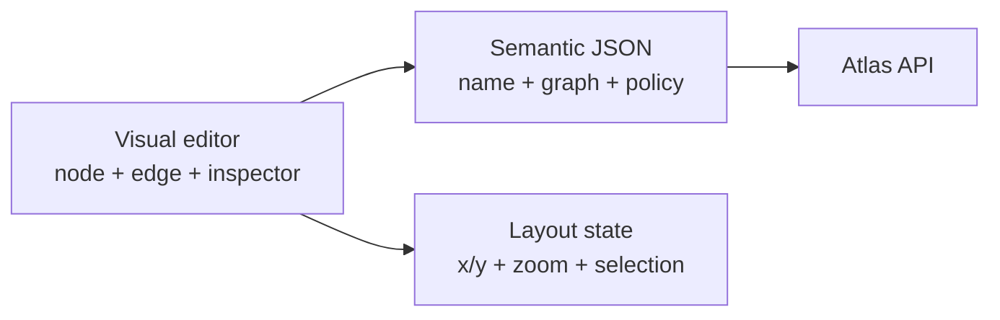
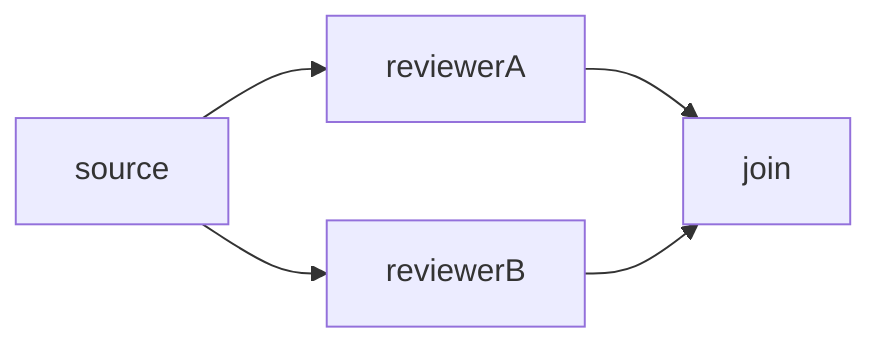
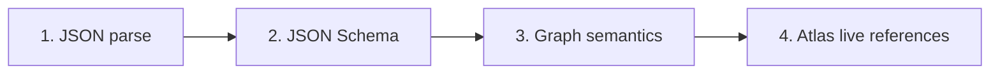

# Atlas Visual Workflow Builder Specification

[English](workflow-visual-builder-spec-en.md) · **ภาษาไทย**

สถานะ: **Implementation specification v1.0**<br>
อ้างอิงระบบ: Atlas ณ วันที่ 2026-06-29<br>
กลุ่มเป้าหมาย: UX/UI designer, frontend programmer, backend programmer, QA และ AI workflow builder

เอกสารนี้กำหนดวิธีสร้างหน้า workflow แบบกราฟลากวาง และวิธีแปลงกราฟนั้นเป็น JSON
ที่ Atlas ใช้จริง เป้าหมายคือให้ visual editor, raw JSON editor, API และ AI สร้างผลลัพธ์
ที่มีความหมายตรงกันและ round-trip ได้โดยไม่สูญเสียข้อมูล

ไฟล์สำหรับตรวจโครงสร้างอัตโนมัติ:

- [Workflow Definition JSON Schema](workflow-definition.schema.json)
- [Workflow Trigger JSON Schema](workflow-trigger.schema.json)
- [AI Workflow Draft JSON Schema](workflow-ai-draft.schema.json)

`$id` ใน schema เป็น identifier ไม่ใช่ URL สำหรับดาวน์โหลด Validator ต้อง preload ไฟล์
ทั้งสามเข้า schema registry เพื่อ resolve reference โดยไม่เรียก network

เอกสารอ้างอิงประกอบ:

- [นิยามและเอกสารอ้างอิง](../concepts-th.md)
- [ตัวอย่าง Workflow](../workflow-examples.md)
- [คู่มือใช้งานเว็บ](../guides/web-user-guide-th.md)

## 1. คำที่ใช้ในสเปก

- **MUST / ต้อง** — ขาดไม่ได้ หากไม่ทำถือว่าไม่ตรงสเปก
- **SHOULD / ควร** — แนะนำอย่างมาก ยกเว้นมีเหตุผลทางเทคนิคที่บันทึกไว้
- **MAY / อาจ** — เป็นความสามารถเสริม
- **Semantic JSON** — JSON ที่กำหนดพฤติกรรมของ workflow และส่งให้ Atlas API
- **Layout state** — ตำแหน่ง node, zoom, viewport, selection และสถานะ UI ซึ่งไม่มีผลต่อการรัน
- **Canonical JSON** — รูปแบบ JSON ที่ visual editor ส่งออกหลัง normalize แล้ว

## 2. ข้อสรุปสำคัญ

ใช่—กราฟที่ผู้ใช้ลากวางต้องแปลงเป็น JSON แต่ต้องแยกข้อมูลสองชั้น:



1. **Semantic JSON** ต้องส่งให้ Atlas และเป็น source of truth ของพฤติกรรม
2. **Layout state** ต้องเก็บแยก ห้ามใส่ `x`, `y`, สี หรือข้อมูล UI ลงใน `graph.nodes`
3. การขยับ node เปลี่ยนเฉพาะ layout ห้ามเปลี่ยน Semantic JSON
4. การต่อเส้น, เปลี่ยน condition, เปลี่ยน start, policy หรือ field ของ node จึงเปลี่ยน Semantic JSON

## 3. ขอบเขต v1

Visual builder ต้องครอบคลุมความสามารถปัจจุบันทั้งหมด:

- node: `worker`, `manager`, `join`, `human_gate`
- join mode: `all`, `any`, `quorum`
- condition: `always`, `artifact_equals`, `artifact_in`, `manager_selected`,
  `human_selected`, `max_iterations_below`
- artifact จาก worker: `text` และ `json`
- route: worker, workspace, role และ routing hints
- execution mode ของ job worker/manager (`execution`: `stream` หรือ `callback`)
  และการเก็บไฟล์หลัง job เสร็จ (`collect_files`, T9a)
- การส่งไฟล์ต่อให้ node ถัดไปผ่าน edge (`push_files`, T9b) ซึ่งต้องเปิด
  `policy.file_handoff` ก่อน
- policy/guard ทุก field ที่ backend รองรับ
- trigger: `manual`, `schedule`, `webhook`, `workflow_run_completed`,
  `artifact_created`, `worker_status_changed`
- template, import/export JSON, validate, suggest workers, AI draft/repair และ run input

สิ่งต่อไปนี้ไม่ใช่ Semantic JSON ของ definition:

- workflow run state, job state, approval state และ event timeline
- artifact ที่เกิดระหว่าง run
- node position, viewport, selected item และ panel state
- worker/workspace inventory ซึ่งต้องโหลดสดจาก Fleet

## 4. โครงหน้าจอและ visual grammar

### 4.1 โครงหน้าจอขั้นต่ำ

หน้าจอ desktop ควรมี 4 ส่วน:

1. **Toolbar** — New, template, undo/redo, auto-layout, import/export, Validate, Save, Run
2. **Node palette** — node 4 ชนิดและคำอธิบายสั้น
3. **Canvas** — node, port, edge, start marker, minimap/zoom ตามความจำเป็น
4. **Inspector** — form ของ workflow, node, edge, policy หรือ trigger ที่เลือก

แถบ error ต้องมองเห็นได้โดยไม่ต้อง hover และกดแล้ว focus node/edge/field ที่ผิดได้

### 4.2 รูปแบบ node

ห้ามใช้สีเป็นตัวแยกชนิดเพียงอย่างเดียว ต้องมี icon, shape หรือ label ซ้ำเสมอ:

| Node | Label ที่แสดง | รูปทรงแนะนำ | Port |
| --- | --- | --- | --- |
| `worker` | Worker | สี่เหลี่ยมมุมมน | input 1, output 1 |
| `manager` | Manager | หกเหลี่ยมหรือสี่เหลี่ยมมีสัญลักษณ์ decision | input 1, output 1 |
| `join` | Join: all/any/quorum | ข้าวหลามตัดหรือวงกลมรวมทาง | input หลาย, output 1 |
| `human_gate` | จุดรอการตัดสินใจ | ข้าวหลามตัดพร้อม icon ผู้ใช้ | input 1+, output 1+ |

ทุก node ต้องแสดงอย่างน้อย `id`, type และสถานะ validation ถ้าเป็น worker/manager ควร
แสดง route แบบย่อและ output artifact ถ้ามี

### 4.3 รูปแบบ edge

- edge ต้องมีลูกศรบอกทิศ `from → to`
- ต้องแสดง condition เป็น label บนเส้น เช่น `always`, `fact_check.verdict = approved`
- loop/back edge ต้องมองออกว่าเป็นเส้นย้อนกลับ
- edge ที่เลือกต้องมี focus style ที่ไม่พึ่งสีอย่างเดียว
- execution edge เป็นคนละเรื่องกับ artifact dependency เส้นที่อ้าง artifact อาจแสดงแบบ
  dotted overlay ได้ แต่ห้าม serialize เป็น `graph.edges` เพิ่มเอง

### 4.4 Start node

- graph มี start ได้หนึ่ง node เท่านั้น
- canvas ต้องแสดง badge **Start** ชัดเจน
- context menu หรือ inspector ต้องมี **Set as start**
- ลบ start node ไม่ได้จนกว่าจะเลือก start ใหม่ หรือผู้ใช้ยืนยันให้ editor เลือก node ใหม่

### 4.5 Accessibility และ mobile

- ทุกคำสั่งลากวางต้องมีทางเลือกผ่าน keyboard/menu เช่น Add node, Connect to, Move up/down
- hit target อย่างน้อย 44×44 CSS px บน touch
- tooltip อย่างเดียวไม่พอ ข้อมูลสำคัญต้องเปิดจาก focus/tap ได้
- mobile portrait ใช้ list/step editor + inspector เป็น fallback ไม่บังคับลากเส้นบน canvas
- รองรับ undo/redo สำหรับ add, delete, connect, disconnect, field edit และ auto-layout

## 5. Canonical Workflow Definition JSON

Payload ที่ visual editor ส่งให้ `POST /api/workflows` หรือ `PUT /api/workflows/{id}`:

```json
{
  "name": "Research approval",
  "description": "Research, review, and request a publishing decision.",
  "graph": {
    "start": "researcher",
    "nodes": [],
    "edges": []
  },
  "policy": {
    "max_jobs": 20,
    "max_iterations": 5,
    "max_attempts_per_node": 3,
    "max_minutes": 30,
    "stop_on_first_failure": true
  }
}
```

กฎ canonical:

- root ต้องมี `name`, `graph`, `policy`; `description` เป็น optional string
- `graph` ต้องมี `start`, `nodes`, `edges` แม้ `edges` เป็น `[]`
- serializer ต้องเขียน `condition` ทุก edge; ถ้าไม่มีให้ normalize เป็น
  `{"type":"always"}`
- `join.mode` ต้องเขียนเสมอ; ค่า default ตอน import คือ `all`
- `manager.schema` ต้องเป็น `manager_decision_v1` และต้องเขียนเสมอ
- `output_format` ให้เขียนเฉพาะเมื่อเป็น `json`; ถ้าไม่มีหมายถึง `text`
- ห้ามส่ง layout state หรือ unknown field ไป API

JSON Schema เป็น canonical editor profile จึงมีเจตนาเข้มกว่า backend บางจุด: บังคับ
name/graph/policy, เขียน condition/mode/schema และ trigger fields ให้ชัด และจำกัด `outputs`
ไว้หนึ่ง key เพราะ runtime ปัจจุบันใช้เฉพาะ key แรก Backend อาจรับรูปย่อบางแบบ แต่ importer
ต้อง normalize ก่อนตรวจด้วย schema นี้

## 6. กฎร่วมของ node

node ทุกตัวต้องมี:

```json
{"id":"unique_node_id","type":"worker"}
```

กฎ:

1. `id` ต้องเป็น non-empty string และไม่ซ้ำใน graph
2. แนะนำ pattern `^[A-Za-z_][A-Za-z0-9_]*$` เพื่ออ่านง่ายและ refactor ปลอดภัย
3. เปลี่ยน node ID ต้องแก้ reference แบบ atomic ทั้ง:
   - `graph.start`
   - edge `from` / `to`
   - `manager_selected.target`
   - `max_iterations_below.node`
4. ลบ node ต้องลบ incident edges หลังผู้ใช้ยืนยัน
5. เปลี่ยน type ต้องแสดง preview ของ field/edge ที่จะถูกลบและห้ามเปลี่ยนแบบเงียบ ๆ
6. `budget_units` ถ้ามีต้องเป็น integer มากกว่า 0; runtime นับเฉพาะ worker/manager

## 7. Node specification

### 7.1 Worker node

ตัวอย่าง:

```json
{
  "id": "fact_checker",
  "type": "worker",
  "role": "fact_checker",
  "prompt": "Return JSON for {artifact.notes}",
  "outputs": ["fact_check"],
  "output_format": "json",
  "budget_units": 1
}
```

Inspector fields:

| Field | Required | กฎ |
| --- | --- | --- |
| `id` | ต้อง | unique non-empty string |
| `prompt` | ควร | string; ว่างได้ตาม backend แต่ UI ควรเตือน |
| `worker_id` | ไม่ | explicit worker ID |
| `workspace_id` | ไม่ | explicit workspace ID; มีลำดับเหนือ worker route |
| `role` | ไม่ | route ไป worker ที่ role/tag ตรงกัน |
| `workspace_key` | ไม่ | advanced routing hint |
| `company` | ไม่ | advanced routing hint |
| `tags` | ไม่ | array ของ routing tags |
| `model` | ไม่ | model override |
| `outputs` | ไม่ | canonical v1 รองรับหนึ่ง artifact key |
| `output_format` | ไม่ | omit = text, `json` = parse JSON ทั้ง response |
| `budget_units` | ไม่ | integer > 0; default runtime = 1 |
| `execution` | ไม่ | `stream` (default) หรือ `callback`; execution mode ของ job |
| `collect_files` | ไม่ | array ของ relative glob pattern; เก็บไฟล์ output จริงเป็น artifact `file_ref` หลัง job สำเร็จ (T9a) จำนวนถูกจำกัดด้วย `artifact_max_files_cap()` ของ backend |

Route precedence คือ `workspace_id` → `worker_id` → auto-route จาก role/hints
workspace ที่เลือกต้องเป็นของ worker ที่เลือก และต้องไม่ขัด policy allowlist

Artifact rules:

- ไม่มี `outputs` = job สำเร็จได้แต่ไม่สร้าง artifact
- มี `outputs: ["notes"]` = เก็บ `assistant_text` ทั้งก้อนเป็น artifact `notes`
- runtime ปัจจุบันใช้ output key แรกเท่านั้น
- `output_format: "json"` ต้องได้ JSON ล้วนที่ parse ได้ มิฉะนั้น node fail
- output key ควรใช้ `^[A-Za-z_][A-Za-z0-9_]*$` เพื่อเรียก `{artifact.KEY}` ได้

ดูรายละเอียดเรื่องจังหวะการเก็บไฟล์ deadline และ cap ได้ที่ api-reference-th.md
หัวข้อ "Frozen Job Artifacts (`collect_files`, T9a)"

### 7.2 Manager node

```json
{
  "id": "manager",
  "type": "manager",
  "role": "manager",
  "schema": "manager_decision_v1",
  "prompt": "Choose the next bounded action.",
  "budget_units": 1
}
```

Manager ใช้ routing field และ budget เหมือน worker แต่ไม่สร้าง output artifact โดยตรง
Manager รองรับ field `execution` และ `collect_files` เหมือน worker ใน 7.1 ด้วย
ทุก outgoing edge ต้องเป็น `manager_selected` และ `target` ต้องตรงกับ edge `to`

Manager worker ต้องตอบ JSON ล้วน:

```json
{
  "stop": false,
  "reason": "Research is ready for review.",
  "next": [
    {
      "node": "reviewer",
      "input_artifacts": ["research"],
      "instructions": "Check facts and return concise corrections."
    }
  ]
}
```

กฎ `manager_decision_v1`:

- `stop` boolean, `reason` string, `next` array
- `stop: true` ต้องมี `next: []`
- `stop: false` ต้องมี `next` อย่างน้อยหนึ่งรายการ
- แต่ละรายการต้องมี `node`, `input_artifacts[]`, `instructions`
- target ต้องมี outgoing edge จาก manager, artifact ต้องมีจริง, route/policy/guard ต้องผ่าน
- target ซ้ำจะรันครั้งเดียว; ถ้ารายการใดผิด proposal ทั้งชุดถูก reject
- AI/manager เสนอได้ แต่ Atlas เป็นผู้บังคับกฎและตัดสินว่าจะ schedule หรือไม่

### 7.3 Join node

```json
{"id":"reviews_join","type":"join","mode":"quorum","quorum":2}
```

| Mode | พฤติกรรม |
| --- | --- |
| `all` | รอ upstream ที่มาถึง join ครบทุก node |
| `any` | ไปต่อเมื่อ upstream แรกสำเร็จมาถึง |
| `quorum` | ไปต่อเมื่อ upstream สำเร็จครบ `quorum` node |

กฎ:

- join ไม่สร้าง worker job และไม่ใช้ budget
- `mode` omit ตอน import ได้และ normalize เป็น `all`
- `quorum` ต้องเป็น integer > 0 และไม่เกินจำนวน **distinct incoming upstream**
- duplicate incoming edge จาก source เดิมนับหนึ่ง
- ถ้า quorum เป็นไปไม่ได้เพราะ upstream fail, join fail อย่างชัดเจน
- เปลี่ยน mode ออกจาก quorum ต้องลบ field `quorum`

### 7.4 Human gate node

ชื่อที่ใช้ใน UI ภาษาไทย: **จุดรอการตัดสินใจจากผู้ใช้**

แบบ Approve/Reject:

```json
{
  "id": "publish_approval",
  "type": "human_gate",
  "label": "อนุมัติการเผยแพร่",
  "reason": "ตรวจเนื้อหาก่อนเผยแพร่"
}
```

แบบมีตัวเลือก:

```json
{
  "id": "publish_decision",
  "type": "human_gate",
  "label": "เลือกขั้นตอนถัดไป",
  "reason": "ตรวจฉบับร่าง",
  "choices": [
    {"id": "publish", "label": "เผยแพร่"},
    {"id": "revise", "label": "ส่งกลับแก้ไข"}
  ]
}
```

กฎ:

- node ไม่สร้าง job และทำให้ run เป็น `waiting_for_human`
- `choices` ถ้ามีต้องเป็น non-empty array และ choice ID ต้องไม่ซ้ำ
- gate ไม่มี choices: Approve แล้วประเมิน outgoing conditions; Reject ทำให้ run fail
- gate มี choices: outgoing edge ทุกเส้นต้องเป็น `human_selected` และอ้าง choice ที่ประกาศ
- เปลี่ยน choice ID ต้อง refactor `human_selected.choice` ทุกเส้นแบบ atomic
- ลบ choice ที่ยังมี edge อ้างอยู่ต้อง block หรือขอให้ลบ edge พร้อมกัน

## 8. Edge และ condition specification

edge canonical:

```json
{
  "from": "reporter",
  "to": "writer",
  "condition": {"type": "always"}
}
```

`from` และ `to` ต้องอ้าง node ที่มีอยู่ Visual editor ควรไม่สร้าง self-loop โดยไม่ถามยืนยัน
แม้ backend จะรับได้ถ้ามี loop guard edge อาจมี `push_files` เพื่อส่งไฟล์ที่เก็บไว้ก่อนหน้า
ให้ node ปลายทางด้วย ดู 8.4

### 8.1 Condition table

| Type | Inspector fields | ตรงเมื่อ |
| --- | --- | --- |
| `always` | ไม่มี | เสมอ |
| `artifact_equals` | artifact, optional path, value | actual เท่ากับ value |
| `artifact_in` | artifact, optional path, values[] | actual อยู่ใน values |
| `manager_selected` | target | manager เลือก target |
| `human_selected` | choice | ผู้ใช้เลือก choice |
| `max_iterations_below` | node, max | จำนวนครั้งที่ node รันยังน้อยกว่า max |

### 8.2 Condition JSON

```json
{"type":"always"}
```

```json
{
  "type": "artifact_equals",
  "artifact": "fact_check",
  "path": "verdict",
  "value": "approved"
}
```

```json
{
  "type": "artifact_in",
  "artifact": "fact_check",
  "path": "verdict",
  "values": ["approved", "minor_changes"]
}
```

```json
{"type":"manager_selected","target":"writer"}
```

```json
{"type":"human_selected","choice":"publish"}
```

```json
{"type":"max_iterations_below","node":"researcher","max":3}
```

รายละเอียด runtime:

- artifact ที่ไม่มีหรือ path หาไม่พบให้ actual เป็น `null`/`None` และ condition มักไม่ match
- condition path เดิน object ด้วย dot-path และ array ด้วย index ตัวเลข เช่น `items.0.id`
- `artifact_in.values` ควรมีอย่างน้อยหนึ่งค่า แม้ backend จะยอมรับ array ว่าง
- edge จาก manager ต้องเป็น `manager_selected` เท่านั้น
- `manager_selected.target` ต้องเท่ากับ edge `to`
- `human_selected` ใช้ได้เมื่อ source เป็น `human_gate` ที่ประกาศ choice นั้น
- `max_iterations_below.node` ต้องอ้าง node ที่มีอยู่ และ `max` เป็น integer > 0

### 8.3 การสร้าง edge ด้วย drag

หลังผู้ใช้ลาก output port ไป input port:

1. ถ้า source เป็น manager ให้สร้าง `manager_selected` และตั้ง `target = to` อัตโนมัติ
2. ถ้า source เป็น human gate ที่มี choices ให้บังคับเลือก choice ก่อนสร้าง edge
3. กรณีอื่น default เป็น `always` แล้วเปิด edge inspector ให้เปลี่ยน condition ได้
4. ถ้า edge ทำให้เกิด cycle ต้องแสดง loop warning และบังคับเพิ่ม guard ก่อน Save

### 8.4 การส่งไฟล์ผ่าน edge (`push_files`, T9b)

edge อาจมี field `push_files` เป็น array ของ glob pattern สำหรับ artifact key
(เช่น `files.coder.*`) เพื่อส่งไฟล์ที่เก็บไว้ก่อนหน้า (artifact `file_ref` จาก
`collect_files` ใน 7.1, T9a) ให้ node ปลายทางของ edge นั้นก่อนที่ job ของ node
ปลายทางจะเริ่ม

- `push_files` ต้องเปิด `policy.file_handoff: true` ก่อน มิฉะนั้น backend จะ reject
  ตอน save และตรวจซ้ำอีกครั้งตอน runtime
- prompt ของ node ปลายทางสามารถอ้างไฟล์ที่ส่งมาผ่าน placeholder `{files_dir}`
- ดูรายละเอียดเรื่อง transport, cap และ jailing ได้ที่ api-reference-th.md หัวข้อ
  "การส่งไฟล์ระหว่าง node (`push_files`, T9b)"

## 9. Execution semantics ที่กราฟต้องสื่อให้ถูก

### 9.1 Fan-out

หลัง node สำเร็จ Atlas ประเมิน outgoing edge ทุกเส้น และ schedule **ทุกเส้นที่ match**
ไม่ใช่เลือกเส้นแรก ดังนั้นหลายเส้น `always` คือ fan-out



ถ้าหลาย edge match ไป target เดียวกันในรอบเดียว target จะถูก queue ครั้งเดียว

### 9.2 Join

branch ที่ต้องกลับมารวมต้องต่อเข้า join โดยตรง อย่าคาดหวังว่าเส้นหลายเส้นเข้า worker
ธรรมดาจะทำให้ worker รอทุก branch—worker ปกติอาจถูก schedule เมื่อ branch แรกมาถึง

### 9.3 Cycle และ loop guard

graph ที่มี cycle ต้องมีอย่างน้อยหนึ่ง guard:

- `policy.max_iterations` เป็น integer > 0 หรือ
- edge condition `max_iterations_below`

Visual editor ควรแนะนำ edge-specific `max_iterations_below` บน back edge เพราะสื่อว่าหยุด
ตรงไหนได้ชัดกว่า `max_iterations` อย่างเดียว ทั้งนี้ `max_iterations` ของ runtime ปัจจุบัน
นับจำนวน worker/manager jobs ที่เริ่ม ไม่ใช่จำนวนรอบ graph ตามทฤษฎี

### 9.4 Terminal node

node ที่ไม่มี outgoing edge เป็น terminal ได้ ไม่ต้องมี node ชนิด End แยก เมื่อ ready queue
หมด run จึงจบ ถ้ามี node ใด fail run จบ `failed` แม้ `stop_on_first_failure: false`
จะอนุญาตให้ branch อิสระทำต่อก็ตาม

## 10. Prompt และ Artifact

placeholder ที่ visual editor ควรช่วย autocomplete:

| Placeholder | ความหมาย |
| --- | --- |
| `{input.KEY}` | run input |
| `{artifact.KEY}` | artifact ของ run |
| `{artifact.KEY.FIELD}` | field ใน JSON artifact |
| `{run.KEY}` | metadata ของ run; advanced |
| `{node.KEY}` | field ของ node ปัจจุบัน; advanced |
| `{job.KEY}` | job metadata; ขณะ render ก่อน submit มีข้อมูลจำกัด |

placeholder ต้องมี root และ path อย่างน้อยหนึ่งส่วน ชื่อแต่ละส่วนต้องเป็น identifier
ตามรูปแบบ `[A-Za-z_][A-Za-z0-9_]*` Prompt renderer ปัจจุบันเดินผ่าน object/dict เท่านั้น
จึงไม่ควรเสนอ array index ใน prompt แม้ condition path จะรองรับ array index

Linter ควรตรวจ:

- artifact key ที่อ้างมี producer หรือระบุว่าเป็น manual/file artifact
- producer อยู่ upstream ของ consumer
- JSON field reference ใช้กับ producer ที่ `output_format: "json"`
- output key ซ้ำในหลาย node เป็น warning เพราะค่าล่าสุดของ run จะถูกใช้
- missing placeholder เป็น error ก่อน Run หากพิสูจน์ได้ และ warning หากขึ้นกับ manual input

Artifact reference ไม่สร้าง execution dependency อัตโนมัติ ผู้ใช้ยังต้องต่อ execution edge
จาก producer ไป consumer หรือผ่าน join ที่ถูกต้อง

## 11. Policy และ guard

| Field | ช่วงที่ backend รับ | ความหมาย |
| --- | --- | --- |
| `max_jobs` | 1–100 | จำนวน worker/manager jobs สูงสุด |
| `max_iterations` | 1–100 | runtime ปัจจุบันนับ worker/manager jobs ที่เริ่ม |
| `max_attempts_per_node` | 1–25 | จำนวน attempt สูงสุดต่อ node |
| `max_minutes` | 1–1440 | เวลารวมของ run |
| `requires_human_after_iterations` | 1–100 | หยุดขออนุมัติหนึ่งครั้งเมื่อ jobs_started ถึงค่า |
| `max_budget_units` | 1–1,000,000 | budget นามธรรม ไม่ใช่เงินหรือ token |
| `allowed_worker_ids` | string[] | allowlist worker |
| `allowed_workspace_ids` | string[] | allowlist workspace |
| `stop_on_first_failure` | boolean | true = หยุดเมื่อ branch แรก fail |
| `file_handoff` | boolean | เปิดใช้ edge `push_files` (T9b); ปิดโดย default |

ค่าแนะนำสำหรับ workflow ใหม่:

```json
{
  "max_jobs": 20,
  "max_iterations": 5,
  "max_attempts_per_node": 3,
  "max_minutes": 30,
  "stop_on_first_failure": true
}
```

ข้อสำคัญ: backend ไม่ได้เติม numeric defaults เหล่านี้ลง persisted policy ให้อัตโนมัติ
ถ้า editor ต้องการ safety guard ต้อง materialize ค่าใน JSON ตอนสร้าง workflow ใหม่
ส่วน `stop_on_first_failure` มีพฤติกรรม default เป็น true ที่ runtime

Policy inspector ต้องแสดง conflict ทันที เช่น node เลือก worker ที่ไม่อยู่ใน allowlist
หรือ workspace เป็นของ worker ที่ policy ไม่อนุญาต

## 12. Trigger specification

Trigger เป็น resource แยกจาก workflow definition ไม่อยู่ใน `graph` และต้องสร้างหลังมี
`workflow_definition_id` แล้ว Visual editor อาจเก็บ trigger drafts แยกและ POST ทีละตัว

Canonical trigger draft:

```json
{
  "name": "Every 15 minutes",
  "type": "schedule",
  "enabled": true,
  "config": {"interval_minutes": 15}
}
```

| Type | Config |
| --- | --- |
| `manual` | `{}` |
| `webhook` | `{}` หรือ config ที่ integration ใช้ |
| `schedule` interval | `{"interval_minutes": 15}`; number > 0 |
| `schedule` daily | `{"daily_time":"09:30"}`; local time HH:MM |
| `workflow_run_completed` | optional `source_workflow_definition_id`, `state` |
| `artifact_created` | optional `source_workflow_definition_id`, `key`, `kind` |
| `worker_status_changed` | optional `worker_id`, `status` |

Internal trigger สามชนิดท้ายถูกยิงโดย Atlas และไม่ควรแสดงปุ่ม Fire ส่วน
manual/schedule/webhook แสดง Fire เพื่อทดสอบได้ Event เดิมควรส่ง `dedupe_key` เดิมเมื่อ retry

ไฟล์ [workflow-trigger.schema.json](workflow-trigger.schema.json) ตรวจ trigger drafts
ก่อนส่ง API โดย `workflow_definition_id` จะถูกเติมตอน persist

## 13. Layout state และ round-trip

Layout state ที่แนะนำ:

```json
{
  "layout_version": 1,
  "nodes": {
    "researcher": {"x": 120, "y": 180},
    "writer": {"x": 420, "y": 180}
  },
  "viewport": {"x": 0, "y": 0, "zoom": 1}
}
```

กฎ:

- key ใน `layout.nodes` คือ semantic node ID
- node ที่ไม่มีตำแหน่งใช้ auto-layout
- layout ของ node ที่ถูกลบต้องถูก cleanup
- import semantic JSON ที่ไม่มี layout ต้องยังใช้งานได้
- export สำหรับ API ส่งเฉพาะ definition; export สำหรับแชร์ editor อาจมี envelope แยก
- raw JSON → visual → raw JSON ต้องรักษ field ที่สเปกรองรับทั้งหมด
- editor ห้ามเก็บ unknown semantic field แบบเงียบ ๆ ต้องแสดง unsupported-field error

Auto-layout ควรใช้ layered left-to-right เป็น default, รักษาตำแหน่งที่ผู้ใช้ pin ไว้ และจัด
loop edge อ้อมด้านบน/ล่างเพื่อลดเส้นตัดกัน

## 14. Import, normalize และ serialize

### Import pipeline

1. Parse JSON; ต้องเป็น object เดียว ห้ามรับ Markdown fence
2. ถ้า edge ไม่มี condition ให้เติม `always`
3. ถ้า join ไม่มี mode ให้เติม `all`
4. ถ้า manager ไม่มี schema ให้เติม `manager_decision_v1`
5. แปลง `output_format: "text"` เป็นการ omit field
6. ตรวจ JSON Schema
7. ตรวจ semantic rules และ live references
8. สร้าง layout สำหรับ node ที่ไม่มีตำแหน่ง
9. แสดง warnings ก่อนให้ Save

### Serialize pipeline

1. ใช้ state model ไม่อ่านค่าจาก DOM โดยตรง
2. trim field ที่เป็น ID แต่ห้ามเปลี่ยน prompt/label โดยไม่แจ้ง
3. ลบ field ที่ไม่เกี่ยวกับ node type
4. เขียน condition/mode/schema defaults ให้ชัด
5. sort เฉพาะเพื่อความเสถียร: nodes ตาม visual/order model, edges ตาม from/to/order
6. ห้าม sort choices ถ้าลำดับปุ่มมีความหมายต่อ UX
7. validate อีกครั้งก่อน Save/Export

## 15. Validation contract

ต้องมี validation 4 ชั้น:



### 15.1 Schema validation

ตรวจ type, required field, enum, numeric range และ canonical shape ด้วย schema ในโฟลเดอร์นี้

### 15.2 Semantic validation ที่ JSON Schema ตรวจไม่ได้ครบ

ต้องตรวจอย่างน้อย:

- node IDs ไม่ซ้ำ และ `start` มีอยู่จริง
- edge from/to มีอยู่
- choice IDs ไม่ซ้ำ
- manager/human edge coupling ถูกต้อง
- manager target ตรง edge target
- human choice ถูกประกาศโดย source gate
- quorum ไม่เกิน distinct incoming upstream
- graph cycle มี guard
- rename/delete refactor references ครบ
- artifact references และ reachability เป็น lint warnings
- unreachable node เป็น warning
- duplicate exact edge เป็น warning หรือ block ใน editor

### 15.3 Live-reference validation

ตรวจกับ Fleet ปัจจุบัน:

- worker/workspace ID มีจริง
- workspace เป็นของ worker ที่เลือก
- role มี worker role/tag ที่ match ถ้าไม่มี explicit route
- route ไม่ขัด policy allowlists
- trigger `source_workflow_definition_id` และ `worker_id` อ้าง resource ที่มีจริง
- AI ห้ามสร้าง ID ที่ไม่อยู่ใน context

### 15.4 Error format สำหรับ UI และ AI

validator ฝั่ง client ควรคืนข้อมูลรูปแบบเดียว:

```json
{
  "severity": "error",
  "code": "MANAGER_EDGE_CONDITION_REQUIRED",
  "path": "/graph/edges/3/condition/type",
  "node_id": "manager",
  "edge_index": 3,
  "message": "เส้นออกจาก manager ต้องใช้ manager_selected",
  "suggested_fix": "เปลี่ยน condition และตั้ง target ให้ตรงกับ edge.to"
}
```

ระดับ:

- `error` — Save/Run ไม่ได้
- `warning` — Save ได้แต่มีความเสี่ยงหรืออาจไม่เกิดผลตามคาด
- `info` — คำแนะนำด้าน readability/UX

Error code ต้อง stable เพื่อให้ test และ AI อ้างได้ ห้ามใช้ message text เป็น programmatic key

## 16. การใช้ AI เป็นทางเลือก

AI ไม่ใช่ validator หลัก แต่ใช้สร้าง Draft, Explain, Repair และ Suggest ได้

### 16.1 Context ที่ต้องส่งให้ AI

- worker และ workspace ที่มีจริง พร้อม ID, role, tags และ ownership
- node/condition/trigger enums จากสเปกนี้
- policy defaults และ limits
- template ที่มีอยู่
- JSON Schema หรือสรุป field contract
- คำขอของผู้ใช้

### 16.2 Output contract

AI draft ต้องตอบ JSON object เดียว ไม่มี Markdown fence:

```json
{
  "name": "...",
  "description": "...",
  "graph": {"start":"...","nodes":[],"edges":[]},
  "policy": {},
  "triggers": [],
  "explanation": "...",
  "warnings": []
}
```

trigger draft แต่ละตัวต้องอยู่ใน canonical shape `{name,type,enabled,config}` Prompt ที่ส่ง
ให้ AI ต้องระบุ field เหล่านี้เป็น required ถ้ารองรับ output จาก builder รุ่นเก่า อาจเติม
`enabled: true` และ `config: {}` ก่อนตรวจ schema ได้ แต่ห้ามเดา type หรือ config ที่มีผลต่อการรัน

ก่อนแสดงผลต้อง:

1. parse JSON
2. validate response ทั้งก้อนด้วย [AI Workflow Draft JSON Schema](workflow-ai-draft.schema.json)
   ซึ่งอ้าง definition และ trigger schema อีกชั้น
3. validate semantic/live references
4. แสดง visual preview และ diff
5. ให้ผู้ใช้กด Apply/Save เอง

AI ต้องไม่ Save, ลบ, Fire trigger หรือ Run workflow อัตโนมัติ และต้องไม่ invent worker,
workspace, artifact หรือ choice ID ถ้าไม่มีใน context การ Repair ต้องคืน preview ที่ตรวจผ่าน
แล้วแต่ยังไม่บันทึก

### 16.3 Deterministic validation ยังเป็นผู้ตัดสิน

ถ้า AI บอกว่า valid แต่ schema/server บอกว่า invalid ให้ถือ schema/server เป็นหลักเสมอ
AI review ใช้หา warning เชิงความหมาย เช่น prompt ไม่ชัด, artifact น่าจะไม่มี producer หรือ
policy สูงเกินความจำเป็น แต่ห้ามแทน validation แบบ deterministic

## 17. API mapping

| การกระทำใน Visual Builder | API ปัจจุบัน |
| --- | --- |
| โหลด definitions | `GET /api/workflows` |
| โหลด template | `GET /api/workflow-templates` |
| สร้าง | `POST /api/workflows` |
| แก้ไข | `PUT /api/workflows/{id}` |
| ลบ | `DELETE /api/workflows/{id}` |
| Validate saved definition/preview | `POST /api/workflows/{id}/validate` |
| AI draft | `POST /api/workflows/draft` |
| AI/local suggest workers | `POST /api/workflows/suggest-workers` |
| Explain | `POST /api/workflows/{id}/explain` |
| Repair | `POST /api/workflows/{id}/repair` |
| Suggest triggers | `POST /api/workflows/{id}/suggest-triggers` |
| สร้าง trigger | `POST /api/workflow-triggers` |
| Run | `POST /api/workflow-runs` |

ข้อจำกัด API ปัจจุบัน: endpoint Validate ต้องมี saved workflow ID ก่อน สำหรับ unsaved draft
ให้ client validate ด้วย schema/semantic validator; ตอน Save backend จะ validate ซ้ำ ส่วน AI
draft endpoint validate ผลลัพธ์ก่อนส่งกลับอยู่แล้ว

## 18. ตัวอย่างที่ครอบคลุม node ทุกชนิด

```json
{
  "name": "Research review and publish",
  "description": "Fan-out review, manager decision, bounded rewrite, and human publishing choice.",
  "graph": {
    "start": "researcher",
    "nodes": [
      {
        "id": "researcher",
        "type": "worker",
        "role": "researcher",
        "prompt": "Research {input.topic}",
        "outputs": ["research"]
      },
      {
        "id": "fact_checker",
        "type": "worker",
        "role": "fact_checker",
        "prompt": "Return JSON with verdict for {artifact.research}",
        "outputs": ["fact_check"],
        "output_format": "json"
      },
      {
        "id": "editor",
        "type": "worker",
        "role": "editor",
        "prompt": "Review writing quality of {artifact.research}",
        "outputs": ["edit_notes"]
      },
      {"id": "reviews_join", "type": "join", "mode": "all"},
      {
        "id": "manager",
        "type": "manager",
        "role": "manager",
        "schema": "manager_decision_v1",
        "prompt": "Choose rewrite or publishing approval."
      },
      {
        "id": "writer",
        "type": "worker",
        "role": "writer",
        "prompt": "Rewrite {artifact.research} using {artifact.edit_notes}",
        "outputs": ["draft"]
      },
      {
        "id": "publish_decision",
        "type": "human_gate",
        "label": "ตรวจฉบับก่อนเผยแพร่",
        "reason": "เลือกเผยแพร่หรือส่งกลับแก้ไข",
        "choices": [
          {"id": "publish", "label": "เผยแพร่"},
          {"id": "revise", "label": "แก้ไขอีกครั้ง"}
        ]
      },
      {
        "id": "publisher",
        "type": "worker",
        "role": "publisher",
        "prompt": "Publish {artifact.draft}",
        "outputs": ["published_result"]
      }
    ],
    "edges": [
      {"from":"researcher","to":"fact_checker","condition":{"type":"always"}},
      {"from":"researcher","to":"editor","condition":{"type":"always"}},
      {"from":"fact_checker","to":"reviews_join","condition":{"type":"always"}},
      {"from":"editor","to":"reviews_join","condition":{"type":"always"}},
      {"from":"reviews_join","to":"writer","condition":{"type":"always"}},
      {"from":"writer","to":"manager","condition":{"type":"max_iterations_below","node":"writer","max":3}},
      {"from":"manager","to":"writer","condition":{"type":"manager_selected","target":"writer"}},
      {"from":"manager","to":"publish_decision","condition":{"type":"manager_selected","target":"publish_decision"}},
      {"from":"publish_decision","to":"publisher","condition":{"type":"human_selected","choice":"publish"}},
      {"from":"publish_decision","to":"writer","condition":{"type":"human_selected","choice":"revise"}}
    ]
  },
  "policy": {
    "max_jobs": 20,
    "max_iterations": 10,
    "max_attempts_per_node": 3,
    "max_minutes": 30,
    "max_budget_units": 20,
    "stop_on_first_failure": true
  }
}
```

หมายเหตุ: ตัวอย่างนี้แสดง contract ไม่ได้รับประกันว่า role ทุกตัวมี worker ใน Fleet ต้องผ่าน
live-reference validation ก่อน Save/Run

## 19. Acceptance criteria สำหรับ programmer และ QA

### Round-trip

- import canonical JSON → render graph → export ได้ semantic JSON เท่าเดิม
- ย้าย node แล้ว Semantic JSON ไม่เปลี่ยน
- rename node/choice แล้ว reference ทุกจุดเปลี่ยนพร้อมกัน
- raw JSON edit ที่ valid สะท้อนกลับ canvas โดยไม่ทำ field สูญหาย

### Node/edge rules

- สร้าง node ทั้ง 4 ชนิดและ inspector field ได้ครบ
- manager edge และ human choice edge ถูกสร้างด้วย condition ที่ถูกต้องอัตโนมัติ
- quorum เกิน incoming count ถูก block
- cycle ไม่มี guard ถูก block
- fan-out และ join แสดงความหมายตรง runtime

### Validation

- JSON Schema tests ครอบคลุม valid/invalid ของ node และ condition ทุกชนิด
- semantic tests ครอบคลุม duplicate ID, missing ref, manager/human mismatch, quorum, cycle
- live-reference tests ครอบคลุม unknown worker/workspace, ownership และ allowlist
- error focus พาผู้ใช้ไป node/edge/field ที่ผิด

### AI

- AI output ที่มี Markdown fence, invent ID หรือ enum ผิดถูก reject
- AI draft/repair ไม่ Save อัตโนมัติ
- deterministic validator เป็น final authority
- ผู้ใช้เห็น diff และ warnings ก่อน Apply

### Accessibility

- สร้าง/เชื่อม/แก้/ลบ workflow ได้โดยไม่ต้องใช้ drag อย่างเดียว
- keyboard focus มองเห็น, screen reader อ่าน type/id/error ได้
- mobile มี list-based fallback และคำสั่งครบ

## 20. Test matrix ขั้นต่ำ

| Case | ผลที่ต้องได้ |
| --- | --- |
| worker → worker, always | valid |
| worker มี outputs 2 keys | schema reject; runtime รองรับจริงเฉพาะ key แรก |
| JSON output แต่ worker ตอบข้อความไม่ใช่ JSON | run-time node fail |
| manager edge เป็น always | semantic reject |
| manager target ไม่ตรง edge.to | semantic reject |
| human gate choices ซ้ำ | semantic reject |
| human_selected อ้าง choice ไม่มี | semantic reject |
| quorum 3 แต่ distinct incoming 2 | semantic reject |
| cycle ไม่มี guard | semantic reject |
| cycle มี max_iterations | valid |
| artifact condition path ไม่มี | valid graph, runtime condition ไม่ match |
| unknown worker_id | live-reference reject |
| workspace ไม่เป็นของ worker | live-reference reject |
| policy เกิน hard limit | reject |
| schedule 25:00 | trigger schema/backend reject |
| internal trigger มี filter ถูกต้อง | valid |
| ขยับ node | layout เปลี่ยน, semantic JSON ไม่เปลี่ยน |

สเปกนี้ต้องอัปเดตพร้อม `validate_workflow_graph`, `_validate_workflow_policy`,
`validate_workflow_trigger_payload`, `_builder_context` และ runtime semantics ทุกครั้งที่
เพิ่ม node, condition, policy หรือ trigger ชนิดใหม่
