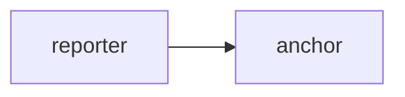
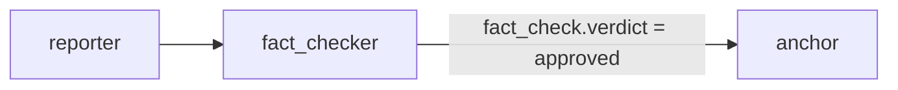
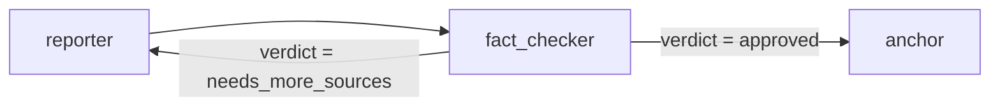
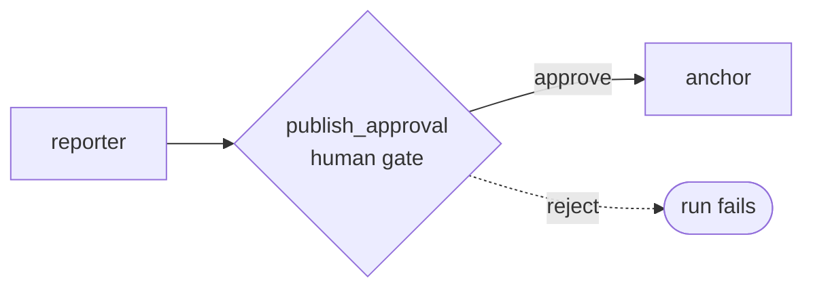
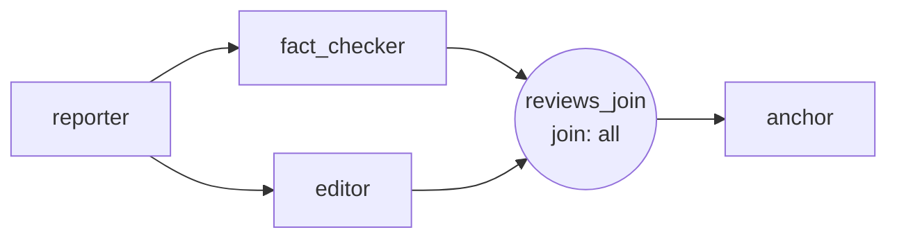
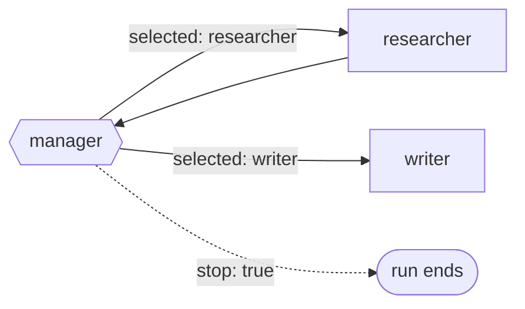
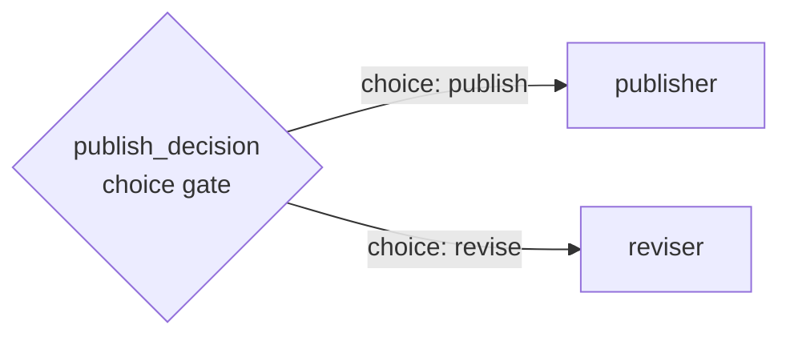
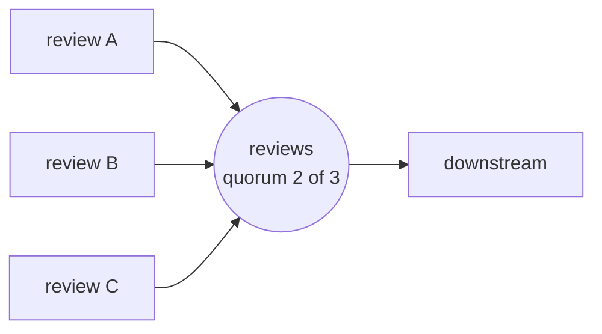
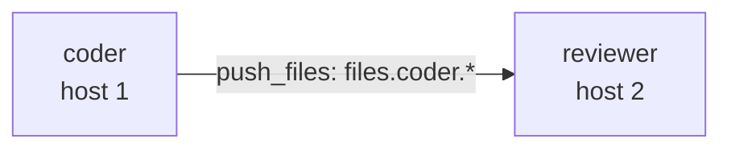
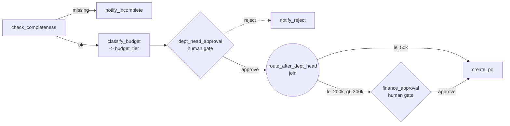

# Workflow Examples

Copy these into the **Workflows** view.

Each example includes a Mermaid diagram of its graph. Diagram shapes: `[ ]`
worker · `{{ }}` manager · `{ }` human gate · `(( ))` join · `([ ])` run
outcome. Edge labels are the condition that must hold to traverse.

For definitions of every node type, join mode, condition, artifact kind, policy
field, and trigger used below, see [Concepts & Reference](concepts-en.md).

## Reporter To Anchor



Graph:

```json
{
  "start": "reporter",
  "nodes": [
    {
      "id": "reporter",
      "type": "worker",
      "role": "reporter",
      "prompt": "Find concise facts about: {input.topic}",
      "outputs": ["notes"]
    },
    {
      "id": "anchor",
      "type": "worker",
      "role": "anchor",
      "prompt": "Write a short broadcast script from these notes: {artifact.notes}",
      "outputs": ["script"]
    }
  ],
  "edges": [
    {"from": "reporter", "to": "anchor", "condition": {"type": "always"}}
  ]
}
```

Policy:

```json
{
  "max_jobs": 5,
  "max_iterations": 5
}
```

Run input:

```json
{
  "topic": "technology news"
}
```

## Fact Checker Approved Branch

The fact checker must return JSON.



Graph:

```json
{
  "start": "reporter",
  "nodes": [
    {
      "id": "reporter",
      "type": "worker",
      "role": "reporter",
      "prompt": "Find facts about: {input.topic}",
      "outputs": ["notes"]
    },
    {
      "id": "fact_checker",
      "type": "worker",
      "role": "fact_checker",
      "output_format": "json",
      "prompt": "Check these notes and return only JSON like {\"verdict\":\"approved\",\"notes\":[]}: {artifact.notes}",
      "outputs": ["fact_check"]
    },
    {
      "id": "anchor",
      "type": "worker",
      "role": "anchor",
      "prompt": "Write the final script from approved notes: {artifact.notes}",
      "outputs": ["script"]
    }
  ],
  "edges": [
    {"from": "reporter", "to": "fact_checker", "condition": {"type": "always"}},
    {
      "from": "fact_checker",
      "to": "anchor",
      "condition": {
        "type": "artifact_equals",
        "artifact": "fact_check",
        "path": "verdict",
        "value": "approved"
      }
    }
  ]
}
```

Policy:

```json
{
  "max_jobs": 5,
  "max_iterations": 5
}
```

## Needs More Sources Loop With Policy Guard

This sends work back to the reporter while `fact_check.verdict` is
`needs_more_sources`. `policy.max_iterations` is the hard guard if the workflow
never reaches `approved`.



Graph:

```json
{
  "start": "reporter",
  "nodes": [
    {
      "id": "reporter",
      "type": "worker",
      "role": "reporter",
      "prompt": "Find or improve facts about: {input.topic}",
      "outputs": ["notes"]
    },
    {
      "id": "fact_checker",
      "type": "worker",
      "role": "fact_checker",
      "output_format": "json",
      "prompt": "Return only JSON with verdict approved or needs_more_sources for: {artifact.notes}",
      "outputs": ["fact_check"]
    },
    {
      "id": "anchor",
      "type": "worker",
      "role": "anchor",
      "prompt": "Write script from: {artifact.notes}",
      "outputs": ["script"]
    }
  ],
  "edges": [
    {"from": "reporter", "to": "fact_checker", "condition": {"type": "always"}},
    {
      "from": "fact_checker",
      "to": "anchor",
      "condition": {
        "type": "artifact_equals",
        "artifact": "fact_check",
        "path": "verdict",
        "value": "approved"
      }
    },
    {
      "from": "fact_checker",
      "to": "reporter",
      "condition": {
        "type": "artifact_equals",
        "artifact": "fact_check",
        "path": "verdict",
        "value": "needs_more_sources"
      }
    }
  ]
}
```

Policy:

```json
{
  "max_jobs": 10,
  "max_iterations": 4,
  "max_attempts_per_node": 3
}
```

Note: current edge conditions are independent. Do not model `verdict ==
needs_more_sources AND reporter_count < 2` as two separate edges; that would be
two OR branches.

## Human Gate Before Publish

The gate pauses after the reporter finishes and creates no worker job. Approve
to run the anchor once, or reject to fail the run.



```json
{
  "start": "reporter",
  "nodes": [
    {
      "id": "reporter",
      "type": "worker",
      "role": "reporter",
      "prompt": "Find concise facts about: {input.topic}",
      "outputs": ["notes"]
    },
    {
      "id": "publish_approval",
      "type": "human_gate",
      "label": "Approve publication",
      "reason": "Review reporter notes before creating the final script"
    },
    {
      "id": "anchor",
      "type": "worker",
      "role": "anchor",
      "prompt": "Write a short broadcast script from: {artifact.notes}",
      "outputs": ["script"]
    }
  ],
  "edges": [
    {"from": "reporter", "to": "publish_approval", "condition": {"type": "always"}},
    {"from": "publish_approval", "to": "anchor", "condition": {"type": "always"}}
  ]
}
```

Policy:

```json
{"max_jobs": 5, "max_iterations": 5}
```

For guarded loops, add `"requires_human_after_iterations": 2`. Atlas pauses
once before the next worker job after two worker jobs complete; the normal
`max_iterations` guard still applies.

## Fan-Out With Join All

The fact checker and editor both run after the reporter. The anchor starts only
after both branches succeed. The join itself does not create a worker job.



```json
{
  "start": "reporter",
  "nodes": [
    {
      "id": "reporter",
      "type": "worker",
      "role": "reporter",
      "prompt": "Find facts about: {input.topic}",
      "outputs": ["notes"]
    },
    {
      "id": "fact_checker",
      "type": "worker",
      "role": "fact_checker",
      "output_format": "json",
      "prompt": "Return JSON with verdict and corrections for: {artifact.notes}",
      "outputs": ["fact_check"]
    },
    {
      "id": "editor",
      "type": "worker",
      "role": "editor",
      "prompt": "Return concise editing notes for: {artifact.notes}",
      "outputs": ["edit_notes"]
    },
    {
      "id": "reviews_join",
      "type": "join",
      "mode": "all"
    },
    {
      "id": "anchor",
      "type": "worker",
      "role": "anchor",
      "prompt": "Write the final script from {artifact.notes}. Fact check: {artifact.fact_check}. Editing notes: {artifact.edit_notes}",
      "outputs": ["script"]
    }
  ],
  "edges": [
    {"from": "reporter", "to": "fact_checker", "condition": {"type": "always"}},
    {"from": "reporter", "to": "editor", "condition": {"type": "always"}},
    {"from": "fact_checker", "to": "reviews_join", "condition": {"type": "always"}},
    {"from": "editor", "to": "reviews_join", "condition": {"type": "always"}},
    {"from": "reviews_join", "to": "anchor", "condition": {"type": "always"}}
  ]
}
```

Policy:

```json
{"max_jobs": 5, "max_iterations": 10}
```

Use `"mode":"any"` when the first successful review may continue downstream.
Other queued branches still run; Atlas prevents the join or its downstream node
from being scheduled twice.

## Bounded Manager-Directed Loop

The manager chooses only declared outgoing targets. After research, the manager
can select the writer with `input_artifacts: ["research"]`, or return
`{"stop":true,"reason":"...","next":[]}`. Atlas validates the proposal before
creating the selected target job.



```json
{
  "start": "manager",
  "nodes": [
    {
      "id": "manager",
      "type": "manager",
      "worker_id": "wrk_manager",
      "schema": "manager_decision_v1",
      "prompt": "Choose researcher, writer, or stop. Return manager_decision_v1 JSON only."
    },
    {
      "id": "researcher",
      "type": "worker",
      "worker_id": "wrk_researcher",
      "prompt": "Research: {input.topic}",
      "outputs": ["research"]
    },
    {
      "id": "writer",
      "type": "worker",
      "worker_id": "wrk_writer",
      "prompt": "Write from: {artifact.research}",
      "outputs": ["draft"]
    }
  ],
  "edges": [
    {
      "from": "manager",
      "to": "researcher",
      "condition": {"type": "manager_selected", "target": "researcher"}
    },
    {
      "from": "manager",
      "to": "writer",
      "condition": {"type": "manager_selected", "target": "writer"}
    },
    {"from": "researcher", "to": "manager", "condition": {"type": "always"}}
  ]
}
```

Policy:

```json
{
  "max_jobs": 5,
  "max_iterations": 5,
  "max_attempts_per_node": 3,
  "max_minutes": 30,
  "allowed_worker_ids": ["wrk_manager", "wrk_researcher", "wrk_writer"]
}
```

Manager response selecting the writer:

```json
{
  "stop": false,
  "reason": "Research artifact is ready.",
  "next": [
    {
      "node": "writer",
      "input_artifacts": ["research"],
      "instructions": "Produce one concise draft."
    }
  ]
}
```

## Human Choice And Quorum

A choice gate routes to one branch per declared choice; a quorum join continues
once enough upstream branches succeed:





A choice gate declares its options and each branch names one declared choice:

```json
{
  "id": "publish_decision",
  "type": "human_gate",
  "label": "Choose publication path",
  "choices": [
    {"id": "publish", "label": "Publish"},
    {"id": "revise", "label": "Revise"}
  ]
}
```

```json
{"from":"publish_decision","to":"publisher","condition":{"type":"human_selected","choice":"publish"}}
```

A 2-of-3 join is `{"id":"reviews","type":"join","mode":"quorum","quorum":2}`.
Incoming sources are counted once even if duplicate edges exist. With
`"stop_on_first_failure":false`, independent ready branches continue; failed
nodes never traverse outgoing edges and the run still finishes failed.

Budget policy example:

```json
{"max_budget_units":6,"stop_on_first_failure":false}
```

Worker/manager nodes default to one unit and may set `"budget_units":2`.

## File Artifact Upload And Download

This attaches a file to an **existing workflow run**. The key `evidence` is the
artifact name; the upload does not place the file in a worker workspace.

Upload a bounded direct binary body (not multipart or base64):

```bash
curl -sS -X POST 'http://127.0.0.1:8787/api/workflow-runs/wfr_xxx/files?key=evidence' \
  -H 'content-type: application/pdf' \
  -H 'x-filename: evidence.pdf' \
  --data-binary @evidence.pdf
```

Download the resulting `file_ref` with
`GET /api/artifacts/art_xxx/content`. It returns the bytes Atlas stored, not an
arbitrary worker file. A worker does not read the upload automatically. Typical
uses are human review at a gate, audit evidence, and an external integration
fetching a deliverable. See [Artifact kinds](concepts-en.md#9-artifact-kinds) or
[ชนิด artifact](concepts-th.md#9-ชนิด-artifact).

## Cross-Host File Handoff

Two workers on different machines, no shared filesystem. `coder` writes real
files; Atlas freezes them as `file_ref` artifacts and pushes the matching ones
to `reviewer` before that node's job starts. Pinning `worker_id` (instead of
`role`) is what forces each node onto a specific machine.



Graph:

```json
{
  "start": "coder",
  "nodes": [
    {
      "id": "coder",
      "type": "worker",
      "worker_id": "wrk_a",
      "prompt": "Implement {input.task} and write the report under reports/",
      "collect_files": ["reports/*"],
      "collect_required": true
    },
    {
      "id": "reviewer",
      "type": "worker",
      "worker_id": "wrk_b",
      "prompt": "Review the files in {files_dir} and list blocking issues.",
      "outputs": ["review"]
    }
  ],
  "edges": [
    {
      "from": "coder",
      "to": "reviewer",
      "condition": {"type": "always"},
      "push_files": ["files.coder.*"]
    }
  ]
}
```

Policy — `file_handoff` is required and off by default; saving a `push_files`
edge without it is a validation error:

```json
{
  "max_jobs": 5,
  "max_iterations": 5,
  "file_handoff": true
}
```

The files land on host 2 under `inputs/incoming/<run_id>/coder/…`, which
`{files_dir}` resolves to. Every file is size- and SHA-256-verified on both
legs; a failed push fails the edge before the `reviewer` job is created.
`collect_required: true` is optional — without it a node still succeeds when
collection finds nothing. Caps and deadlines are in the
[API Reference](specs/api-reference-en.md); the network requirements are in
[Deployment §6](ops/deployment.md).

## Restart Recovery API

After restart, retry a `recovery_required` run only after reviewing possible
duplicate side effects:

```bash
curl -sS -X POST http://127.0.0.1:8787/api/workflow-runs/wfr_xxx/resume \
  -H 'content-type: application/json' \
  -d '{"retry_interrupted":true}'
```

## Manual Trigger API

```bash
curl -sS -X POST http://127.0.0.1:8787/api/workflow-triggers \
  -H 'content-type: application/json' \
  -d '{
    "workflow_definition_id": "wfd_xxx",
    "name": "Manual news run",
    "type": "manual"
  }'
```

```bash
curl -sS -X POST http://127.0.0.1:8787/api/workflow-triggers/wtr_xxx/fire \
  -H 'content-type: application/json' \
  -d '{
    "payload": {"topic": "technology news"},
    "dedupe_key": "manual-news-001"
  }'
```

## Interval Schedule Trigger API

```bash
curl -sS -X POST http://127.0.0.1:8787/api/workflow-triggers \
  -H 'content-type: application/json' \
  -d '{
    "workflow_definition_id": "wfd_xxx",
    "name": "Every 15 minutes",
    "type": "schedule",
    "config": {"interval_minutes": 15}
  }'
```

## Daily Local-Time Trigger API

```bash
curl -sS -X POST http://127.0.0.1:8787/api/workflow-triggers \
  -H 'content-type: application/json' \
  -d '{
    "workflow_definition_id": "wfd_xxx",
    "name": "Morning run",
    "type": "schedule",
    "config": {"daily_time": "09:30"}
  }'
```

## Webhook Trigger API

```bash
curl -sS -X POST http://127.0.0.1:8787/api/workflow-triggers \
  -H 'content-type: application/json' \
  -d '{
    "workflow_definition_id":"wfd_target",
    "name":"CRM webhook",
    "type":"webhook"
  }'

curl -sS -X POST http://127.0.0.1:8787/api/workflow-triggers/wtr_xxx/fire \
  -H 'content-type: application/json' \
  -d '{"payload":{"lead_id":"lead_123"},"dedupe_key":"crm-lead-123"}'
```

## Internal Event Trigger API

`workflow_definition_id` is the workflow Atlas starts. The config identifies
the source event:

```bash
curl -sS -X POST http://127.0.0.1:8787/api/workflow-triggers \
  -H 'content-type: application/json' \
  -d '{
    "workflow_definition_id":"wfd_target",
    "name":"After reporter workflow",
    "type":"workflow_run_completed",
    "config":{"source_workflow_definition_id":"wfd_source","state":"succeeded"}
  }'
```

For `artifact_created`, filter with `source_workflow_definition_id`, `key`, or
`kind`. For `worker_status_changed`, filter with `worker_id` or `status`.
Internal event triggers are fired only by Atlas.

## Manual Artifact API

Use this when an operator or external system already has structured data that
must join an existing run. Unlike file upload, the content is stored inline and
can be read by prompts or edge conditions. This example creates a JSON artifact
named `invoice_batch`:

```bash
curl -sS -X POST http://127.0.0.1:8787/api/artifacts \
  -H 'content-type: application/json' \
  -d '{
    "run_id":"wfr_xxx",
    "key":"invoice_batch",
    "kind":"json",
    "content":{"invoice_ids":["inv_1","inv_2"]},
    "metadata":{"source":"manual"}
  }'
```

The response includes the artifact id. Read it later with
`GET /api/artifacts/{id}`. A later prompt can use
`{artifact.invoice_batch.invoice_ids}` and an `artifact_created` trigger can
filter on key `invoice_batch` or kind `json`.

## Workflow Builder Draft API

Requires a worker with role or tag `workflow_builder`.

```bash
curl -sS -X POST http://127.0.0.1:8787/api/workflows/draft \
  -H 'content-type: application/json' \
  -d '{
    "plain_language_prompt": "Build a reporter to fact checker to anchor workflow. If fact checker says needs_more_sources, send it back to reporter up to 2 times."
  }'
```

Builder output is accepted only after graph, worker/workspace reference, policy,
and trigger validation. Other builder endpoints for a saved workflow are:

```bash
curl -sS -X POST http://127.0.0.1:8787/api/workflows/wfd_xxx/explain
curl -sS -X POST http://127.0.0.1:8787/api/workflows/wfd_xxx/repair \
  -H 'content-type: application/json' \
  -d '{"graph":{},"policy":{},"triggers":[]}'
curl -sS -X POST http://127.0.0.1:8787/api/workflows/wfd_xxx/suggest-triggers \
  -H 'content-type: application/json' \
  -d '{"plain_language_prompt":"Run every morning at 09:30"}'
```

List built-in templates without saving them:

```bash
curl -sS http://127.0.0.1:8787/api/workflow-templates
```

## Purchase Approval By Amount

The shape a real approval workflow takes, and the two constraints that decide it.

Atlas has **no numeric comparison condition** — a worker classifies the amount
into a named bucket artifact, and edges branch on that. And an edge leaving a
`human_gate` that declares choices must carry a `human_selected` condition, while
an edge carries exactly one condition — so branching by amount *after* a gate
needs a node in between. A `join` does that routing for free; a `worker` there
would spend a model call to restate an artifact that already exists.



```json
{
  "start": "classify_budget",
  "nodes": [
    {
      "id": "classify_budget",
      "type": "worker",
      "role": "classifier",
      "prompt": "Classify the purchase budget into a tier. Output JSON with 'tier' set to 'le_50k' (<= 50,000), 'le_200k' (> 50,000 and <= 200,000), or 'gt_200k' (> 200,000). Request: {input.request}",
      "outputs": ["budget_tier"],
      "output_format": "json"
    },
    {
      "id": "dept_head_approval",
      "type": "human_gate",
      "label": "Approve purchase request",
      "choices": [
        {"id": "approve", "label": "Approve"},
        {"id": "reject", "label": "Reject"}
      ]
    },
    {"id": "route_after_dept_head", "type": "join", "mode": "all"},
    {
      "id": "finance_approval",
      "type": "human_gate",
      "label": "Finance budget check",
      "choices": [
        {"id": "approve", "label": "Approve"},
        {"id": "reject", "label": "Reject"}
      ]
    },
    {
      "id": "create_po",
      "type": "worker",
      "role": "procurement",
      "prompt": "Create the purchase order for {input.request} and return the PO number.",
      "outputs": ["po_number"]
    },
    {
      "id": "notify_reject",
      "type": "worker",
      "role": "notifier",
      "prompt": "Tell the requester their purchase request was rejected."
    }
  ],
  "edges": [
    {
      "from": "classify_budget",
      "to": "dept_head_approval",
      "condition": {"type": "always"}
    },
    {
      "from": "dept_head_approval",
      "to": "notify_reject",
      "condition": {"type": "human_selected", "choice": "reject"}
    },
    {
      "from": "dept_head_approval",
      "to": "route_after_dept_head",
      "condition": {"type": "human_selected", "choice": "approve"}
    },
    {
      "from": "route_after_dept_head",
      "to": "create_po",
      "condition": {
        "type": "artifact_equals",
        "artifact": "budget_tier",
        "path": "tier",
        "value": "le_50k"
      }
    },
    {
      "from": "route_after_dept_head",
      "to": "finance_approval",
      "condition": {
        "type": "artifact_in",
        "artifact": "budget_tier",
        "path": "tier",
        "values": ["le_200k", "gt_200k"]
      }
    },
    {
      "from": "finance_approval",
      "to": "notify_reject",
      "condition": {"type": "human_selected", "choice": "reject"}
    },
    {
      "from": "finance_approval",
      "to": "create_po",
      "condition": {"type": "human_selected", "choice": "approve"}
    }
  ]
}
```

Policy — the gates may wait for days, so pair it with the reminders below:

```json
{
  "max_jobs": 20,
  "stop_on_first_failure": true,
  "approval_webhook_url": "http://127.0.0.1:9000/atlas/approval-overdue",
  "approval_overdue_hours": [72, 168]
}
```

Two things Atlas does NOT need modelled here. Every decision is already audited
with who, when, outcome and reason, so an audit node would duplicate the ledger.
And time parked at a gate does not count against `policy.max_minutes`, so a gate
answered three days later resumes normally.

Sending the email is an ordinary `worker` node — `node_types` is closed, but what
a worker *does* is not. It needs a registered worker whose role has that
capability; if none exists, that is a roster gap ("add a worker with role
`notifier`"), not an Atlas limitation.

## Approval Reminders (Overdue Human Gate) API

A `human_gate` waits indefinitely — nothing in the graph expresses "chase whoever
has not answered". That is `policy`, not topology, and the notification leaves
Atlas as a signed outbound delivery.

Two things have to exist before a reminder can be sent, and Atlas is silent
rather than loud when either is missing:

1. `ATLAS_SECRET_KEY`, or Atlas refuses to send unsigned and nothing leaves.
2. The receiver's host in `ATLAS_OUTBOUND_ALLOWLIST`, or every delivery is
   recorded `blocked` and no socket is opened.

```bash
export ATLAS_SECRET_KEY='...'                  # openssl rand -hex 32
export ATLAS_OUTBOUND_ALLOWLIST='127.0.0.1'
export ATLAS_APPROVAL_OVERDUE_HOURS='72,168'   # deployment default
python3 -m atlas
```

Per workflow, in `policy` — these override the deployment defaults, so several
departments can share one Atlas and each address its own reminders:

```json
{
  "max_jobs": 20,
  "approval_webhook_url": "http://127.0.0.1:9000/atlas/approval-overdue",
  "approval_overdue_hours": [72, 168]
}
```

The list is ascending and unique because **the index is the escalation level**:
`72` is level 1, `168` is level 2. Hours are wall clock counted from when the gate
was reached, not from when the run started. "Two business days" is a calendar —
leave room for a weekend (72, not 48) and let the receiver decide the exact
moment to send.

Prove a receiver is listening without waiting days for a real gate to age:

```bash
curl -sS -X POST http://127.0.0.1:8787/api/workflows/wfd_xxx/test-approval-webhook
# {"test":{"ok":true,"status":204}}
# {"test":{"ok":false,"reason":"callback_url host is not covered by ATLAS_OUTBOUND_ALLOWLIST: relay.internal"}}
```

It resolves the same URL the sweep would, sends one synthetic event marked
`"test": true`, and writes no delivery row — the ledger stays an answer to "did a
real reminder go out".

Atlas notifies once per level. What it POSTs:

```json
{
  "event": "approval_overdue",
  "delivery_id": "dlv_apr_apr_123_l2",
  "approval": {
    "id": "apr_123",
    "label": "Approve purchase request",
    "reason": "Budget 250,000 THB",
    "choices": [{"id": "approve", "label": "Approve"}],
    "created_at": "2026-08-07T02:00:00Z",
    "age_hours": 130.5,
    "level": 2,
    "threshold_hours": 120
  },
  "run": {
    "id": "wfr_xxx",
    "node_key": "dept_head_approval",
    "workflow_definition_id": "wfd_xxx",
    "workflow_name": "Purchase approval"
  },
  "signed_at": "2026-08-12T12:30:00Z"
}
```

signed with `X-Atlas-Signature: sha256=<hex>` over the exact bytes on the wire.
The body is self-sufficient on purpose: a receiver composes a human message from
it without calling Atlas back, which is why it needs no Atlas credential. Route on
`run.node_key` (which gate is stuck) and `approval.level` (remind or escalate) —
Atlas states the fact and stops there, because who to tell needs an org chart it
does not have.

A runnable receiver is at [`poc/approval_reminder_receiver.py`](../poc/approval_reminder_receiver.py):

```bash
ATLAS_SECRET_KEY='...' python3 poc/approval_reminder_receiver.py --port 9000
```

Verify the signature over the **raw request bytes** — `json.loads` then
`json.dumps` produces different bytes and a different digest, which is the single
most common way a receiver rejects every legitimate delivery.

Whether a reminder was sent, and whether it arrived, is on `GET /api/deliveries`
(`delivered` / `failed` / `blocked`) — reminder rows are the ones whose id starts
with `dlv_apr_` and whose `payload.event` is `approval_overdue`. The embedded
dashboard surfaces the same ledger in its **Deliveries** view, with a nav badge
counting `failed` rows and a per-row Retry. A `failed` `dlv_apr_*` row is worth
an alert: it is the one signal that a human was supposed to be chased and was
not.

The body is **contract v1** — additive-only, and a breaking change would arrive
as a new event name (`approval_overdue.v2`), never as a change to these fields.
See the API reference §14 for the declaration.
