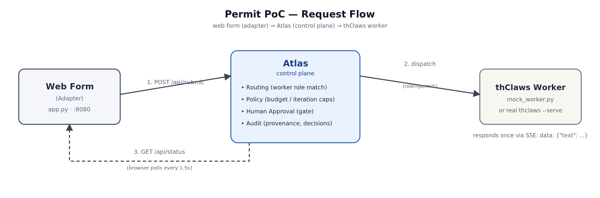
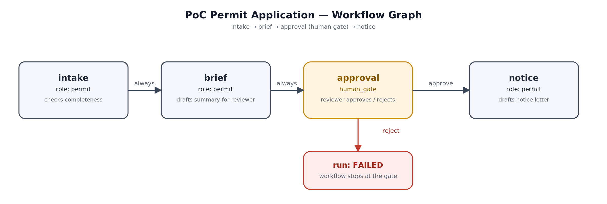
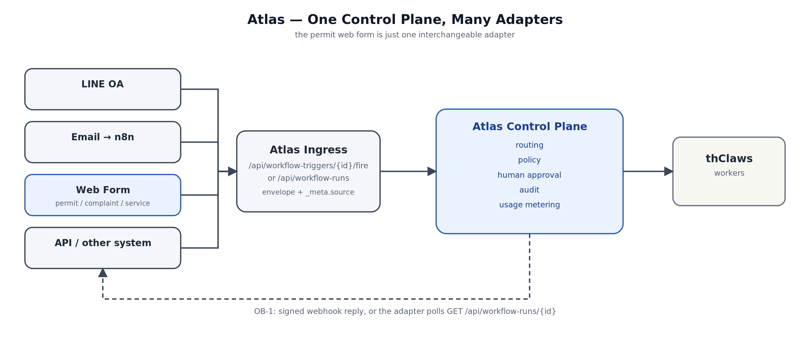
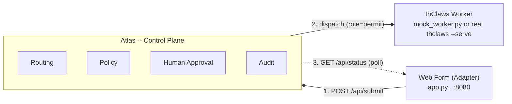
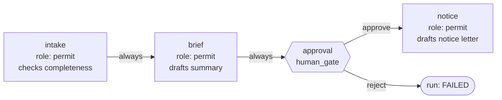
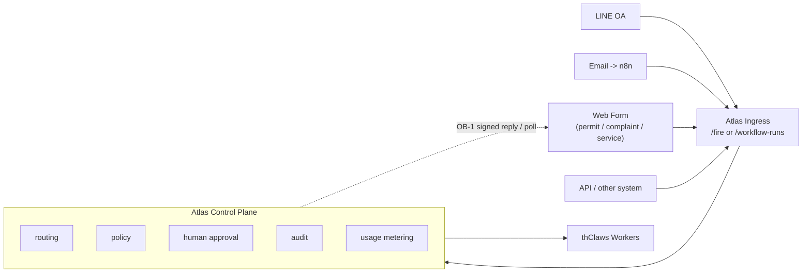

# จากฟอร์มขออนุญาต ถึง Atlas: PoC ที่พิสูจน์ว่า AI ทำงานได้ โดยที่คนยังคุมปุ่มอนุมัติ

เวลาพูดถึง "เอา AI มาช่วยงานราชการหรืองานเอกสารขององค์กร" คำถามที่ตามมาเสมอคือ
แล้วใครรับผิดชอบถ้า AI ตัดสินใจผิด, ใครอนุมัติจริง, และตรวจสอบย้อนหลังได้ไหมว่าอะไรมาจากช่องทางไหน
โปรเจกต์ **Atlas** ถูกออกแบบมาตอบคำถามนี้โดยเฉพาะ — มันไม่ใช่ตัว AI เอง แต่เป็น **control plane**
ที่คุมทุกอย่างรอบตัว AI: ใครส่งงานเข้ามา, งานไปวิ่งอยู่ที่ไหน, ต้องมีคนอนุมัติตรงไหนก่อนไปต่อ
และทุกการตัดสินใจถูกบันทึกไว้อย่างไร

บทความนี้พาไปดู PoC ตัวเล็ก ๆ ตัวหนึ่งใน repo ของ Atlas ชื่อ
[`poc/permit_web`](https://github.com/kaebmoo/atlas-control-plane/tree/main/poc/permit_web)
ซึ่งจำลองสถานการณ์ที่ตรงไปตรงมาที่สุด: **แบบฟอร์มขออนุญาตออนไลน์** ที่ส่งคำขอเข้าไปให้ Atlas
คุมงานทั้งกระบวนการ ตั้งแต่ตรวจเอกสาร ไปจนถึงให้เจ้าหน้าที่กดอนุมัติ และร่างหนังสือแจ้งผล

## Atlas กับ thClaws คืออะไร

- **Atlas** คือ control plane — เขียนด้วย Python standard library ล้วน ๆ (ไม่มี dependency
  ภายนอก) ทำหน้าที่ routing, จัดการ workflow, policy (เพดานงาน/รอบ/งบประมาณ), job, session,
  audit, การอนุมัติของมนุษย์ (human approval) และการนับการใช้งาน (usage metering)
- **thClaws** คือ worker runtime ที่รันงาน AI จริง (`thclaws --serve`) — Atlas ไม่ยุ่งกับโมเดลหรือ
  API key ของโมเดลเลย (หลักการ **BYOK** — bring your own key — กุญแจโมเดลอยู่ที่ thClaws ไม่ใช่ Atlas)

พูดง่าย ๆ คือ Atlas ไม่ใช่ "AI agent" แต่เป็นชั้นควบคุมที่อยู่รอบ ๆ AI agent อีกที

## แนวคิดหลัก: Input Adapter Contract

Atlas มีแนวคิดที่เรียกว่า **Input Adapter Contract**: ช่องทางอะไรก็ตาม (LINE, อีเมลผ่าน n8n,
เว็บฟอร์ม, หรือระบบภายในอื่น) ที่แปลงข้อมูลของตัวเองให้เป็น JSON ตาม "ซอง" (envelope) มาตรฐาน
แล้วยิงเข้าประตูเดิมที่มีอยู่แล้ว (`POST /api/workflow-runs` หรือ `POST /api/workflow-triggers/{id}/fire`)
ก็กลายเป็น adapter ได้ทันที — ไม่ต้องเพิ่ม endpoint ใหม่ ไม่ต้องเขียน logic เฉพาะช่องทางไว้ใน Atlas

`poc/permit_web` คือตัวอย่างที่จับต้องได้ของแนวคิดนี้: มันเป็นเว็บฟอร์มธรรมดา ๆ ที่ทำหน้าที่เป็น
"adapter" หนึ่งตัว โดยส่ง envelope ที่มี `_meta.source.channel = "web_form"` เข้าไปใน Atlas

## รู้จักไฟล์ใน PoC

PoC นี้มีไฟล์หลักแค่ 3 ไฟล์ ทั้งหมดเป็น stdlib-only เหมือนกับแกนหลักของ Atlas:

| ไฟล์ | หน้าที่ |
| --- | --- |
| `mock_worker.py` | worker ปลอมที่พูดภาษาเดียวกับ thClaws ขั้นต่ำสุด (`/healthz`, `/v1/agent/info`, `/agent/run`) แล้วตอบข้อความไทยสำเร็จรูปตาม step เพื่อไม่ต้องมี thClaws จริงตอนสาธิต |
| `setup.py` | สคริปต์ตั้งค่าครั้งเดียว: ลงทะเบียน worker แล้วสร้าง/อัปเดต workflow ชื่อ `PoC Permit Application` ให้ Atlas — รันซ้ำได้ (idempotent by name) |
| `app.py` | ตัวเว็บแอปของ PoC เอง: เสิร์ฟฟอร์ม แล้ว proxy คำสั่ง submit / status / decide ไปให้ Atlas — token ของ Atlas อยู่ฝั่งเซิร์ฟเวอร์เท่านั้น เบราว์เซอร์ไม่มีทางเห็น |

## ภาพรวมการทำงาน



ฟอร์มเว็บ (adapter) ไม่ได้คุยกับ worker โดยตรง มันส่งคำขอให้ Atlas เท่านั้น แล้ว Atlas เป็นคนตัดสินใจ
ว่าจะส่งงานไปที่ worker ตัวไหน (จับคู่ด้วย `role: "permit"`), คุม policy, รอการอนุมัติจากมนุษย์ และ
บันทึก audit ทุกขั้นตอน ฝั่งเบราว์เซอร์แค่ **poll** สถานะ run ของตัวเองทุก 1.5 วินาที ไม่ต้องมี
webhook, ไม่ต้องเปิดพอร์ตออกอินเทอร์เน็ต, ไม่ต้องมี ngrok — รันบน localhost ล้วน ๆ

## Workflow 4 ขั้นตอน

เบื้องหลังฟอร์มคือ workflow เดียวชื่อ `PoC Permit Application` ที่มี 4 node เรียงกัน:



1. **intake** (worker, role `permit`) — ตรวจความครบถ้วนของคำขอ
2. **brief** (worker, role `permit`) — สรุปผลตรวจเป็นบันทึกเสนอผู้พิจารณา
3. **approval** (**human_gate**) — จุดที่ workflow หยุดรอจริง ๆ ให้เจ้าหน้าที่กดอนุมัติหรือปฏิเสธ
4. **notice** (worker, role `permit`) — ร่างหนังสือแจ้งผล (ทำงานเฉพาะเมื่ออนุมัติ)

ถ้าเจ้าหน้าที่ปฏิเสธที่ node `approval` run จะจบสถานะ `failed` ทันที — ไม่ไปต่อที่ `notice` นี่คือ
"governance by design" ที่ Atlas พูดถึง: ไม่ว่าคำขอจะเข้ามาทางไหน ทุกคำขอเดินผ่าน control plane
เดียวกัน มี gate เดียวกัน และมี audit เดียวกัน

## ตัวอย่างจริงจากการรัน

ต่อไปนี้คือ input/output จริงจากการรัน PoC ด้วยค่าเริ่มต้นตาม Quick Start (Atlas +
`mock_worker.py`) — **ข้อความที่ได้เป็นข้อความสำเร็จรูป (canned) ที่ฝังไว้ใน mock worker**
ไม่ใช่คำตอบจากโมเดลจริง เพราะจุดประสงค์ของ mock worker คือให้ทดสอบทั้งกระบวนการได้โดยไม่ต้องมี
thClaws และโมเดลจริง ถ้าต่อกับ thClaws จริง (มี model key แบบ BYOK) ข้อความช่วงนี้จะเปลี่ยนเป็น
คำตอบที่โมเดลเขียนขึ้นจริงแทน

**คำขอที่ส่งเข้าไป (input):**

```json
{
  "applicant_name": "นายทดสอบ ระบบ",
  "national_id": "1234567890123",
  "permit_type": "ขออนุญาตก่อสร้าง",
  "detail": "ขออนุญาตก่อสร้างอาคารพาณิชย์ 2 ชั้น บนที่ดินของตนเอง",
  "attachments": "สำเนาบัตรประชาชน, โฉนดที่ดิน, แบบแปลน"
}
```

**ขั้นที่ 1 — `intake` (ผลตรวจความครบถ้วน):**

```
ผลตรวจความครบถ้วนของคำขออนุญาต (mock)
- ข้อมูลผู้ขอ: ครบ
- ประเภทคำขอ: ครบ
- รายละเอียด/เหตุผล: ครบ
- เอกสารแนบ: ตรวจพบตามที่ระบุ — แนะนำให้เจ้าหน้าที่ยืนยันสำเนาบัตรประชาชนและ
  หลักฐานกรรมสิทธิ์อีกครั้งก่อนพิจารณา
สรุป: เอกสารเพียงพอต่อการพิจารณาเบื้องต้น
```

**ขั้นที่ 2 — `brief` (บันทึกสรุปเสนอผู้พิจารณา):**

```
บันทึกสรุปเสนอผู้พิจารณา (mock)
เรื่อง: คำขออนุญาตพร้อมพิจารณา
สาระสำคัญ: คำขอมีข้อมูลและเอกสารครบตามผลตรวจเบื้องต้น ไม่พบเงื่อนไขต้องห้าม
ข้อเสนอแนะ: เห็นควรอนุมัติ โดยแจ้งเงื่อนไขให้ผู้ขอปฏิบัติตามระเบียบที่เกี่ยวข้อง
ความเสี่ยง: ต่ำ — รอการยืนยันสำเนาเอกสารจากเจ้าหน้าที่
```

ถึงจุดนี้ run จะค้างสถานะ `waiting_for_human` และฟอร์มจะแสดงปุ่ม **อนุมัติ** / **ปฏิเสธ** ให้กด —
สมมติเจ้าหน้าที่กด **อนุมัติ**:

**ขั้นที่ 3 — `notice` (ร่างหนังสือแจ้งผล):**

```
หนังสือแจ้งผลการพิจารณา (ร่าง/mock)
เรียน ผู้ยื่นคำขอ
ตามที่ท่านได้ยื่นคำขออนุญาตนั้น หน่วยงานได้พิจารณาแล้วเห็นควร "อนุมัติ" ตามคำขอ
โดยขอให้ท่านปฏิบัติตามเงื่อนไขที่แนบและติดต่อรับเอกสารภายใน 15 วันทำการ
จึงเรียนมาเพื่อทราบและดำเนินการต่อไป
```

run จบด้วยสถานะ **`succeeded`** — ถ้าเจ้าหน้าที่กด **ปฏิเสธ** แทน run จะจบด้วยสถานะ **`failed`**
ทันทีที่ node `approval` โดยไม่มีการสร้างหนังสือแจ้งผลเลย

## ทดสอบกับ thClaws จริงผ่าน Atlas (ไม่ใช่ mock)

Mock worker มีไว้พิสูจน์ "กระบวนการ" เฉยๆ — เพื่อดูว่า PoC ทำงานได้จริงกับโมเดลจริง ต้องต่อ Atlas
เข้ากับ **thClaws ตัวจริง** ที่มี model key เป็นของตัวเอง (BYOK) ในการทดสอบครั้งนี้ Atlas รันอยู่ที่
`http://127.0.0.1:8787` และ thClaws จริงรันอยู่ที่ `http://127.0.0.1:4317` ขั้นตอนตั้งค่ามีดังนี้:

**1. รัน thClaws เป็น server พร้อม token และ model key ของตัวเอง**

```bash
cd <thClaws repo>
ANTHROPIC_API_KEY='sk-…' THCLAWS_API_TOKEN='dev-token-1' \
  thclaws --serve --bind 127.0.0.1 --port 4317

curl http://127.0.0.1:4317/healthz   # ตรวจว่าขึ้นจริงก่อน
```

Atlas เองไม่เคยเห็นหรือเก็บ model key เลยตลอดขั้นตอนนี้ — คีย์อยู่ที่ thClaws เท่านั้น ตามหลัก **BYOK**
Atlas มีหน้าที่แค่เรียก thClaws ผ่าน HTTP ตาม protocol เดิม (`/healthz`, `/v1/agent/info`,
`/agent/run`) เหมือนที่ทำกับ mock worker ทุกประการ

**2. ชี้ Atlas ไปที่ thClaws ตัวจริงแทน mock** — เลือกทางใดทางหนึ่ง:

- **อัตโนมัติ (แนะนำ):** รัน `setup.py` ซ้ำ โดยชี้ env ไปที่ thClaws แทน mock:

  ```bash
  MOCK_WORKER_URL='http://127.0.0.1:4317' MOCK_WORKER_TOKEN='dev-token-1' \
    python3 poc/permit_web/setup.py
  # ผลที่ควรเห็น: worker permit-mock (wrk_…) -> http://127.0.0.1:4317  [status: online]
  ```

  Atlas upsert worker ด้วย **`base_url`** (ไม่ใช่ด้วยชื่อ) การรัน `setup.py` ซ้ำแบบนี้จึง "repoint"
  worker ตัวเดิมจาก mock ไปที่ thClaws จริงให้อัตโนมัติ ไม่ต้องลบ worker เดิม ไม่ต้องสร้าง workflow
  ใหม่ — workflow เดิมที่ผูกกับ worker นี้อยู่แล้วจะวิ่งไปที่ thClaws จริงทันที

- **มือ ผ่าน Atlas web dashboard:** หน้า **Fleet → Add worker** ใส่ Base URL
  `http://127.0.0.1:4317`, Token ให้ตรงกับ `THCLAWS_API_TOKEN` ที่ตั้งไว้ตอนรัน thClaws, ตั้ง
  **Role: `permit`** แล้ว Save (**ต้องทำขั้นนี้ก่อน** ดูเหตุผลด้านล่าง) จากนั้นไปหน้า **Workflows →
  New** แล้ววาง JSON แต่ละก้อนลงช่องของมัน:

  **ช่อง Name:**

  ```
  PoC Permit Application
  ```

  **ช่อง Graph (JSON):**

  ```json
  {
    "start": "intake",
    "nodes": [
      {"id": "intake", "type": "worker", "role": "permit",
       "prompt": "STEP=intake\nตรวจความครบถ้วนของคำขออนุญาตต่อไปนี้ และระบุสิ่งที่ขาด:\nผู้ขอ: {input.applicant_name}\nประเภทคำขอ: {input.permit_type}\nรายละเอียด: {input.detail}\nเอกสารแนบ: {input.attachments}",
       "outputs": ["review"]},
      {"id": "brief", "type": "worker", "role": "permit",
       "prompt": "STEP=summary\nจากผลตรวจต่อไปนี้ เขียนบันทึกสรุปเสนอผู้พิจารณาพร้อมข้อเสนอแนะ:\n{artifact.review}",
       "outputs": ["brief"]},
      {"id": "approval", "type": "human_gate",
       "label": "อนุมัติคำขออนุญาต", "reason": "ตรวจบันทึกสรุปก่อนตัดสินใจอนุมัติหรือปฏิเสธ"},
      {"id": "notice", "type": "worker", "role": "permit",
       "prompt": "STEP=notice\nร่างหนังสือแจ้งผลการอนุมัติตามบันทึกสรุปนี้:\n{artifact.brief}",
       "outputs": ["notice"]}
    ],
    "edges": [
      {"from": "intake", "to": "brief", "condition": {"type": "always"}},
      {"from": "brief", "to": "approval", "condition": {"type": "always"}},
      {"from": "approval", "to": "notice", "condition": {"type": "always"}}
    ]
  }
  ```

  **ช่อง Policy (JSON):**

  ```json
  {"max_jobs": 10, "max_iterations": 3, "max_attempts_per_node": 2, "max_budget_units": 10}
  ```

  กด **Save** (จะได้ `wfd_…` สถานะ draft — รันได้เลย) → จากนั้นวาง input นี้ในช่องรัน แล้วกด **Run**:

  ```json
  {"applicant_name": "นายทดสอบ ระบบ", "national_id": "1234567890123", "permit_type": "ขออนุญาตก่อสร้าง", "detail": "ก่อสร้างอาคารพาณิชย์ 2 ชั้น", "attachments": "สำเนาบัตรประชาชน, โฉนดที่ดิน, แบบแปลน", "_meta": {"source": {"channel": "web_form", "adapter": "manual-dashboard", "form": "permit_request", "external_id": "manual-001"}}}
  ```

  จะเห็น run เดิน `running → waiting_for_human` (ได้ artifact `review`, `brief`) ไปหน้า Monitor กด
  **Approve** → `succeeded` ได้ `notice`

  ต่างจากที่ `setup.py` สร้างให้อัตโนมัติ: อันนั้นผูก `worker_id` ตรง ๆ ส่วนชุดนี้ใช้ `role: "permit"`
  แทน (ยืดหยุ่นกว่า — worker ตัวไหน online ที่มี role นี้ก็รับงานได้) เลือกใช้แบบใดแบบหนึ่งพอ **อย่ามี
  workflow ทั้งสองแบบชื่อซ้ำกัน** จะสับสนว่ารันตัวไหนอยู่

  **ข้อควรระวังที่เจอจริงตอนทำมือ:** ต้อง **เพิ่ม worker ที่มี role/tag `permit` ก่อน** แล้วค่อยกด
  Save workflow เสมอ — เพราะ Atlas เช็คตอน save ว่า node ที่ระบุ `role` ต้องมี worker online (หรือ
  ลงทะเบียนแล้ว) ที่ match role นั้นอยู่จริง ถ้าสลับลำดับ (สร้าง workflow ก่อนเพิ่ม worker) จะเจอ
  error:

  ```
  workflow node intake role no matching worker: permit
  ```

  วิธีแก้คือกลับไปเพิ่ม worker (role หรือ tag = `permit`) ที่ Fleet ก่อน แล้วกลับมา Save workflow
  อีกครั้ง — ไม่ใช่ JSON ผิด แค่ยังไม่มี worker ที่ match role ในระบบตอนนั้น

**3. ส่ง input ชุดเดิมเข้าไปอีกครั้ง** — จะผ่านฟอร์มเว็บของ PoC (port 8080) หรือวาง JSON ตรงในช่อง
Run ของ workflow บน Atlas dashboard เองก็ได้ผลเหมือนกัน เพราะทั้งคู่ยิงเข้า endpoint เดียวกัน สิ่งที่
เปลี่ยนคือฝั่งหลังบ้าน: `intake` / `brief` / `notice` จะได้ข้อความที่ **โมเดลจริงเขียนขึ้นเอง** แทน
ข้อความสำเร็จรูปของ mock — บรรทัด `STEP=intake|summary|notice` ที่นำหน้า prompt เป็นแค่ label ที่
mock worker ใช้เลือกข้อความสำเร็จรูป โมเดลจริงจะมองข้ามไปเฉยๆ และตอบตามคำสั่งจริงในบรรทัดถัดไป

ข้อแตกต่างจาก mock worker จริงๆ แล้วมีจุดเดียว: ต้องมี model key จริง (BYOK) ให้ thClaws — ที่เหลือคือ
validate, policy, human approval gate, audit ทำงานเหมือนเดิมทุกประการ เพราะ Atlas ไม่รู้และไม่สนใจว่า
worker ที่อยู่หลัง role `permit` เป็น mock หรือของจริง นี่คือใจความสำคัญของ control plane: ตัว AI
เปลี่ยนได้ (mock → thClaws → โมเดลไหนก็ได้ที่ thClaws เรียก) แต่ governance รอบตัวมันไม่เปลี่ยน

### ผลจริงจากการทดสอบกับ thClaws จริง

ต่อไปนี้คือคำตอบจริงที่ thClaws ตอบกลับมาในการทดสอบครั้งนี้ (input ชุดเดียวกับตัวอย่าง mock ข้างต้น
ต่างกันแค่ `detail` สั้นกว่าเล็กน้อย: "ก่อสร้างอาคารพาณิชย์ 2 ชั้น") ข้อความทั้งหมดด้านล่างเป็นคำตอบ
จริงจากโมเดล ไม่ได้ตัดต่อหรือแก้ไขเนื้อหา:

**ขั้นที่ 1 — `intake` (ผลตรวจความครบถ้วน จากโมเดลจริง):**

```
จากการตรวจสอบความครบถ้วนของคำขออนุญาตก่อสร้าง (ตามมาตรฐาน พ.ร.บ. ควบคุมอาคาร ของประเทศไทย สำหรับอาคารพาณิชย์ 2 ชั้น) มีรายละเอียดดังนี้ครับ
✅ สิ่งที่มีแล้ว:
1. ข้อมูลผู้ขออนุญาตและรายละเอียดเบื้องต้น
2. สำเนาบัตรประชาชน
3. โฉนดที่ดิน
4. แบบแปลน (แผนผังบริเวณและแบบก่อสร้าง)
❌ สิ่งที่ยังขาด (เอกสารสำคัญที่ต้องใช้ประกอบการยื่นขออนุญาต):
1. แบบคำขอ ข.1 (คำขออนุญาตก่อสร้างอาคาร ดัดแปลงอาคาร หรือรื้อถอนอาคาร)
2. สำเนาทะเบียนบ้าน ของผู้ขออนุญาต
3. รายการคำนวณโครงสร้าง (เนื่องจากเป็นอาคารพาณิชย์ 2 ชั้น เข้าข่ายต้องมีวิศวกรคำนวณ)
4. หนังสือรับรองและสำเนาใบอนุญาตประกอบวิชาชีพของวิศวกร (ผู้คำนวณแบบ)
5. หนังสือรับรองและสำเนาใบอนุญาตประกอบวิชาชีพของสถาปนิก (ผู้ออกแบบ)
6. หนังสือแสดงความยินยอมของผู้ควบคุมงาน (แบบ น.4)
7. เอกสารยินยอมให้ก่อสร้างในที่ดิน (จำเป็นเฉพาะกรณีที่ "นายทดสอบ ระบบ" ไม่ได้มีชื่อเป็นเจ้าของกรรมสิทธิ์ในโฉนดที่ดินที่แนบมา)
8. หนังสือยินยอมชิดเขตที่ดินข้างเคียง (จำเป็นเฉพาะกรณีที่แบบแปลนระบุการก่อสร้างชิดเขตที่ดินผู้อื่นน้อยกว่าระยะร่นที่กฎหมายกำหนด)
สรุป: คำขอยังไม่ครบถ้วน ไม่สามารถดำเนินการอนุมัติได้ ต้องเรียกเก็บเอกสารทางวิศวกรรม/สถาปัตยกรรม (ข้อ 3-6) และเอกสารแสดงตัวตนเพิ่มเติม (ข้อ 1-2) ให้ครบก่อนครับ
```

สังเกตความต่างจาก mock ทันที: mock ตอบ "เอกสารเพียงพอต่อการพิจารณาเบื้องต้น" เสมอ ไม่ว่า input จะเป็น
อะไร แต่โมเดลจริง**อ้างอิงกฎหมายจริง** (พ.ร.บ. ควบคุมอาคาร) แล้วชี้ว่าเอกสารที่แนบมาไม่พอ พร้อมระบุ
รายการเอกสารที่ขาดอย่างเจาะจง — นี่คือคุณค่าที่ mock worker แสดงให้ดูไม่ได้

**ขั้นที่ 2 — `brief` (บันทึกสรุปเสนอผู้พิจารณา จากโมเดลจริง):**

```
บันทึกข้อความ
เรื่อง: สรุปผลการตรวจสอบคำขออนุญาตก่อสร้างอาคารพาณิชย์ 2 ชั้น และข้อเสนอแนะเพื่อดำเนินการ
เรียน: ผู้พิจารณา / เจ้าพนักงานท้องถิ่น

ตามที่ได้มีการยื่นคำขออนุญาตก่อสร้างอาคารพาณิชย์ 2 ชั้น (ในนาม นายทดสอบ ระบบ) จากการตรวจสอบเอกสารหลักฐานประกอบการยื่นคำขอตามข้อกำหนดของ พ.ร.บ. ควบคุมอาคาร พบว่า เอกสารยังไม่ครบถ้วนสมบูรณ์ และยังไม่สามารถดำเนินการพิจารณาอนุมัติได้ โดยมีรายละเอียดสรุปดังนี้

1. เอกสารที่ได้รับและตรวจสอบแล้ว (ครบถ้วน): ข้อมูลผู้ขออนุญาต, สำเนาบัตรประจำตัวประชาชน, สำเนาโฉนดที่ดิน, แบบแปลน

2. เอกสารสำคัญที่ยังขาดหาย แบ่งเป็น 3 ส่วน: (1) เอกสารคำขอและข้อมูลบุคคล — แบบ ข.1, สำเนาทะเบียนบ้าน
(2) เอกสารทางวิศวกรรม/สถาปัตยกรรม (บังคับตามกฎหมาย) — รายการคำนวณโครงสร้าง, หนังสือรับรองวิศวกร,
หนังสือรับรองสถาปนิก, หนังสือยินยอมผู้ควบคุมงาน (แบบ น.4) (3) เอกสารเฉพาะกรณี — หนังสือยินยอมให้ก่อสร้าง
ในที่ดิน, หนังสือยินยอมชิดเขตที่ดินข้างเคียง

ข้อเสนอแนะเพื่อโปรดพิจารณาสั่งการ:
1. ระงับการอนุมัติชั่วคราว เนื่องจากขาดเอกสารสำคัญด้านความปลอดภัย (รายการคำนวณและผู้รับรองแบบ)
2. ออกหนังสือแจ้งผู้ขออนุญาตให้นำส่งเอกสารที่ขาดในส่วนที่ 1 และ 2 ให้ครบภายในระยะเวลาที่กำหนด
3. มอบหมายเจ้าหน้าที่ตรวจสอบแบบแปลนเบื้องต้นเรื่องระยะร่นและกรรมสิทธิ์ที่ดิน เพื่อแจ้งเอกสารส่วนที่ 3
   ในคราวเดียวหากเข้าข่าย
4. หากผู้ขออนุญาตไม่จัดส่งเอกสารครบภายในกรอบเวลา เห็นควรสั่งจำหน่ายเรื่องหรือยกเลิกคำขอ

จึงเรียนมาเพื่อโปรดพิจารณาสั่งการ
```

ถึงจุดนี้ run ค้างที่ `waiting_for_human` เหมือนเดิม — แต่คราวนี้สิ่งที่รอการตัดสินใจมีน้ำหนักจริง:
AI เองแนะนำให้ **ระงับการอนุมัติไว้ก่อน** จนกว่าเอกสารจะครบ ไม่ใช่ปัดผ่านให้แบบ mock

ในการทดสอบนี้ผู้ทดสอบกด **อนุมัติ** ที่ human gate ต่อ (เพื่อดูผลลัพธ์ของขั้น `notice` ให้ครบทั้งสาย)
แม้ AI จะแนะนำให้ระงับไว้ก่อนก็ตาม — ซึ่งเผยให้เห็นรายละเอียดสำคัญของ governance ที่ Atlas ออกแบบไว้:
**human gate อนุมัติแค่ "ให้ workflow เดินต่อ" เท่านั้น ไม่ได้ผูกมัดว่าต้องเห็นด้วยกับคำแนะนำของ AI** —
การตัดสินใจสุดท้ายว่าจะอนุมัติคำขอจริงหรือไม่ยังคงเป็นดุลยพินิจของเจ้าหน้าที่ ไม่ใช่ของโมเดล

**ขั้นที่ 3 — `notice` (ร่างหนังสือ จากโมเดลจริง):**

```
ที่ .....................................
ส่วนราชการ ........................................................................
วันที่ ........................................................................
เรื่อง แจ้งผลการตรวจสอบเอกสารประกอบคำขออนุญาตก่อสร้างอาคาร และให้จัดส่งเอกสารเพิ่มเติม
เรียน นายทดสอบ ระบบ
อ้างถึง คำขออนุญาตก่อสร้างอาคารพาณิชย์ 2 ชั้น

ตามที่ท่านได้ยื่นคำขออนุญาตก่อสร้างอาคารพาณิชย์ 2 ชั้น ต่อเจ้าพนักงานท้องถิ่น พร้อมแนบเอกสารหลักฐาน
ประกอบการพิจารณา นั้น จากการตรวจสอบเอกสารหลักฐานประกอบการยื่นคำขอตามข้อกำหนดของพระราชบัญญัติควบคุม
อาคาร พ.ศ. 2522 และที่แก้ไขเพิ่มเติม พบว่าเอกสารประกอบคำขอของท่านยังไม่ครบถ้วนสมบูรณ์ จึงยังไม่สามารถ
นำเข้าสู่กระบวนการพิจารณาอนุมัติได้

จึงขอให้ท่านนำส่งเอกสารเพิ่มเติมให้ครบถ้วน: (1) แบบคำขอ ข.1 และสำเนาทะเบียนบ้าน (2) รายการคำนวณ
โครงสร้าง, หนังสือรับรองวิศวกร, หนังสือรับรองสถาปนิก, หนังสือยินยอมผู้ควบคุมงาน (แบบ น.4) (3) หนังสือ
ยินยอมให้ก่อสร้างในที่ดิน และหนังสือยินยอมชิดเขตที่ดินข้างเคียง (เฉพาะกรณีที่เข้าเงื่อนไข)

ทั้งนี้ ขอให้ท่านรวบรวมและจัดส่งเอกสารเพิ่มเติมทั้งหมด ณ [ระบุชื่อหน่วยงาน/กองช่าง] ภายใน [ระบุจำนวนวัน
เช่น 15 หรือ 30] วัน นับแต่วันที่ได้รับหนังสือฉบับนี้ หากท่านไม่ดำเนินการภายในระยะเวลาที่กำหนด
เจ้าพนักงานท้องถิ่นจะถือว่าท่านไม่ประสงค์จะดำเนินการต่อ และจะดำเนินการสั่งจำหน่ายเรื่องหรือยกเลิกคำขอ
ดังกล่าวตามระเบียบต่อไป

จึงเรียนมาเพื่อโปรดทราบและเร่งดำเนินการ

ขอแสดงความนับถือ
(ลงชื่อ) .......................................................
ตำแหน่ง .......................................................
```

(ข้อความเต็มที่โมเดลตอบมามีส่วนบันทึกสรุปซ้ำกับขั้น `brief` ปนอยู่ก่อนร่างหนังสือจริง — ตัดส่วนซ้ำออก
ในบทความนี้เพื่อความกระชับ ส่วนเนื้อหาหนังสือคงไว้ครบตามที่โมเดลร่างจริงทุกคำ)

ผลลัพธ์สุดท้ายคือ `succeeded` เหมือนกับสาย mock แต่เนื้อหาที่ได้ต่างกันโดยสิ้นเชิง: แทนที่จะเป็นหนังสือ
**อนุมัติ** (แบบ mock ตอบตายตัว) กลายเป็นหนังสือ **ขอเอกสารเพิ่มเติม** ที่ต่อเนื่องมาจากเหตุผลจริงในขั้น
`intake`/`brief` — นี่คือสิ่งที่ mock worker แสดงให้ดูไม่ได้เลย: **โมเดลจริงตอบตามเนื้อหาจริง ไม่ใช่
ตอบตามสคริปต์ตายตัว** ส่วน Atlas เองก็ยังทำหน้าที่เดิมไม่เปลี่ยน — คุมเส้นทาง, หยุดรอคนที่ gate, และ
บันทึก audit เหมือนตอนใช้ mock ทุกประการ

## PoC นี้พิสูจน์อะไรบ้าง

- **Input Adapter Contract ใช้งานได้จริง** — ฟอร์มส่ง envelope ที่มี
  `_meta.source.channel = "web_form"` เข้าไป และ Atlas บันทึก provenance นี้ไว้ใน audit log
- **Governance by design** — ไม่ว่าคำขอจะมาจากช่องทางไหน ทุกคำขอผ่าน routing, policy, human
  approval gate และ audit ชุดเดียวกันเสมอ
- **Poll return path ใช้แทน webhook ได้** — หน้าเว็บอ่านสถานะ run ของตัวเองซ้ำ ๆ ไม่ต้องมี
  callback URL หรือ allowlist ขาออก (การสลับไปใช้ push แบบ webhook เป็นอีกขั้นที่ทำเพิ่มได้ทีหลัง)
- **สลับจาก mock ไป thClaws จริงได้โดยไม่ต้องแก้ workflow** — ทดสอบจริงแล้วว่าแค่ repoint worker
  (upsert ด้วย `base_url`) เนื้อหาที่ได้เปลี่ยนจากข้อความสำเร็จรูปเป็นเหตุผลจริงที่อ้างอิงกฎหมายจริง
  (พ.ร.บ. ควบคุมอาคาร) ทันที โดยที่ policy/gate/audit ของ Atlas ไม่ต้องแก้อะไรเลย

## ภาพใหญ่กว่านั้น: ฟอร์มนี้เป็นแค่ adapter หนึ่งตัว

จุดที่น่าสนใจที่สุดของ PoC นี้ไม่ใช่ตัวฟอร์มเอง แต่คือสิ่งที่มันสาธิต — เว็บฟอร์มขออนุญาตเป็นเพียง
*หนึ่งใน* ช่องทางที่ยิงเข้า control plane เดียวกันได้ ช่องทางอื่นอย่าง LINE Official Account,
อีเมลที่กรองผ่าน n8n, หรือระบบภายในอื่น ก็ทำแบบเดียวกันได้ทันทีโดยไม่ต้องแก้อะไรใน Atlas เลย
เพราะทุกช่องทางคุยกันด้วย envelope หน้าตาเดียวกัน



## ข้อจำกัดที่ควรรู้ (นี่คือ demo ไม่ใช่ production)

- `mock_worker.py` คืนข้อความสำเร็จรูปเสมอ ไม่ได้เรียกโมเดลจริง — ใช้แทน thClaws ได้เฉพาะตอน
  สาธิตกระบวนการเท่านั้น
- Quick start ใช้ `ATLAS_LOOPBACK_NO_AUTH=true` (ปิดการยืนยันตัวตนตอนอยู่บน loopback) — **ห้ามใช้
  นอก localhost** เด็ดขาด ของจริงต้องสร้าง operator token แล้วรันแบบมี auth ปกติ
- PoC นี้แยกออกจาก core ของ Atlas โดยสิ้นเชิง — ไม่ import หรือแก้โค้ดใน `atlas/` ใด ๆ

## อยากลองเอง

โค้ดทั้งหมดอยู่ที่
[`poc/permit_web`](https://github.com/kaebmoo/atlas-control-plane/tree/main/poc/permit_web)
ในตัว README มีขั้นตอนรันแบบ 4 terminal (Atlas, mock worker, `setup.py`, `app.py`) รวมถึงวิธีสลับจาก
mock worker ไปใช้ thClaws จริงด้วย model key ของตัวเอง (BYOK) เมื่อพร้อม

---

## ภาคผนวก: Mermaid source

ถ้าตีพิมพ์บนแพลตฟอร์มที่ render Mermaid ได้ (เช่น GitHub, GitLab, Notion, dev.to, Hashnode,
MkDocs) ใช้โค้ดด้านล่างแทนรูปภาพได้เลย — **Medium ไม่รองรับ Mermaid** ให้ใช้รูป PNG ที่แนบมาแทน

### ภาพรวมการทำงาน



### Workflow graph



### Multi-channel control plane


